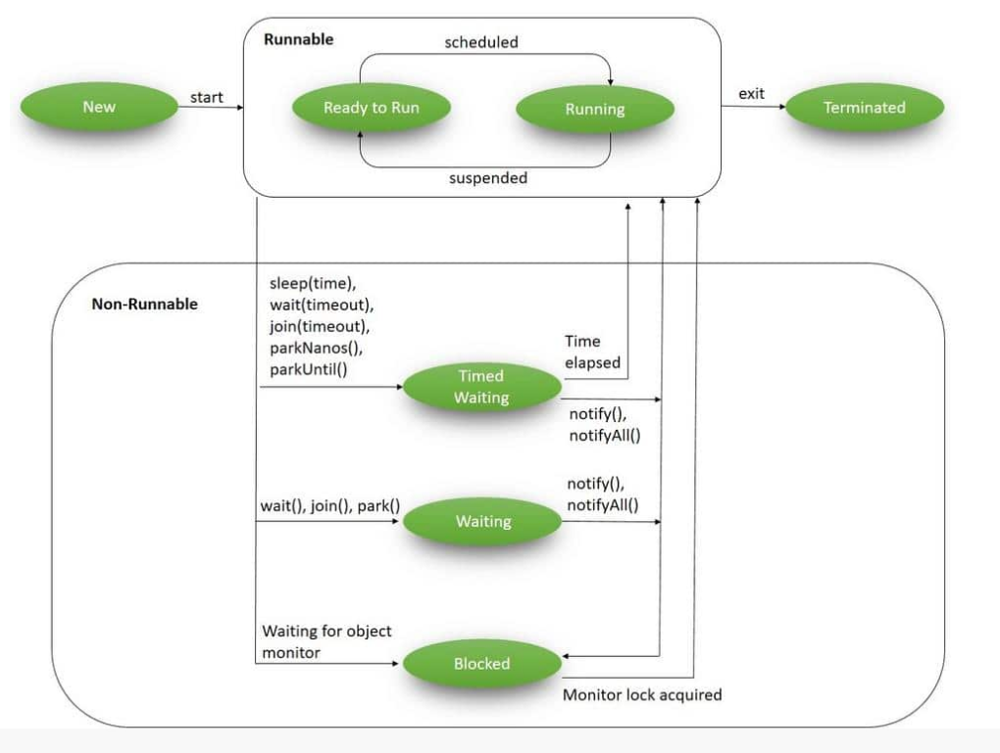
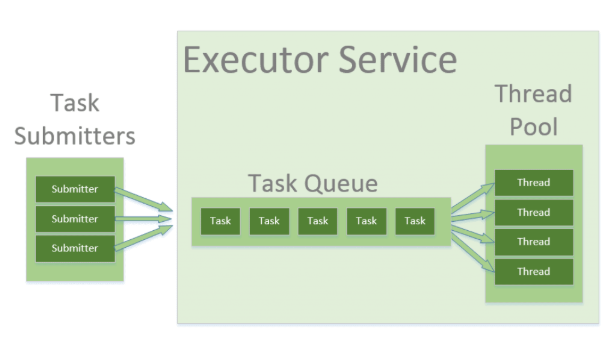
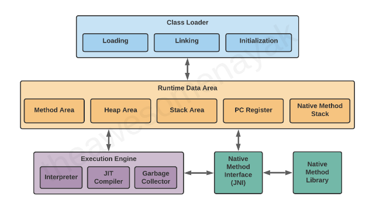
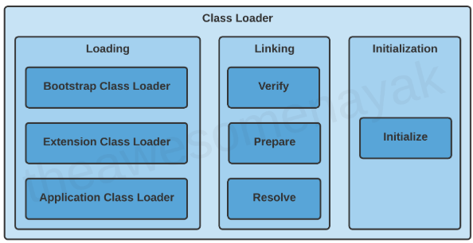
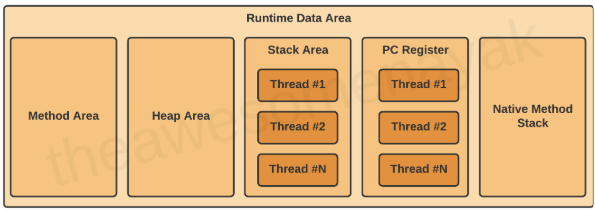
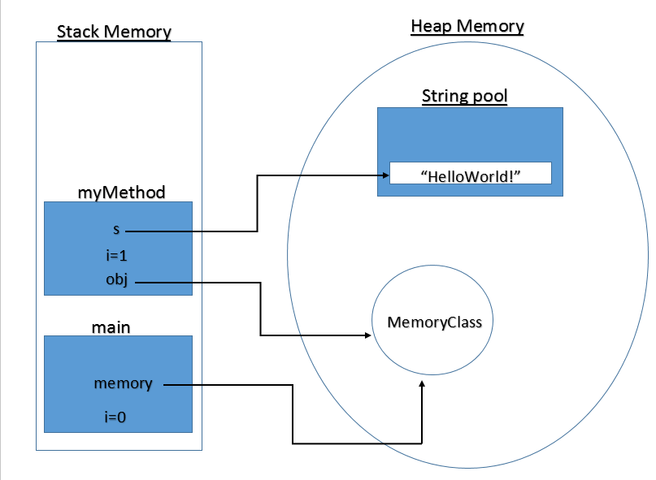
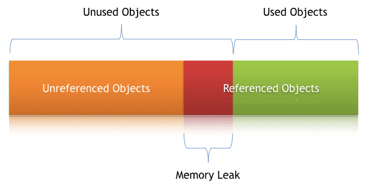

# Multithreading and Synchronization

## Thread Lifecycle

- In the Java language, multithreading is driven by the core concept of a Thread.
- During their lifecycle, threads go through various states:
	- **NEW (or a Born Thread)**
		- A newly created thread that has not yet started the execution.
		- It remains in this state until we start it using the `start()` method.
	- **RUNNABLE**
		- When we’ve created a new thread and called the `start()` method on that, it’s moved from `NEW` to `RUNNABLE` state.
		- Threads in this state are either running or ready to run, but they’re waiting for resource allocation from the system.
		- In a multi-threaded environment, the Thread-Scheduler (which is part of JVM) allocates a fixed amount of time to each thread.
		- So it runs for a particular amount of time, then relinquishes the control to other `RUNNABLE` threads.
	- **BLOCKED**
		- A thread is in the `BLOCKED` state when it’s currently not eligible to run.
		- It enters this state when it is waiting for a monitor lock and is trying to access a section of code that is locked by some other thread.
	- **WAITING**
		- A thread is in `WAITING` state when it’s waiting for some other thread to perform a particular action without any time limit.
		- Any thread can enter this state by calling any one of the following three methods:
			- `object.wait()`
			- `thread.join()`
			- `LockSupport.park()`
	- **TIMED_WAITING**
		- A thread is in `TIMED_WAITING` state when it’s waiting for another thread to perform a particular action within a stipulated amount of time.
		- There are five ways to put a thread on `TIMED_WAITING` state:
			- `thread.sleep(long millis)`
			- `wait(int timeout)` or `wait(int timeout, int nanos)`
			- `thread.join(long millis)`
			- `LockSupport.parkNanos`
			- `LockSupport.parkUntil`
	- **TERMINATED**
		- This is the state of a dead thread.
		- It’s in the `TERMINATED` state when it has either finished execution or was terminated abnormally.



## Runnable and Callable Interfaces

### `Runnable`

- This interface is designed to provide a common protocol for objects that wish to execute code while they are active.
- For example, `Runnable` is implemented by class `Thread`.
- Being active simply means that a thread has been started and has not yet been stopped.
- In addition, `Runnable` provides the means for a class to be active while not subclassing `Thread`.
- A class that implements `Runnable` can run without subclassing `Thread` by instantiating a Thread instance and passing itself in as the target.
- Typically, the `Runnable` interface is the preferred choice when the intention is solely to redefine the `run()` method without altering any other methods of Thread.
- This is important because classes should not be subclassed unless the programmer intends on modifying or enhancing the fundamental behavior of the class.

```java
public class CountDownTimer implements Runnable {
    private int startFrom;

    public CountDownTimer(int startFrom) {
        this.startFrom = startFrom;
    }

    @Override
    public void run() {
        try {
            while (startFrom > 0) {
                System.out.println("Countdown: " + startFrom);
                startFrom--;
                Thread.sleep(1000);
            }
            System.out.println("Countdown finished!");
        } catch (InterruptedException e) {
            System.out.println("Countdown was interrupted.");
        }
    }

    public static void main(String[] args) {
        Runnable countdown = new CountDownTimer(10);
        Thread thread = new Thread(countdown);
        thread.start();
    }
}
```

**`Callable`**

- The Callable interface, similar to Runnable, is designed to represent a task that can be executed by a thread.
- However, unlike Runnable, the Callable interface can return a result and is able to throw a checked exception.
- The Executors class contains utility methods to convert from other common forms to Callable classes.

```java
public class WordLengthCallable implements Callable<Integer> {
    private final String word;
    public WordLengthCallable(String word) {
        this.word = word;
    }
    @Override
    public Integer call() {
        return word.length();
    }

    public static void main(String[] args) throws ExecutionException, InterruptedException {
        ExecutorService executor = Executors.newCachedThreadPool();
        Future<Integer> futureResult = executor.submit(new WordLengthCallable("Hello World"));
        System.out.println("Length of the word is: " + futureResult.get());
        executor.shutdown();
    }
}
```

## Synchronization

- In multithreading, synchronization is important to make sure multiple threads safely work on shared resources.
- Without synchronization, data can become inconsistent or corrupted if multiple threads access and modify shared variables at the same time.
- In Java, it is a mechanism that ensures that only one thread can access a resource at any given time.
- This process helps prevent issues such as data inconsistency and race conditions when multiple threads interact with shared resources.
- Java provides a way to create threads and synchronize their tasks using synchronized blocks. 
- A synchronized block in Java is synchronized on some object.
- Synchronized blocks in Java are marked with the `synchronized` keyword.
- All synchronized blocks synchronize on the same object and can only have one thread executed inside them at a time.
- All other threads attempting to enter the synchronized block are blocked until the thread inside the synchronized block exits the block.

### Process Synchronization

- It is a technique used to coordinate the execution of multiple processes.
- It ensures that the shared resources are safe and in order.

### Thread Synchronization

- It is used to coordinate and ordering of the execution of the threads in a multi-threaded program.
- **Mutual Exclusive:*** helps keep threads from interfering with one another while sharing data.
	- Synchronized method.
	- Synchronized block.
	- Static synchronization.
- **Cooperation (Inter-thread communication)**
	- A mechanism in which a thread is paused from running in its critical section, and another thread is allowed to enter (or lock) the same critical section to be executed.
	- Java provides `wait()`, `notify()`, and `notifyAll()` methods to facilitate this communication.

## Synchronization in Java

### Synchronized Method

- Using `synchronized` keyword with method signature.
- This synchronizes the entire method to ensure only one thread can execute it at a time.

```java
class Counter {
    private int count = 0;

    public synchronized void increment() {
        count++;
    }

    public int getCount() {
        return count;
    }
}
```

### Synchronized Block

- Synchronize a block of code instead of the entire method.
- This provides more control and efficiency.
- The parameter passed is the monitor object.
- If the method is static, we would pass the class name in place of the object reference, and the class would be a monitor for synchronization of the block.

```java
class Counter {
    private int count = 0;

    public void increment() {
        synchronized (this) {
            count++;
        }
    }

    public static void staticIncrement() {
        synchronized (Counter.class) {
            count++;
        }
    }

    public int getCount() {
        return count;
    }
}
```

### Static Synchronization

- Synchronize static methods to ensure only one thread can execute them for the class, not the instance.

```java
class Counter {
    private static int count = 0;
    public static synchronized void increment() {
        count++;
    }
    public static int getCount() {
        return count;
    }
}
```

### Locks

- In Java, every object has a lock associated with it.
- As per convention, a thread requiring consistent access to an object's fields must acquire the object's lock before accessing them.
- Subsequently, the lock is released when the thread is finished with the fields.
- Use `java.util.concurrent.locks.Lock` for more sophisticated thread synchronization.

```java
class Counter {
    private int count = 0;
    private final Lock lock = new ReentrantLock();

    public void increment() {
        lock.lock();
        try {
            count++;
        } finally {
            lock.unlock();
        }
    }

    public int getCount() {
        return count;
    }
}
```

## Executors and Thread Pools

- It is an object that executes submitted `Runnable` tasks.
- This interface provides a way of decoupling task submission from the mechanics of how each task will be run, including details of thread use, scheduling, etc.
- An `Executor` is normally used instead of explicitly creating threads.
- However, the `Executor` interface does not strictly require that execution be asynchronous.
- In the simplest case, an executor can run the submitted task immediately in the caller's thread.
- Many `Executor` implementations impose some sort of limitation on how and when tasks are scheduled.
- Has `execute` method that executes the given command at some time in the future. The command may execute in a new thread, in a pooled thread, or in the calling thread, at the discretion of the `Executor` implementation.

```java
Executor executor = anExecutor;
 executor.execute(new RunnableTask1());
 executor.execute(new RunnableTask2());
 ...

class DirectExecutor implements Executor {
   public void execute(Runnable r) {
     r.run();
   }
 }
```



### `ExecutorService`

- It is a JDK API that simplifies running tasks in asynchronous mode.
- It automatically provides a pool of threads and an API for assigning tasks to it.
- It is an `Executor` that provides methods to manage termination and methods that can produce a `Future` for tracking progress of one or more asynchronous tasks.
- `ExecutorService` can execute `Runnable` and `Callable` tasks.
- An `ExecutorService` can be shut down, which will cause it to reject new tasks.
- This doesn’t cause immediate destruction of the service, rather makes the service stop accepting new tasks and shut down after all running threads finish their current work.
- Upon termination, an executor has no tasks actively executing, no tasks awaiting execution, and no new tasks can be submitted.
- An unused `ExecutorService` should be shut down to allow reclamation of its resources.

```java
// The easiest way to create ExecutorService is to use one of the factory methods of the Executors class.
// This will create a thread pool with 10 threads.
ExecutorService executor = Executors.newFixedThreadPool(10);

Runnable runnableTask = () -> {
    try {
        TimeUnit.MILLISECONDS.sleep(300);
    } catch (InterruptedException e) {
        e.printStackTrace();
    }
};
executorService.execute(runnableTask);

Callable<String> callableTask = () -> {
    TimeUnit.MILLISECONDS.sleep(300);
    return "Task's execution";
};
// submit() submits a Callable or a Runnable task to an ExecutorService and returns a result of type Future
Future<String> future = executorService.submit(callableTask);

List<Callable<String>> callableTasks = new ArrayList<>();
callableTasks.add(callableTask);
// invokeAny() assigns a collection of tasks to an ExecutorService, causing each to run, and returns the result of a successful execution of one task (if there was a successful execution)
String result = executorService.invokeAny(callableTasks);
// invokeAll() assigns a collection of tasks to an ExecutorService, causing each to run, and returns the result of all task executions in the form of a list of objects of type Future
List<Future<String>> futures = executorService.invokeAll(callableTasks);

executorService.shutdown();
List<Runnable> notExecutedTasks = executorService.shutDownNow(); // tries to destroy the ExecutorService immediately, but it doesn’t guarantee that all the running threads will be stopped at the same time

// recommended by Oracle to shutdown service
executorService.shutdown();
try {
    if (!executorService.awaitTermination(800, TimeUnit.MILLISECONDS)) {
        executorService.shutdownNow();
    } 
} catch (InterruptedException e) {
    executorService.shutdownNow();
}
```

### Thread Pools

- In Java, threads are mapped to system-level threads, which are the operating system’s resources.
- If we create threads uncontrollably, we may run out of these resources quickly.
- The Thread Pool pattern helps to save resources in a multithreaded application and to contain the parallelism in certain predefined limits.
- When we use a thread pool, we write our concurrent code in the form of parallel tasks and submit them for execution to an instance of a thread pool.
- This instance controls several re-used threads for executing these tasks.
- We use the `Executor` and `ExecutorService` interfaces to work with different thread pool implementations in Java.
- Usually, we should keep our code decoupled from the actual implementation of the thread pool and use these interfaces throughout our application.
- Some thread pool services by Java:
	- `ThreadPoolExecutor`
	- `ScheduledThreadPoolExecutor`
	- `ForkJoinPool`

## Resources

1. https://www.baeldung.com/java-thread-lifecycle
2. https://docs.oracle.com/javase/8/docs/api/java/lang/Runnable.html
3. https://medium.com/@reetesh043/javas-multithreading-a-deep-dive-into-runnable-and-callable-interfaces-9a6f842b183f
4. https://www.geeksforgeeks.org/java/synchronization-in-java/
5. https://medium.com/@pratik.941/synchronization-in-java-27a9fc268a18
6. https://docs.oracle.com/javase/8/docs/api/java/util/concurrent/Executor.html
7. https://docs.oracle.com/javase/8/docs/api/java/util/concurrent/ExecutorService.html
8. https://www.baeldung.com/java-executor-service-tutorial
9. https://www.baeldung.com/thread-pool-java-and-guava

---

# Java Virtual Machine (JVM)

## Introduction

- JVM is the core of the Java ecosystem, and makes it possible for Java-based software programs to follow the "write once, run anywhere" approach.
- JVM was initially designed to support only Java. However, over the time, many other languages such as Scala, Kotlin and Groovy were adopted on the Java platform. All of these languages are collectively known as JVM languages.
- A virtual machine is a virtual representation of a physical computer.
- We can call the virtual machine the guest machine, and the physical computer it runs on is the host machine.
- In programming languages like C and C++, the code is first compiled into platform-specific machine code. These languages are called compiled languages.
- On the other hand, in languages like Python, the computer executes the instructions directly without having to compile them. These languages are called interpreted languages.
- Java uses a combination of both techniques. Java code is first compiled into byte code to generate a class file. This class file is then interpreted by the Java Virtual Machine for the underlying platform.
- The same class file can be executed on any version of JVM running on any platform and operating system.
- Similar to virtual machines, the JVM creates an isolated space on a host machine. This space can be used to execute Java programs irrespective of the platform or operating system of the machine.

## Bytecode

- Java Bytecode is the intermediate representation of your Java code that is executed by the Java Virtual Machine (JVM).
- When we compile a Java program, the Java compiler (`javac`) converts the code into bytecode, which is a set of instructions that the JVM can understand and execute.
- This bytecode is platform-independent, meaning the same Java program can run on different devices and operating systems, a principle known as "write once, run anywhere".
- It acts as a bridge between your high-level Java code and the lower-level operations that occur within the Java Virtual Machine (JVM).
- This bytecode is a set of instructions that are not human-readable like Java code but are far less complex than machine code.
- Each instruction in Java bytecode is one byte in length, which is where the term “bytecode” comes from.
- However, some instructions are followed by additional bytes that provide operands for the instructions.
- The bytecode instructions are designed to be compact, and efficient, and operate on a stack-based architecture. This is in contrast to most physical CPU architectures, which are register-based.

## JVM Architecture



JVM consists of three distinct components.

### Class Loader

- When we compile a `.java` source file, it is converted into byte code as a `.class` file.
- When we try to use this class in our program, the class loader loads it into the main memory.
- The first class to be loaded into memory is usually the class that contains the `main()` method.
- There are three phases in the class loading process:



- **Loading**
	- Involves taking the binary representation (bytecode) of a class or interface with a particular name, and generating the original class or interface from that.
	- If a parent class loader is unable to find a class, it delegates the work to a child class loader.
	- If the last child class loader isn't able to load the class either, it throws `NoClassDefFoundError` or `ClassNotFoundException`.
- **Linking**
	- Linking a class or interface involves combining the different elements and dependencies of the program together.
	- **Verification:** This phase checks the structural correctness of the .class file by checking it against a set of constraints or rules. If verification fails for some reason, we get a `VerifyException`.
	- **Preparation:** In this phase, the JVM allocates memory for the static fields of a class or interface, and initializes them with default values.
	- **Resolution:** In this phase, symbolic references are replaced with direct references present in the runtime constant pool.
- **Initialization**
	- Involves executing the initialization method of the class or interface (known as `<clinit>`).
	- This can include calling the class's constructor, executing the static block, and assigning values to all the static variables.
	- The JVM is multi-threaded. It can happen that multiple threads are trying to initialize the same class at the same time. This can lead to concurrency issues.

### Runtime Memory/Data Area



- **Method Area**
	- All the class level data such as the run-time constant pool, field, and method data, and the code for methods and constructors, are stored here.
	- If the memory available in the method area is not sufficient for the program startup, the JVM throws an `OutOfMemoryError`.
- **Heap Area**
	- All the objects and their corresponding instance variables are stored here.
	- This is the run-time data area from which memory for all class instances and arrays is allocated.
	- The heap is created on the virtual machine start-up, and there is only one heap area per JVM.
	- Since the Method and Heap areas share the same memory for multiple threads, the data stored here is not thread safe.
- **Stack Area**
	- Whenever a new thread is created in the JVM, a separate runtime stack is also created at the same time.
	- All local variables, method calls, and partial results are stored in the stack area.
	- If the processing being done in a thread requires a larger stack size than what's available, the JVM throws a `StackOverflowError`.
	- For every method call, one entry is made in the stack memory which is called the Stack Frame.
	- When the method call is complete, the Stack Frame is destroyed.
	- The Stack Frame is divided into three sub-parts: **Local Variables**, **Operand Stack**, **Frame Data**.
	- Since the Stack Area is not shared, it is inherently thread safe.
- **Program Counter (PC) Registers**
	- The JVM supports multiple threads at the same time.
	- Each thread has its own PC Register to hold the address of the currently executing JVM instruction.
	- Once the instruction is executed, the PC register is updated with the next instruction.
- **Native Method Stacks**
	- The JVM contains stacks that support native methods.
	- These methods are written in a language other than the Java, such as C and C++.
	- For every new thread, a separate native method stack is also allocated.

### Execution Engine

- Once the bytecode has been loaded into the main memory, and details are available in the runtime data area, the next step is to run the program.
- The Execution Engine handles this by executing the code present in each class.
- However, before executing the program, the bytecode needs to be converted into machine language instructions.
- The JVM can use an interpreter or a JIT compiler for the execution engine.

### Java Native Interface (JNI)

- At times, it is necessary to use native (non-Java) code (for example, C/C++).
- This can be in cases where we need to interact with hardware, or to overcome the memory management and performance constraints in Java.
- Java supports the execution of native code via the Java Native Interface (JNI).
- JNI acts as a bridge for permitting the supporting packages for other programming languages such as C, C++, and so on.
- This is especially helpful in cases where we need to write code that is not entirely supported by Java, like some platform specific features that can only be written in C.
- **Native Method Libraries**
	- Libraries that are written in other programming languages, such as C, C++, and assembly.
	- These libraries are usually present in the form of `.dll` or `.so` files.
	- These native libraries can be loaded through JNI.

## Just-In-Time (JIT) Compiler

- The interpreter reads and executes the bytecode instructions line by line. Due to the line by line execution, the interpreter is comparatively slower.
- Another disadvantage of the interpreter is that when a method is called multiple times, every time a new interpretation is required.
- The JIT Compiler overcomes the disadvantage of the interpreter.
- The Execution Engine first uses the interpreter to execute the byte code, but when it finds some repeated code, it uses the JIT compiler.
- The JIT compiler then compiles the entire bytecode and changes it to native machine code.
- This native machine code is used directly for repeated method calls, which improves the performance of the system.
- The JIT Compiler has the following components:
	- **Intermediate Code Generator** - generates intermediate code.
	- **Code Optimizer** - optimizes the intermediate code for better performance.
	- **Target Code Generator** - converts intermediate code to native machine code.
	- **Profiler** - finds the hotspots (code that is executed repeatedly).
- A JIT compiler takes more time to compile the code than for the interpreter to interpret the code line by line.

## Resources

1. https://www.freecodecamp.org/news/jvm-tutorial-java-virtual-machine-architecture-explained-for-beginners/
2. https://medium.com/@AlexanderObregon/an-introduction-to-java-bytecode-885677548674

---

# Memory Management and Garbage Collection

## Heap and Stack Memory

- To run an application in an optimal way, JVM divides memory into stack and heap memory.
- Whenever we declare new variables and objects, call a new method, declare a String, or perform similar operations, JVM designates memory to these operations from either Stack Memory or Heap Space.



### Stack

- Stack Memory in Java is used for static memory allocation and the execution of a thread.
- It contains primitive values that are specific to a method and references to objects referred from the method that are in a heap.
- Access to this memory is in Last-In-First-Out (LIFO) order.
- Whenever we call a new method, a new block is created on top of the stack which contains values specific to that method, like primitive variables and references to objects.
- When the method finishes execution, its corresponding stack frame is flushed, the flow goes back to the calling method, and space becomes available for the next method.
- It grows and shrinks as new methods are called and returned, respectively.
- It’s automatically allocated and deallocated when the method finishes execution.
- If this memory is full, Java throws `StackOverFlowError`.
- Access to this memory is fast when compared to heap memory.
- This memory is thread-safe, as each thread operates in its own stack.

### Heap

- Heap space is used for the dynamic memory allocation of Java objects and JRE classes at runtime.
- New objects are always created in heap space, and the references to these objects are stored in stack memory.
- These objects have global access and we can access them from anywhere in the application.
- We can break this memory model down into smaller parts, called generations, which are:
	- **Young Generation**
		- This is where all new objects are allocated and aged.
		- A minor Garbage collection (called Minor GC) occurs when this fills up.
	- **Old or Tenured Generation**
		- This contains the objects that are long-lived and survived after many rounds of Minor GC.
		- When objects are stored in the Young Generation, a threshold for the object’s age is set, and when that threshold is reached, the object is moved to the old generation.
		- Usually, garbage collection is performed in Old Generation memory when it’s full.
		- Old Generation Garbage Collection is called Major GC and usually takes a longer time.
	- **Permanent Generation**
		- This consists of JVM metadata for the runtime classes and application methods.
		- Perm Gen objects are garbage collected in a full garbage collection.
- We can always manipulate the size of heap memory as per our requirement.
- If heap space is full, Java throws `OutOfMemoryError`.
- Access to this memory is comparatively slower than stack memory
- This memory, in contrast to stack, isn’t automatically deallocated. It needs Garbage Collector to free up unused objects so as to keep the efficiency of the memory usage.
- Unlike stack, a heap isn’t thread safe and needs to be guarded by properly synchronizing the code.

## Garbage Collection Mechanisms

- Java Garbage Collection is the process to identify and remove the unused objects from the memory and free space to be allocated to objects created in future processing.
- Garbage collection makes Java memory efficient because because it removes the unreferenced objects from heap memory and makes free space for new objects.
- All the Garbage Collections are “Stop the World” events because all application threads are stopped until the operation completes.
- Since Young generation keeps short-lived objects, Minor GC is very fast and the application doesn’t get affected by this.
- However, Major GC takes a long time because it checks all the live objects and can make the application unresponsive for the garbage collection duration.
- The duration taken by garbage collector depends on the strategy used for garbage collection.
- That’s why it’s necessary to monitor and tune the garbage collector to avoid timeouts in the highly responsive applications.
- Garbage Collections is done automatically by the JVM at regular intervals and does not need to be handled separately.
- It can also be triggered by calling `System.gc()`, but the execution is not guaranteed.

### Garbage Collector

- The Garbage Collector (GC) collects and removes unreferenced objects from the heap area.
- It is the process of reclaiming the runtime unused memory automatically by destroying them.
- It performs automatic dynamic memory management through the following operations:
	- Allocates from and gives back memory to the operating system.
	- Hands out that memory to the application as it requests it.
	- Determines which parts of that memory is still in use by the application.
	- Reclaims the unused memory for reuse by the application.
- It involves the following phases:
	- **Mark** - the GC identifies the unused objects in memory.
	- **Sweep** - the GC removes the objects identified during the previous phase.
	- **Compact** - For better performance, after deleting unused objects, all the survived objects can be moved to be together.

### Garbage Collection Types

- **Serial GC (`-XX:+UseSerialGC`)**
	- Serial GC uses the simple **mark-sweep-compact** approach for young and old generations garbage collection i.e Minor and Major GC.
	- Serial GC is useful in client machines such as simple stand-alone applications and machines with smaller CPU.
	- It is good for small applications with low memory footprint.
- **Parallel GC (`-XX:+UseParallelGC`)**
	- Parallel GC is same as Serial GC except that it spawns N threads for young generation garbage collection where N is the number of CPU cores in the system.
	- We can control the number of threads using `-XX:ParallelGCThreads=n` JVM option.
	- Parallel Garbage Collector is also called throughput collector because it uses multiple CPUs to speed up the GC performance.
	- Parallel GC uses a single thread for Old Generation garbage collection.
- **Parallel Old GC (`-XX:+UseParallelOldGC`)**
	- This is same as Parallel GC except that it uses multiple threads for both Young Generation and Old Generation garbage collection.
- **Concurrent Mark Sweep (CMS) Collector (`-XX:+UseConcMarkSweepGC`)**
	- CMS Collector is also referred as concurrent low pause collector.
	- It does the garbage collection for the Old generation.
	- CMS collector tries to minimize the pauses due to garbage collection by doing most of the garbage collection work concurrently with the application threads.
	- CMS collector on the young generation uses the same algorithm as that of the parallel collector.
	- This garbage collector is suitable for responsive applications where we can’t afford longer pause times.
	- We can limit the number of threads in CMS collector using `-XX:ParallelCMSThreads=n` JVM option.
- **G1 Garbage Collector (`-XX:+UseG1GC`)**
	- The Garbage First or G1 garbage collector is available from Java 7 and its long term goal is to replace the CMS collector.
	- The G1 collector is a parallel, concurrent, and incrementally compacting low-pause garbage collector.
	- Garbage First Collector doesn’t work like other collectors and there is no concept of Young and Old generation space.
	- It divides the heap space into multiple equal-sized heap regions.
	- When a garbage collection is invoked, it first collects the region with lesser live data, hence “Garbage First”.
- The flags define which garbage collection to run for the JVM. For example: `java -XX:+UseSerialGC MyApp`.
- The default garbage collector used by a JVM depends on the Java version and the platform.

### Garbage Collection Monitoring

- We can use the Java command line as well as UI tools for monitoring garbage collection activities of an application.
- We can use `jstat` command line tool to monitor the JVM memory and garbage collection activities.
- The advantage of `jstat` is that it can be executed in remote servers too where we don’t have GUI.
- `jvisualvm` (command line tool) along with Visual GC plugin allows to see memory and GC operations in GUI.

### Garbage Collection Tuning

- The purpose of a garbage collector is to free the application developer from manual dynamic memory management.
- It should be the last option for a developer to should use GC tuning for increasing the throughput of an application and only when there is a drop in performance because of longer GC timings causing application timeout.
- Overall garbage collection tuning takes a lot of effort and time and there is no hard and fast rule for that.
- Java SE selects the most appropriate garbage collector based on the class of the computer on which the application is run. However, this selection may not be optimal for every application.
- Users, developers, and administrators with strict performance goals or other requirements may need to explicitly select the garbage collector and tune certain parameters to achieve the desired level of performance.

## Memory Leaks

- A Memory Leak is a situation where there are objects present in the heap that are no longer used, but the garbage collector is unable to remove them from memory, and therefore, they’re unnecessarily maintained.
- One of the core benefits of Java is the automated memory management with the help of the built-in Garbage Collector.
- The GC implicitly takes care of allocating and freeing up memory, and thus is capable of handling the majority of memory leak issues.
- While the GC effectively handles a good portion of memory, it doesn’t guarantee a foolproof solution to memory leaking.
- The GC is pretty smart, but not flawless. Memory leaks can still sneak up, even in the applications of a conscientious developer.
- There might still be situations where the application generates a substantial number of superfluous objects, thus depleting crucial memory resources, and sometimes resulting in the whole application’s failure.
- A memory leak is bad because it blocks memory resources and degrades system performance over time.
- If not dealt with, the application will eventually exhaust its resources, finally terminating with a fatal `OutOfMemoryError`.
- There are two different types of objects that reside in Heap memory, referenced and unreferenced.
- Referenced objects are those that still have active references within the application, whereas unreferenced objects don’t have any active references.
- The garbage collector removes unreferenced objects periodically, but it never collects the objects that are still being referenced. This is where memory leaks can occur.



### Types of Memory Leaks in Java

Memory leaks can occur for numerous reasons. The most common ones are:
#### Memory Leak Through static Fields
- In Java, static fields have a life that usually matches the entire lifetime of the running application (unless `ClassLoader` becomes eligible for garbage collection).
- If collections or large objects are declared as static, then they remain in the memory throughout the lifetime of the application, thus blocking vital memory that could otherwise be used elsewhere.
- **How to prevent this?**
	- Minimize the use of static variables.
	- When using singletons, rely upon an implementation that lazily loads the object, instead of eagerly loading.
```java
public class StaticFieldsMemoryLeakUnitTest {
    public static List<Double> list = new ArrayList<>();
    // since the field is static, it will never be garbage collected, even if we do not use it anymore.

    public void populateList() {
        for (int i = 0; i < 10000000; i++) {
            list.add(Math.random());
        }
    }

    public static void main(String[] args) {
        new StaticFieldsDemo().populateList();
    }
}
```

#### Through Unclosed Resources
- Whenever we make a new connection or open a stream, the JVM allocates memory for these resources.
- Forgetting to close these resources can block the memory, thus keeping them out of the reach of the GC.
- This can even happen in case of an exception that prevents the program execution from reaching the statement that’s handling the code to close these resources.
- **How to prevent this?**
	- Always use `finally` block to close resources.
	- The code (even in the `finally` block) that closes the resources shouldn’t have any exceptions itself.
	- When using Java 7+, we can make use of the `try-with-resources` block.

#### Improper `equals()` and `hashCode()` Implementations
- When defining new classes, a very common oversight is not writing proper overridden methods for the `equals()` and `hashCode()` methods.
- `HashSet` and `HashMap` use these methods in many operations, and if they’re not overridden correctly, they can become a source for potential memory leak problems.
- ORM tools like Hibernate uses the `equals()` and `hashCode()` methods to analyze the objects and saves them in the cache.
- Without proper implementation of these methods, Hash methods and Hibernate wouldn’t be able to compare objects and would fill its cache with duplicate objects.
- **How to Prevent It?**
	- As a rule of thumb, when defining new entities, always override the `equals()` and `hashCode()` methods.
	- It’s not enough to just override, these methods must be overridden in an optimal way as well.

#### Inner Classes That Reference Outer Classes
- This happens in the case of non-static inner classes (anonymous classes).
- For initialization, these inner classes always require an instance of the enclosing class.
- Every non-static Inner Class has, by default, an implicit reference to its containing class.
- If we use this inner class’s object in our application, then even after our containing class’s object goes out of scope, it won’t be garbage collected.
- This happens because the inner class object implicitly holds a reference to the outer class object, thereby making it an invalid candidate for garbage collection.
- The same happens in the case of anonymous classes.
- **How to Prevent It?**
	- Migrating to the latest version of Java that uses modern Garbage Collectors such as ZGC that uses root references to find unreachable objects.
	- Since the references are found from the root, this will solve the cyclic problem, like the anonymous class holding reference to the container class.
	- If the inner class doesn’t need access to the containing class members, consider turning it into a static class.

#### Through `finalize()` Methods
- Whenever a class’s `finalize()` method is overridden, then objects of that class aren’t instantly garbage collected.
- Instead, the GC queues them for finalization, which occurs at a later point in time.
- If the code written in the `finalize()` method isn’t optimal, and if the finalizer queue can’t keep up with the Java garbage collector, then sooner or later our application is destined to meet an `OutOfMemoryError`.
- **How to Prevent It?**
	- We should always avoid finalizers.

#### Interned Strings
- The Java String pool went through a major change in Java 7 when it was transferred from PermGen to Heap Space.
- However, for applications operating on version 6 and below, we need to be more attentive when working with large Strings. 
- If we read a massive String object, and call `intern()` on that object, it goes to the string pool, which is located in permanent memory, and will stay there as long as our application runs.
- This blocks the memory and creates a major memory leak in our application.
- **How to Prevent It?**
	- The simplest way to resolve this issue is by upgrading to the latest Java version, as String pool moved to Heap Space starting with Java version 7.
	- If we’re working on large Strings, we can increase the size of the PermGen space to avoid any potential `OutOfMemoryErrors`.

#### Using ThreadLocals
- `ThreadLocal` is a construct that gives us the ability to isolate state to a particular thread, and thus allows us to achieve thread safety.
- When using this construct, each thread will hold an implicit reference to its copy of a `ThreadLocal` variable and will maintain its own copy, instead of sharing the resource across multiple threads, as long as the thread is alive.
- Despite its advantages, the use of `ThreadLocal` variables is controversial, as they’re infamous for introducing memory leaks if not used properly.
- `ThreadLocal`s are supposed to be garbage collected once the holding thread is no longer alive.
- But the problem arises when we use `ThreadLocal`s along with modern application servers.
- Modern application servers use a pool of threads to process requests, instead of creating new ones (for example, the Executor in the case of Apache Tomcat).
- Since Thread Pools in application servers work on the concept of thread reuse, they’re never garbage collected; instead, they’re reused to serve another request.
- If any class creates a `ThreadLocal` variable, but doesn’t explicitly remove it, then a copy of that object will remain with the worker Thread even after the web application is stopped, thus preventing the object from being garbage collected.
- **How to Prevent It?**
	- It’s good practice to clean-up `ThreadLocal`s when we’re no longer using them.
	- `ThreadLocal`s provide the `remove()` method, which removes the current thread’s value for this variable.
	- Don’t use `ThreadLocal.set(null)` to clear the value. It doesn’t actually clear the value, but will instead look up the Map associated with the current thread and set the key-value pair as the current thread and null, respectively.
	- It’s best to consider ThreadLocal a resource that we need to close in a finally block, even in the case of an exception.

## Resources

- https://www.baeldung.com/java-stack-heap
- https://www.digitalocean.com/community/tutorials/java-jvm-memory-model-memory-management-in-java
- https://docs.oracle.com/en/java/javase/21/gctuning/introduction-garbage-collection-tuning.html#GUID-223394DF-2E27-4F5D-A7DF-83151EB577BB
- https://www.baeldung.com/java-memory-leaks


---

# Networking

## `Sockets`

**Overview:**
- Java sockets are essential for network communication, acting as endpoints for sending and receiving data.
- A socket is created on a client device and attempts to connect to a server socket at a specified IP address and port number.

**Key Concepts:**
- `Socket` represents a connection between two machines
- TCP-based communication (reliable, connection-oriented)
- Client-server architecture

### Code Examples

#### Client Socket
```java
import java.io.*;
import java.net.*;

public class SocketClient {
    public static void main(String[] args) {
        try {
            // Create socket connection to server
            Socket socket = new Socket("localhost", 9999);
            
            // Get input and output streams
            PrintWriter out = new PrintWriter(socket.getOutputStream(), true);
            BufferedReader in = new BufferedReader(new InputStreamReader(socket.getInputStream()));
            
            // Send message to server
            out.println("Hello Server!");
            
            // Read response from server
            String response = in.readLine();
            System.out.println("Server response: " + response);
            
            // Close connections
            in.close();
            out.close();
            socket.close();
            
        } catch (IOException e) {
            System.err.println("Client error: " + e.getMessage());
        }
    }
}
```

**Resources:**
- [Oracle Java Socket Documentation](https://docs.oracle.com/javase/8/docs/api/java/net/Socket.html)
- [Java Network Programming Tutorial](https://docs.oracle.com/javase/tutorial/networking/sockets/)

## `ServerSockets`

**Overview:**
`ServerSocket` is used to create server applications that listen for client connections on a specific port.

**Key Concepts:**
- Listens for incoming client connections
- Accepts connections and creates `Socket` instances for communication
- Can handle multiple clients using threading

### Code Examples

#### Basic Server
```java
import java.io.*;
import java.net.*;

public class SimpleServer {
    public static void main(String[] args) {
        try {
            // Create server socket on port 9999
            ServerSocket serverSocket = new ServerSocket(9999);
            System.out.println("Server started on port 9999");
            
            while (true) {
                // Wait for client connection
                Socket clientSocket = serverSocket.accept();
                System.out.println("Client connected: " + clientSocket.getInetAddress());
                
                // Handle client in separate thread
                new Thread(new ClientHandler(clientSocket)).start();
            }
            
        } catch (IOException e) {
            System.err.println("Server error: " + e.getMessage());
        }
    }
}

class ClientHandler implements Runnable {
    private Socket clientSocket;
    
    public ClientHandler(Socket socket) {
        this.clientSocket = socket;
    }
    
    @Override
    public void run() {
        try {
            BufferedReader in = new BufferedReader(new InputStreamReader(clientSocket.getInputStream()));
            PrintWriter out = new PrintWriter(clientSocket.getOutputStream(), true);
            
            String inputLine;
            while ((inputLine = in.readLine()) != null) {
                System.out.println("Received: " + inputLine);
                out.println("Echo: " + inputLine);
            }
            
            clientSocket.close();
        } catch (IOException e) {
            System.err.println("Error handling client: " + e.getMessage());
        }
    }
}
```

**Resources:**
- [ServerSocket Documentation](https://docs.oracle.com/javase/8/docs/api/java/net/ServerSocket.html)
- [Multi-threaded Server Example](https://docs.oracle.com/javase/tutorial/networking/sockets/clientServer.html)

## `URL` and `HttpURLConnection`

**Overview:**
`URL` class represents a Uniform Resource Locator, while `HttpURLConnection` provides methods for `HTTP`-specific operations.

**Key Concepts:**
- `URL` parsing and manipulation
- `HTTP` methods (`GET`, `POST`, `PUT`, `DELETE`)
- Request/response headers
- Connection management

### Code Examples

#### HTTP GET Request
```java
import java.io.*;
import java.net.*;

public class HttpGetExample {
    public static void main(String[] args) {
        try {
            URL url = new URL("https://api.github.com/users/octocat");
            HttpURLConnection connection = (HttpURLConnection) url.openConnection();
            
            // Set request method
            connection.setRequestMethod("GET");
            connection.setRequestProperty("Accept", "application/json");
            
            // Get response code
            int responseCode = connection.getResponseCode();
            System.out.println("Response Code: " + responseCode);
            
            // Read response
            BufferedReader reader = new BufferedReader(new InputStreamReader(connection.getInputStream()));
            String line;
            StringBuilder response = new StringBuilder();
            
            while ((line = reader.readLine()) != null) {
                response.append(line);
            }
            reader.close();
            
            System.out.println("Response: " + response.toString());
            connection.disconnect();
            
        } catch (Exception e) {
            e.printStackTrace();
        }
    }
}
```

#### HTTP POST Request
```java
import java.io.*;
import java.net.*;

public class HttpPostExample {
    public static void main(String[] args) {
        try {
            URL url = new URL("https://httpbin.org/post");
            HttpURLConnection connection = (HttpURLConnection) url.openConnection();
            
            // Configure POST request
            connection.setRequestMethod("POST");
            connection.setRequestProperty("Content-Type", "application/json");
            connection.setDoOutput(true);
            
            // Send JSON data
            String jsonData = "{\"name\":\"John\",\"age\":30}";
            try (OutputStream os = connection.getOutputStream()) {
                byte[] input = jsonData.getBytes("utf-8");
                os.write(input, 0, input.length);
            }
            
            // Read response
            try (BufferedReader br = new BufferedReader(new InputStreamReader(connection.getInputStream(), "utf-8"))) {
                StringBuilder response = new StringBuilder();
                String responseLine;
                while ((responseLine = br.readLine()) != null) {
                    response.append(responseLine.trim());
                }
                System.out.println(response.toString());
            }
            
        } catch (Exception e) {
            e.printStackTrace();
        }
    }
}
```

### Resources
- [URL Class Documentation](https://docs.oracle.com/javase/8/docs/api/java/net/URL.html)
- [HttpURLConnection Documentation](https://docs.oracle.com/javase/8/docs/api/java/net/HttpURLConnection.html)

## `DatagramSockets`

**Overview:**
`DatagramSocket` provides `UDP` (User Datagram Protocol) communication, which is connectionless and unreliable but faster than `TCP`.

**Key Concepts:**
- Connectionless communication
- Packet-based data transmission
- No guaranteed delivery
- Lower overhead than `TCP`

### Code Examples

#### UDP Client
```java
import java.net.*;
import java.io.*;

public class UDPClient {
    public static void main(String[] args) {
        try {
            DatagramSocket socket = new DatagramSocket();
            InetAddress address = InetAddress.getByName("localhost");
            
            String message = "Hello UDP Server!";
            byte[] buffer = message.getBytes();
            
            // Create and send packet
            DatagramPacket packet = new DatagramPacket(buffer, buffer.length, address, 9876);
            socket.send(packet);
            
            // Receive response
            byte[] responseBuffer = new byte[1024];
            DatagramPacket responsePacket = new DatagramPacket(responseBuffer, responseBuffer.length);
            socket.receive(responsePacket);
            
            String response = new String(responsePacket.getData(), 0, responsePacket.getLength());
            System.out.println("Server response: " + response);
            
            socket.close();
            
        } catch (Exception e) {
            e.printStackTrace();
        }
    }
}
```

#### UDP Server
```java
import java.net.*;

public class UDPServer {
    public static void main(String[] args) {
        try {
            DatagramSocket socket = new DatagramSocket(9876);
            System.out.println("UDP Server started on port 9876");
            
            while (true) {
                byte[] buffer = new byte[1024];
                DatagramPacket packet = new DatagramPacket(buffer, buffer.length);
                
                // Receive packet
                socket.receive(packet);
                String message = new String(packet.getData(), 0, packet.getLength());
                System.out.println("Received: " + message);
                
                // Send response
                String response = "Echo: " + message;
                byte[] responseData = response.getBytes();
                DatagramPacket responsePacket = new DatagramPacket(
                    responseData, responseData.length, packet.getAddress(), packet.getPort());
                socket.send(responsePacket);
            }
            
        } catch (Exception e) {
            e.printStackTrace();
        }
    }
}
```

### Resources
- [DatagramSocket Documentation](https://docs.oracle.com/javase/8/docs/api/java/net/DatagramSocket.html)
- [UDP Programming Tutorial](https://docs.oracle.com/javase/tutorial/networking/datagrams/)
- https://docs.oracle.com/javase/tutorial/networking/overview/networking.html
- https://medium.com/@AlexanderObregon/leveraging-java-for-network-programming-tips-and-techniques-ebbde8189e2b
- https://www.scaler.com/topics/networking-in-java/

---

# Non-blocking I/O (NIO)

## Overview of Java NIO

- Web containers in application servers normally use one server thread per client request.
- To develop scalable web applications, we have to ensure that threads associated with client requests are never sitting idle waiting for a blocking operation to complete.
- Java EE provides nonblocking I/O support for servlets and filters when processing requests in asynchronous mode.

**Key Concepts:**
- Channel-based I/O instead of stream-based
- Buffer-oriented operations
- Selectors for multiplexing
- Non-blocking operations
- Better scalability for high-concurrency applications

**NIO vs Traditional I/O:**
- **Traditional I/O**: Stream-oriented, blocking, one thread per connection
- **NIO**: Buffer-oriented, non-blocking, one thread can handle multiple connections

### Code Examples

#### Basic NIO File Reading
```java
import java.io.*;
import java.nio.*;
import java.nio.channels.*;
import java.nio.file.*;

public class NIOFileExample {
    public static void main(String[] args) {
        try {
            // Reading file using NIO
            Path path = Paths.get("example.txt");
            
            // Method 1: Read entire file
            byte[] fileBytes = Files.readAllBytes(path);
            System.out.println("File content: " + new String(fileBytes));
            
            // Method 2: Using FileChannel
            try (FileChannel fileChannel = FileChannel.open(path, StandardOpenOption.READ)) {
                ByteBuffer buffer = ByteBuffer.allocate(1024);
                
                while (fileChannel.read(buffer) != -1) {
                    buffer.flip(); // Switch to read mode
                    
                    while (buffer.hasRemaining()) {
                        System.out.print((char) buffer.get());
                    }
                    
                    buffer.clear(); // Switch to write mode
                }
            }
            
        } catch (IOException e) {
            e.printStackTrace();
        }
    }
}
```

#### NIO File Writing
```java
import java.nio.*;
import java.nio.channels.*;
import java.nio.file.*;

public class NIOFileWriteExample {
    public static void main(String[] args) {
        try {
            Path path = Paths.get("output.txt");
            String content = "Hello NIO World!\nThis is written using NIO.";
            
            // Method 1: Simple write
            Files.write(path, content.getBytes(), StandardOpenOption.CREATE, StandardOpenOption.WRITE);
            
            // Method 2: Using FileChannel
            try (FileChannel fileChannel = FileChannel.open(path, 
                    StandardOpenOption.CREATE, StandardOpenOption.WRITE, StandardOpenOption.APPEND)) {
                
                ByteBuffer buffer = ByteBuffer.allocate(1024);
                buffer.put("\nAppended using FileChannel".getBytes());
                buffer.flip();
                
                fileChannel.write(buffer);
            }
            
            System.out.println("File written successfully");
            
        } catch (IOException e) {
            e.printStackTrace();
        }
    }
}
```

### Resources
- [Java NIO Tutorial](https://docs.oracle.com/javase/tutorial/essential/io/file.html)
- [NIO.2 File API](https://docs.oracle.com/javase/7/docs/api/java/nio/file/package-summary.html)

## Channels and Buffers

**Overview:**
Channels represent connections to entities capable of I/O operations. Buffers are containers for data that channels read from or write to.

**Key Concepts:**
- **Channels**: `FileChannel`, `SocketChannel`, `ServerSocketChannel`, `DatagramChannel`
- **Buffers**: `ByteBuffer`, `CharBuffer`, `IntBuffer`, etc.
- **Buffer operations**: `put()`, `get()`, `flip()`, `clear()`, `rewind()`
- **Direct vs Heap buffers**

### Code Examples

#### Buffer Operations
```java
import java.nio.*;

public class BufferExample {
    public static void main(String[] args) {
        // Create a ByteBuffer
        ByteBuffer buffer = ByteBuffer.allocate(1024);
        
        System.out.println("Initial state:");
        printBufferState(buffer);
        
        // Put some data
        buffer.put("Hello NIO".getBytes());
        System.out.println("\nAfter putting data:");
        printBufferState(buffer);
        
        // Flip to read mode
        buffer.flip();
        System.out.println("\nAfter flip:");
        printBufferState(buffer);
        
        // Read data
        byte[] data = new byte[buffer.remaining()];
        buffer.get(data);
        System.out.println("Read data: " + new String(data));
        
        System.out.println("\nAfter reading:");
        printBufferState(buffer);
        
        // Clear buffer
        buffer.clear();
        System.out.println("\nAfter clear:");
        printBufferState(buffer);
        
        // Direct buffer example
        ByteBuffer directBuffer = ByteBuffer.allocateDirect(1024);
        System.out.println("\nDirect buffer: " + directBuffer.isDirect());
    }
    
    private static void printBufferState(ByteBuffer buffer) {
        System.out.println("Position: " + buffer.position() + 
                          ", Limit: " + buffer.limit() + 
                          ", Capacity: " + buffer.capacity() + 
                          ", Remaining: " + buffer.remaining());
    }
}
```

#### Channel Transfer Example
```java
import java.io.*;
import java.nio.channels.*;

public class ChannelTransferExample {
    public static void main(String[] args) {
        try {
            // Copy file using channel transfer
            copyFile("source.txt", "destination.txt");
            
        } catch (IOException e) {
            e.printStackTrace();
        }
    }
    
    public static void copyFile(String source, String destination) throws IOException {
        try (FileChannel sourceChannel = FileChannel.open(Paths.get(source), StandardOpenOption.READ);
             FileChannel destChannel = FileChannel.open(Paths.get(destination), 
                     StandardOpenOption.CREATE, StandardOpenOption.WRITE)) {
            
            long position = 0;
            long size = sourceChannel.size();
            
            // Transfer data from source to destination
            sourceChannel.transferTo(position, size, destChannel);
            
            System.out.println("File copied successfully using channel transfer");
        }
    }
}
```

#### Socket Channel Example
```java
import java.net.*;
import java.nio.*;
import java.nio.channels.*;

public class SocketChannelExample {
    public static void main(String[] args) {
        try {
            // Connect to server
            SocketChannel socketChannel = SocketChannel.open();
            socketChannel.connect(new InetSocketAddress("localhost", 8080));
            
            // Send data
            String message = "Hello from NIO client";
            ByteBuffer buffer = ByteBuffer.allocate(1024);
            buffer.put(message.getBytes());
            buffer.flip();
            
            socketChannel.write(buffer);
            
            // Read response
            buffer.clear();
            int bytesRead = socketChannel.read(buffer);
            
            if (bytesRead > 0) {
                buffer.flip();
                byte[] data = new byte[buffer.remaining()];
                buffer.get(data);
                System.out.println("Server response: " + new String(data));
            }
            
            socketChannel.close();
            
        } catch (IOException e) {
            e.printStackTrace();
        }
    }
}
```

### Resources
- [Channel Documentation](https://docs.oracle.com/javase/8/docs/api/java/nio/channels/package-summary.html)
- [Buffer Documentation](https://docs.oracle.com/javase/8/docs/api/java/nio/Buffer.html)

## Selectors

**Overview:**
Selectors enable a single thread to monitor multiple channels for I/O events, providing an efficient way to handle many connections simultaneously.

**Key Concepts:**
- Single thread monitors multiple channels
- `SelectionKey` represents channel registration
- Interest operations (read, write, connect, accept)
- Event-driven programming model

### Code Examples

#### NIO Server with Selector
```java
import java.io.*;
import java.net.*;
import java.nio.*;
import java.nio.channels.*;
import java.util.*;

public class NIOServer {
    private Selector selector;
    private ServerSocketChannel serverChannel;
    private static final int PORT = 8080;
    
    public NIOServer() throws IOException {
        selector = Selector.open();
        serverChannel = ServerSocketChannel.open();
        serverChannel.configureBlocking(false);
        serverChannel.bind(new InetSocketAddress(PORT));
        
        // Register server channel with selector for accept operations
        serverChannel.register(selector, SelectionKey.OP_ACCEPT);
        
        System.out.println("NIO Server started on port " + PORT);
    }
    
    public void start() throws IOException {
        while (true) {
            // Wait for events
            int readyChannels = selector.select();
            
            if (readyChannels == 0) {
                continue;
            }
            
            Set<SelectionKey> selectedKeys = selector.selectedKeys();
            Iterator<SelectionKey> keyIterator = selectedKeys.iterator();
            
            while (keyIterator.hasNext()) {
                SelectionKey key = keyIterator.next();
                
                if (key.isAcceptable()) {
                    handleAccept(key);
                } else if (key.isReadable()) {
                    handleRead(key);
                } else if (key.isWritable()) {
                    handleWrite(key);
                }
                
                keyIterator.remove();
            }
        }
    }
    
    private void handleAccept(SelectionKey key) throws IOException {
        ServerSocketChannel serverChannel = (ServerSocketChannel) key.channel();
        SocketChannel clientChannel = serverChannel.accept();
        
        if (clientChannel != null) {
            clientChannel.configureBlocking(false);
            clientChannel.register(selector, SelectionKey.OP_READ);
            System.out.println("Client connected: " + clientChannel.getRemoteAddress());
        }
    }
    
    private void handleRead(SelectionKey key) throws IOException {
        SocketChannel clientChannel = (SocketChannel) key.channel();
        ByteBuffer buffer = ByteBuffer.allocate(1024);
        
        try {
            int bytesRead = clientChannel.read(buffer);
            
            if (bytesRead > 0) {
                buffer.flip();
                byte[] data = new byte[buffer.remaining()];
                buffer.get(data);
                String message = new String(data).trim();
                
                System.out.println("Received: " + message);
                
                // Echo back the message
                key.attach("Echo: " + message);
                key.interestOps(SelectionKey.OP_WRITE);
                
            } else if (bytesRead < 0) {
                // Client disconnected
                System.out.println("Client disconnected");
                clientChannel.close();
                key.cancel();
            }
            
        } catch (IOException e) {
            System.out.println("Error reading from client");
            clientChannel.close();
            key.cancel();
        }
    }
    
    private void handleWrite(SelectionKey key) throws IOException {
        SocketChannel clientChannel = (SocketChannel) key.channel();
        String message = (String) key.attachment();
        
        if (message != null) {
            ByteBuffer buffer = ByteBuffer.wrap(message.getBytes());
            clientChannel.write(buffer);
            
            // Switch back to read mode
            key.interestOps(SelectionKey.OP_READ);
            key.attach(null);
        }
    }
    
    public static void main(String[] args) {
        try {
            NIOServer server = new NIOServer();
            server.start();
        } catch (IOException e) {
            e.printStackTrace();
        }
    }
}
```

#### NIO Client with Selector
```java
import java.io.*;
import java.net.*;
import java.nio.*;
import java.nio.channels.*;
import java.util.*;

public class NIOClient {
    private Selector selector;
    private SocketChannel socketChannel;
    
    public NIOClient() throws IOException {
        selector = Selector.open();
        socketChannel = SocketChannel.open();
        socketChannel.configureBlocking(false);
    }
    
    public void connect(String host, int port) throws IOException {
        socketChannel.connect(new InetSocketAddress(host, port));
        socketChannel.register(selector, SelectionKey.OP_CONNECT);
        
        while (true) {
            selector.select();
            Set<SelectionKey> selectedKeys = selector.selectedKeys();
            Iterator<SelectionKey> keyIterator = selectedKeys.iterator();
            
            while (keyIterator.hasNext()) {
                SelectionKey key = keyIterator.next();
                
                if (key.isConnectable()) {
                    handleConnect(key);
                } else if (key.isReadable()) {
                    handleRead(key);
                } else if (key.isWritable()) {
                    handleWrite(key);
                }
                
                keyIterator.remove();
            }
        }
    }
    
    private void handleConnect(SelectionKey key) throws IOException {
        SocketChannel channel = (SocketChannel) key.channel();
        
        if (channel.finishConnect()) {
            System.out.println("Connected to server");
            key.interestOps(SelectionKey.OP_WRITE);
            
            // Send initial message
            key.attach("Hello from NIO client!");
        }
    }
    
    private void handleRead(SelectionKey key) throws IOException {
        SocketChannel channel = (SocketChannel) key.channel();
        ByteBuffer buffer = ByteBuffer.allocate(1024);
        
        int bytesRead = channel.read(buffer);
        if (bytesRead > 0) {
            buffer.flip();
            byte[] data = new byte[buffer.remaining()];
            buffer.get(data);
            System.out.println("Server response: " + new String(data));
        }
        
        // Close connection after reading response
        channel.close();
        key.cancel();
        System.exit(0);
    }
    
    private void handleWrite(SelectionKey key) throws IOException {
        SocketChannel channel = (SocketChannel) key.channel();
        String message = (String) key.attachment();
        
        if (message != null) {
            ByteBuffer buffer = ByteBuffer.wrap(message.getBytes());
            channel.write(buffer);
            
            key.interestOps(SelectionKey.OP_READ);
            key.attach(null);
        }
    }
    
    public static void main(String[] args) {
        try {
            NIOClient client = new NIOClient();
            client.connect("localhost", 8080);
        } catch (IOException e) {
            e.printStackTrace();
        }
    }
}
```

### Resources
- [Selector Documentation](https://docs.oracle.com/javase/8/docs/api/java/nio/channels/Selector.html)
- [NIO Selector Tutorial](https://jenkov.com/tutorials/java-nio/selectors.html)

## Other Resources
- https://docs.oracle.com/javaee/7/tutorial/servlets013.htm
- https://docs.oracle.com/en/java/javase/15/core/java-nio.html
- https://www.baeldung.com/java-io-vs-nio
- https://medium.com/coderscorner/tale-of-client-server-and-socket-a6ef54a74763
- https://www.geeksforgeeks.org/java/non-blocking-server-in-java-nio/

---

# Servlets

## Servlet Lifecycle

**Overview:**
- Servlets are Java programs that run on a web server and handle `HTTP` requests.
- The servlet lifecycle is managed by the servlet container.

**Key Concepts:**
- Servlet lifecycle phases: Loading, Instantiation, Initialization, Request Handling, Destruction
- Container-managed lifecycle
- Single instance serves multiple requests

**Lifecycle Methods:**
- `init()` - Called once when servlet is first loaded
- `service()` - Called for each request
- `destroy()` - Called when servlet is unloaded

### Code Examples

#### Basic Servlet
```java
import javax.servlet.*;
import javax.servlet.http.*;
import java.io.*;

public class LifecycleServlet extends HttpServlet {
    
    @Override
    public void init() throws ServletException {
        System.out.println("Servlet initialized");
        // Initialize resources, database connections, etc.
    }
    
    @Override
    protected void doGet(HttpServletRequest request, HttpServletResponse response) 
            throws ServletException, IOException {
        response.setContentType("text/html");
        PrintWriter out = response.getWriter();
        
        out.println("<html><body>");
        out.println("<h1>Hello from Servlet!</h1>");
        out.println("<p>Request processed at: " + new java.util.Date() + "</p>");
        out.println("</body></html>");
    }
    
    @Override
    protected void doPost(HttpServletRequest request, HttpServletResponse response) 
            throws ServletException, IOException {
        // Handle POST requests
        String username = request.getParameter("username");
        String password = request.getParameter("password");
        
        // Process login logic
        response.setContentType("text/html");
        PrintWriter out = response.getWriter();
        out.println("<html><body>");
        out.println("<h1>Login processed for: " + username + "</h1>");
        out.println("</body></html>");
    }
    
    @Override
    public void destroy() {
        System.out.println("Servlet destroyed");
        // Clean up resources
    }
}
```

#### Web.xml Configuration
```xml
<?xml version="1.0" encoding="UTF-8"?>
<web-app xmlns="http://xmlns.jcp.org/xml/ns/javaee"
         xmlns:xsi="http://www.w3.org/2001/XMLSchema-instance"
         xsi:schemaLocation="http://xmlns.jcp.org/xml/ns/javaee 
         http://xmlns.jcp.org/xml/ns/javaee/web-app_4_0.xsd"
         version="4.0">
    
    <servlet>
        <servlet-name>LifecycleServlet</servlet-name>
        <servlet-class>LifecycleServlet</servlet-class>
        <load-on-startup>1</load-on-startup>
    </servlet>
    
    <servlet-mapping>
        <servlet-name>LifecycleServlet</servlet-name>
        <url-pattern>/lifecycle</url-pattern>
    </servlet-mapping>
</web-app>
```

### Resources
- [Servlet API Documentation](https://docs.oracle.com/javaee/7/api/javax/servlet/package-summary.html)
- [Servlet Tutorial](https://docs.oracle.com/javaee/7/tutorial/servlets.htm)

## Request and Response Handling

**Overview:**
Servlets handle `HTTP` requests and generate responses using `HttpServletRequest` and `HttpServletResponse` objects.

**Key Concepts:**
- Request parameters and headers
- Response status codes and headers
- Content types and character encoding
- Request forwarding and redirection

### Code Examples

#### Request Parameter Handling
```java
import javax.servlet.*;
import javax.servlet.http.*;
import java.io.*;
import java.util.*;

public class RequestHandlingServlet extends HttpServlet {
    
    @Override
    protected void doGet(HttpServletRequest request, HttpServletResponse response) 
            throws ServletException, IOException {
        
        response.setContentType("text/html");
        PrintWriter out = response.getWriter();
        
        out.println("<html><body>");
        out.println("<h2>Request Information</h2>");
        
        // Get request parameters
        String name = request.getParameter("name");
        String age = request.getParameter("age");
        
        if (name != null) {
            out.println("<p>Name: " + name + "</p>");
        }
        if (age != null) {
            out.println("<p>Age: " + age + "</p>");
        }
        
        // Display all parameters
        out.println("<h3>All Parameters:</h3>");
        Enumeration<String> paramNames = request.getParameterNames();
        while (paramNames.hasMoreElements()) {
            String paramName = paramNames.nextElement();
            String[] paramValues = request.getParameterValues(paramName);
            out.println("<p>" + paramName + ": " + Arrays.toString(paramValues) + "</p>");
        }
        
        // Display request headers
        out.println("<h3>Request Headers:</h3>");
        Enumeration<String> headerNames = request.getHeaderNames();
        while (headerNames.hasMoreElements()) {
            String headerName = headerNames.nextElement();
            String headerValue = request.getHeader(headerName);
            out.println("<p>" + headerName + ": " + headerValue + "</p>");
        }
        
        out.println("</body></html>");
    }
    
    @Override
    protected void doPost(HttpServletRequest request, HttpServletResponse response) 
            throws ServletException, IOException {
        
        // Handle file upload
        if (request.getContentType() != null && request.getContentType().startsWith("multipart/")) {
            handleFileUpload(request, response);
        } else {
            // Regular form processing
            processForm(request, response);
        }
    }
    
    private void processForm(HttpServletRequest request, HttpServletResponse response) 
            throws IOException {
        response.setContentType("application/json");
        response.setCharacterEncoding("UTF-8");
        
        PrintWriter out = response.getWriter();
        
        // Create JSON response
        out.println("{");
        out.println("  \"status\": \"success\",");
        out.println("  \"message\": \"Form processed successfully\",");
        out.println("  \"timestamp\": \"" + new Date() + "\"");
        out.println("}");
    }
    
    private void handleFileUpload(HttpServletRequest request, HttpServletResponse response) 
            throws IOException, ServletException {
        // Handle multipart form data for file uploads
        // Implementation would use Part API for file handling
        response.setContentType("text/plain");
        response.getWriter().println("File upload handled");
    }
}
```

#### Response Manipulation
```java
import javax.servlet.*;
import javax.servlet.http.*;
import java.io.*;

public class ResponseHandlingServlet extends HttpServlet {
    
    @Override
    protected void doGet(HttpServletRequest request, HttpServletResponse response) 
            throws ServletException, IOException {
        
        String action = request.getParameter("action");
        
        if ("download".equals(action)) {
            handleFileDownload(response);
        } else if ("redirect".equals(action)) {
            handleRedirect(request, response);
        } else if ("json".equals(action)) {
            handleJsonResponse(response);
        } else {
            handleDefaultResponse(response);
        }
    }
    
    private void handleFileDownload(HttpServletResponse response) throws IOException {
        response.setContentType("application/octet-stream");
        response.setHeader("Content-Disposition", "attachment; filename=\"sample.txt\"");
        
        PrintWriter out = response.getWriter();
        out.println("This is a sample file for download.");
    }
    
    private void handleRedirect(HttpServletRequest request, HttpServletResponse response) 
            throws IOException {
        String redirectUrl = request.getContextPath() + "/welcome.jsp";
        response.sendRedirect(redirectUrl);
    }
    
    private void handleJsonResponse(HttpServletResponse response) throws IOException {
        response.setContentType("application/json");
        response.setCharacterEncoding("UTF-8");
        response.setHeader("Cache-Control", "no-cache");
        
        PrintWriter out = response.getWriter();
        out.println("{");
        out.println("  \"users\": [");
        out.println("    {\"id\": 1, \"name\": \"John Doe\"},");
        out.println("    {\"id\": 2, \"name\": \"Jane Smith\"}");
        out.println("  ]");
        out.println("}");
    }
    
    private void handleDefaultResponse(HttpServletResponse response) throws IOException {
        response.setContentType("text/html");
        PrintWriter out = response.getWriter();
        
        out.println("<!DOCTYPE html>");
        out.println("<html><head><title>Response Examples</title></head>");
        out.println("<body>");
        out.println("<h1>Response Handling Examples</h1>");
        out.println("<ul>");
        out.println("<li><a href='?action=download'>Download File</a></li>");
        out.println("<li><a href='?action=redirect'>Redirect Example</a></li>");
        out.println("<li><a href='?action=json'>JSON Response</a></li>");
        out.println("</ul>");
        out.println("</body></html>");
    }
}
```

### Resources
- [HttpServletRequest Documentation](https://docs.oracle.com/javaee/7/api/javax/servlet/http/HttpServletRequest.html)
- [HttpServletResponse Documentation](https://docs.oracle.com/javaee/7/api/javax/servlet/http/HttpServletResponse.html)

## Session Management

**Overview:**
`HTTP` is stateless, but web applications often need to maintain state across multiple requests. Servlets provide session management capabilities.

**Key Concepts:**
- `HttpSession` object
- Session creation and invalidation
- Session attributes
- Session timeout
- URL rewriting and cookies

### Code Examples

#### Session Management Servlet
```java
import javax.servlet.*;
import javax.servlet.http.*;
import java.io.*;
import java.util.*;

public class SessionManagementServlet extends HttpServlet {
    
    @Override
    protected void doGet(HttpServletRequest request, HttpServletResponse response) 
            throws ServletException, IOException {
        
        HttpSession session = request.getSession(true); // Create if doesn't exist
        response.setContentType("text/html");
        PrintWriter out = response.getWriter();
        
        out.println("<!DOCTYPE html>");
        out.println("<html><head><title>Session Management</title></head>");
        out.println("<body>");
        out.println("<h1>Session Management Example</h1>");
        
        // Display session information
        out.println("<h2>Session Information:</h2>");
        out.println("<p>Session ID: " + session.getId() + "</p>");
        out.println("<p>Creation Time: " + new Date(session.getCreationTime()) + "</p>");
        out.println("<p>Last Accessed: " + new Date(session.getLastAccessedTime()) + "</p>");
        out.println("<p>Max Inactive Interval: " + session.getMaxInactiveInterval() + " seconds</p>");
        out.println("<p>Is New Session: " + session.isNew() + "</p>");
        
        // Handle different actions
        String action = request.getParameter("action");
        
        if ("login".equals(action)) {
            handleLogin(request, session, out);
        } else if ("logout".equals(action)) {
            handleLogout(session, out);
        } else if ("addItem".equals(action)) {
            handleAddItem(request, session, out);
        } else if ("viewCart".equals(action)) {
            handleViewCart(session, out);
        }
        
        // Display navigation
        displayNavigation(out);
        
        out.println("</body></html>");
    }
    
    private void handleLogin(HttpServletRequest request, HttpSession session, PrintWriter out) {
        String username = request.getParameter("username");
        if (username != null && !username.trim().isEmpty()) {
            session.setAttribute("username", username);
            session.setAttribute("loginTime", new Date());
            out.println("<p style='color: green;'>Welcome, " + username + "!</p>");
        }
    }
    
    private void handleLogout(HttpSession session, PrintWriter out) {
        String username = (String) session.getAttribute("username");
        session.invalidate();
        out.println("<p style='color: red;'>Goodbye, " + (username != null ? username : "User") + "!</p>");
    }
    
    @SuppressWarnings("unchecked")
    private void handleAddItem(HttpServletRequest request, HttpSession session, PrintWriter out) {
        String item = request.getParameter("item");
        if (item != null && !item.trim().isEmpty()) {
            List<String> cart = (List<String>) session.getAttribute("cart");
            if (cart == null) {
                cart = new ArrayList<>();
                session.setAttribute("cart", cart);
            }
            cart.add(item);
            out.println("<p style='color: blue;'>Added '" + item + "' to cart.</p>");
        }
    }
    
    @SuppressWarnings("unchecked")
    private void handleViewCart(HttpSession session, PrintWriter out) {
        List<String> cart = (List<String>) session.getAttribute("cart");
        out.println("<h3>Shopping Cart:</h3>");
        if (cart == null || cart.isEmpty()) {
            out.println("<p>Cart is empty.</p>");
        } else {
            out.println("<ul>");
            for (String item : cart) {
                out.println("<li>" + item + "</li>");
            }
            out.println("</ul>");
        }
    }
    
    private void displayNavigation(PrintWriter out) {
        out.println("<hr>");
        out.println("<h3>Actions:</h3>");
        out.println("<form method='get'>");
        out.println("<input type='hidden' name='action' value='login'>");
        out.println("Username: <input type='text' name='username'>");
        out.println("<input type='submit' value='Login'>");
        out.println("</form>");
        
        out.println("<form method='get'>");
        out.println("<input type='hidden' name='action' value='logout'>");
        out.println("<input type='submit' value='Logout'>");
        out.println("</form>");
        
        out.println("<form method='get'>");
        out.println("<input type='hidden' name='action' value='addItem'>");
        out.println("Item: <input type='text' name='item'>");
        out.println("<input type='submit' value='Add to Cart'>");
        out.println("</form>");
        
        out.println("<form method='get'>");
        out.println("<input type='hidden' name='action' value='viewCart'>");
        out.println("<input type='submit' value='View Cart'>");
        out.println("</form>");
    }
}
```

#### Session Listener Example
```java
import javax.servlet.http.*;

public class SessionListener implements HttpSessionListener {
    
    @Override
    public void sessionCreated(HttpSessionEvent se) {
        System.out.println("Session created: " + se.getSession().getId());
        // Initialize session data, increment active user count, etc.
    }
    
    @Override
    public void sessionDestroyed(HttpSessionEvent se) {
        System.out.println("Session destroyed: " + se.getSession().getId());
        // Clean up session data, decrement active user count, etc.
    }
}
```

### Resources
- [HttpSession Documentation](https://docs.oracle.com/javaee/7/api/javax/servlet/http/HttpSession.html)
- [Session Management Tutorial](https://docs.oracle.com/javaee/7/tutorial/servlets011.htm)

---

# Java Server Pages (JSP)

## JSP Syntax and Directives

**Overview:**
Java Server Pages (JSP) is a technology that allows embedding Java code in HTML pages. JSP pages are compiled into servlets by the JSP container.

**Key Concepts:**
- Scriptlets, expressions, and declarations
- Page, include, and taglib directives
- Implicit objects
- JSP lifecycle

**JSP Elements:**
- Scriptlet: `<% Java code %>`
- Expression: `<%= expression %>`
- Declaration: `<%! declaration %>`
- Comment: `<%-- comment --%>`
- Directive: `<%@ directive %>`

### Code Examples

#### Basic JSP Page
```html
<%@ page language="java" contentType="text/html; charset=UTF-8" pageEncoding="UTF-8"%>
<%@ page import="java.util.*, java.text.*" %>
<!DOCTYPE html>
<html>
<head>
    <meta charset="UTF-8">
    <title>JSP Syntax Examples</title>
</head>
<body>
    <h1>JSP Syntax and Directives Example</h1>
    
    <!-- JSP Comment (not visible in HTML source) -->
    <%-- This is a JSP comment --%>
    
    <!-- HTML Comment (visible in HTML source) -->
    <!-- This is an HTML comment -->
    
    <h2>Current Date and Time</h2>
    <!-- Expression -->
    <p>Current time: <%= new Date() %></p>
    
    <h2>Scriptlet Example</h2>
    <%
        // Scriptlet - Java code
        String userName = request.getParameter("name");
        if (userName == null) {
            userName = "Guest";
        }
        
        int visitCount = 1;
        HttpSession userSession = request.getSession();
        Integer count = (Integer) userSession.getAttribute("visitCount");
        if (count != null) {
            visitCount = count + 1;
        }
        userSession.setAttribute("visitCount", visitCount);
    %>
    
    <p>Welcome, <%= userName %>!</p>
    <p>This is your visit number: <%= visitCount %></p>
    
    <h2>Loop Example</h2>
    <ul>
    <%
        String[] colors = {"Red", "Green", "Blue", "Yellow", "Purple"};
        for (int i = 0; i < colors.length; i++) {
    %>
        <li style="color: <%= colors[i].toLowerCase() %>"><%= colors[i] %></li>
    <%
        }
    %>
    </ul>
    
    <h2>Request Information</h2>
    <table border="1">
        <tr><td>Request Method:</td><td><%= request.getMethod() %></td></tr>
        <tr><td>Request URI:</td><td><%= request.getRequestURI() %></td></tr>
        <tr><td>Server Name:</td><td><%= request.getServerName() %></td></tr>
        <tr><td>Server Port:</td><td><%= request.getServerPort() %></td></tr>
        <tr><td>Remote Address:</td><td><%= request.getRemoteAddr() %></td></tr>
        <tr><td>Session ID:</td><td><%= session.getId() %></td></tr>
    </table>
</body>
</html>
```

#### JSP Directives Example
```html
<%-- Page Directive --%>
<%@ page language="java" 
         contentType="text/html; charset=UTF-8" 
         pageEncoding="UTF-8"
         import="java.util.*, java.io.*"
         session="true"
         buffer="8kb"
         autoFlush="true"
         isThreadSafe="true"
         errorPage="error.jsp" %>

<%-- Include Directive --%>
<%@ include file="header.jsp" %>

<%-- Taglib Directive --%>
<%@ taglib uri="http://java.sun.com/jsp/jstl/core" prefix="c" %>
<%@ taglib uri="http://java.sun.com/jsp/jstl/fmt" prefix="fmt" %>

<!DOCTYPE html>
<html>
<head>
    <title>Directives Example</title>
</head>
<body>
    <h1>JSP Directives Example</h1>
    
    <%-- Declaration --%>
    <%!
        // Class-level variables and methods
        private int pageAccessCount = 0;
        
        public String getCurrentDateTime() {
            return new java.util.Date().toString();
        }
        
        public String formatNumber(int number) {
            return String.format("%,d", number);
        }
    %>
    
    <%
        // Increment page access count
        pageAccessCount++;
    %>
    
    <p>Page accessed <%= formatNumber(pageAccessCount) %> times since server restart.</p>
    <p>Current date/time: <%= getCurrentDateTime() %></p>
    
    <h2>Request Parameters</h2>
    <%
        java.util.Enumeration<String> paramNames = request.getParameterNames();
        if (!paramNames.hasMoreElements()) {
    %>
        <p>No parameters provided. Try adding ?name=value to the URL.</p>
    <%
        } else {
    %>
        <table border="1">
            <tr><th>Parameter Name</th><th>Parameter Value</th></tr>
    <%
            while (paramNames.hasMoreElements()) {
                String paramName = paramNames.nextElement();
                String paramValue = request.getParameter(paramName);
    %>
            <tr>
                <td><%= paramName %></td>
                <td><%= paramValue %></td>
            </tr>
    <%
            }
    %>
        </table>
    <%
        }
    %>
</body>
</html>

<%-- Include footer --%>
<%@ include file="footer.jsp" %>
```

#### Error Page Example (`error.jsp`)
```html
<%@ page language="java" contentType="text/html; charset=UTF-8" pageEncoding="UTF-8"%>
<%@ page isErrorPage="true" %>
<!DOCTYPE html>
<html>
<head>
    <title>Error Page</title>
    <style>
        .error { color: red; font-weight: bold; }
        .stack-trace { background-color: #f0f0f0; padding: 10px; font-family: monospace; }
    </style>
</head>
<body>
    <h1 class="error">An Error Occurred</h1>
    
    <p><strong>Error Message:</strong> <%= exception.getMessage() %></p>
    <p><strong>Exception Type:</strong> <%= exception.getClass().getName() %></p>
    
    <h3>Stack Trace:</h3>
    <div class="stack-trace">
        <%
            java.io.StringWriter sw = new java.io.StringWriter();
            java.io.PrintWriter pw = new java.io.PrintWriter(sw);
            exception.printStackTrace(pw);
            out.println(sw.toString());
        %>
    </div>
    
    <p><a href="javascript:history.back()">Go Back</a></p>
</body>
</html>
```

### Resources
- [JSP Syntax Reference](https://docs.oracle.com/javaee/7/tutorial/jspsyntax.htm)
- [JSP Directives Documentation](https://docs.oracle.com/javaee/7/api/javax/servlet/jsp/package-summary.html)

## Expression Language (EL)

**Overview:**
Expression Language (EL) provides a simpler way to access data in JSP pages without using scriptlets. EL expressions are enclosed in `${}` syntax.

**Key Concepts:**
- Access to implicit objects
- Property navigation
- Operators (arithmetic, logical, relational)
- Function calls
- Collections and maps

### Code Examples

#### Basic EL Expressions
```html
<%@ page language="java" contentType="text/html; charset=UTF-8" pageEncoding="UTF-8"%>
<%@ taglib uri="http://java.sun.com/jsp/jstl/core" prefix="c" %>
<!DOCTYPE html>
<html>
<head>
    <title>Expression Language Examples</title>
</head>
<body>
    <h1>Expression Language (EL) Examples</h1>
    
    <%-- Set some attributes for demonstration --%>
    <c:set var="userName" value="John Doe" scope="request" />
    <c:set var="userAge" value="30" scope="request" />
    <c:set var="isAdmin" value="true" scope="session" />
    
    <h2>Basic EL Expressions</h2>
    <p>User Name: ${userName}</p>
    <p>User Age: ${userAge}</p>
    <p>Is Admin: ${isAdmin}</p>
    
    <h2>Arithmetic Operations</h2>
    <p>Age + 5 = ${userAge + 5}</p>
    <p>Age * 2 = ${userAge * 2}</p>
    <p>Age / 3 = ${userAge / 3}</p>
    <p>Age % 7 = ${userAge % 7}</p>
    
    <h2>Comparison Operations</h2>
    <p>Age > 25: ${userAge > 25}</p>
    <p>Age >= 30: ${userAge >= 30}</p>
    <p>Age < 35: ${userAge lt 35}</p>
    <p>Age == 30: ${userAge eq 30}</p>
    <p>Name != 'Admin': ${userName ne 'Admin'}</p>
    
    <h2>Logical Operations</h2>
    <p>Is Adult AND Admin: ${userAge >= 18 && isAdmin}</p>
    <p>Is Adult OR Admin: ${userAge >= 18 || isAdmin}</p>
    <p>Not Admin: ${!isAdmin}</p>
    
    <h2>Conditional (Ternary) Operator</h2>
    <p>Status: ${isAdmin ? 'Administrator' : 'Regular User'}</p>
    <p>Category: ${userAge >= 65 ? 'Senior' : (userAge >= 18 ? 'Adult' : 'Minor')}</p>
    
    <h2>String Operations</h2>
    <p>Empty check: ${empty userName ? 'No name' : userName}</p>
    <p>Not empty check: ${not empty userName}</p>
    
    <h2>Implicit Objects</h2>
    <p>Request Method: ${pageContext.request.method}</p>
    <p>Server Name: ${pageContext.request.serverName}</p>
    <p>Context Path: ${pageContext.request.contextPath}</p>
    <p>Session ID: ${pageContext.session.id}</p>
    
    <h2>Request Parameters</h2>
    <p>Parameter 'name': ${param.name}</p>
    <p>Parameter 'age': ${param.age}</p>
    <p>All parameters: ${paramValues}</p>
    
    <h2>Headers</h2>
    <p>User-Agent: ${header['User-Agent']}</p>
    <p>Accept: ${header.Accept}</p>
    
    <h2>Collections and Arrays</h2>
    <%
        request.setAttribute("numbers", new int[]{1, 2, 3, 4, 5});
        java.util.Map<String, String> userMap = new java.util.HashMap<>();
        userMap.put("firstName", "John");
        userMap.put("lastName", "Doe");
        userMap.put("email", "john.doe@example.com");
        request.setAttribute("userMap", userMap);
    %>
    
    <p>First number: ${numbers[0]}</p>
    <p>Third number: ${numbers[2]}</p>
    <p>Array length: ${numbers.length}</p>
    
    <p>First Name: ${userMap.firstName}</p>
    <p>Last Name: ${userMap['lastName']}</p>
    <p>Email: ${userMap.email}</p>
    
    <h2>Iteration with JSTL</h2>
    <ul>
        <c:forEach var="number" items="${numbers}">
            <li>Number: ${number}, Square: ${number * number}</li>
        </c:forEach>
    </ul>
    
    <h3>User Map Entries:</h3>
    <ul>
        <c:forEach var="entry" items="${userMap}">
            <li>${entry.key}: ${entry.value}</li>
        </c:forEach>
    </ul>
</body>
</html>
```

#### Advanced EL with Custom Functions
```html
<%@ page language="java" contentType="text/html; charset=UTF-8" pageEncoding="UTF-8"%>
<%@ taglib uri="http://java.sun.com/jsp/jstl/core" prefix="c" %>
<%@ taglib uri="http://java.sun.com/jsp/jstl/functions" prefix="fn" %>
<!DOCTYPE html>
<html>
<head>
    <title>Advanced EL Examples</title>
</head>
<body>
    <h1>Advanced Expression Language Examples</h1>
    
    <c:set var="message" value="  Hello, World! Welcome to JSP EL.  " />
    <c:set var="email" value="user@example.com" />
    
    <h2>String Functions</h2>
    <p>Original: "${message}"</p>
    <p>Length: ${fn:length(message)}</p>
    <p>Trimmed: "${fn:trim(message)}"</p>
    <p>Uppercase: ${fn:toUpperCase(fn:trim(message))}</p>
    <p>Lowercase: ${fn:toLowerCase(fn:trim(message))}</p>
    <p>Substring (0-5): ${fn:substring(fn:trim(message), 0, 5)}</p>
    <p>Contains 'World': ${fn:contains(message, 'World')}</p>
    <p>Starts with 'Hello': ${fn:startsWith(fn:trim(message), 'Hello')}</p>
    <p>Ends with 'EL.': ${fn:endsWith(fn:trim(message), 'EL.')}</p>
    <p>Index of 'World': ${fn:indexOf(message, 'World')}</p>
    <p>Replace 'World' with 'Universe': ${fn:replace(message, 'World', 'Universe')}</p>
    
    <h2>Split Function</h2>
    <c:set var="colors" value="red,green,blue,yellow,purple" />
    <p>Colors string: ${colors}</p>
    <p>Split colors:</p>
    <ul>
        <c:forEach var="color" items="${fn:split(colors, ',')}">
            <li style="color: ${color}">${color}</li>
        </c:forEach>
    </ul>
    
    <h2>Join Function</h2>
    <c:set var="words" value="${fn:split('Java,is,awesome', ',')}" />
    <p>Joined with spaces: ${fn:join(words, ' ')}</p>
    <p>Joined with ' - ': ${fn:join(words, ' - ')}</p>
    
    <h2>Email Validation Example</h2>
    <p>Email: ${email}</p>
    <p>Contains @: ${fn:contains(email, '@')}</p>
    <p>Has .com: ${fn:endsWith(email, '.com')}</p>
    <p>Valid format: ${fn:contains(email, '@') && fn:contains(email, '.')}</p>
    
    <h2>Complex Expressions</h2>
    <%
        java.util.List<java.util.Map<String, Object>> users = new java.util.ArrayList<>();
        
        java.util.Map<String, Object> user1 = new java.util.HashMap<>();
        user1.put("name", "Alice Johnson");
        user1.put("age", 25);
        user1.put("active", true);
        
        java.util.Map<String, Object> user2 = new java.util.HashMap<>();
        user2.put("name", "Bob Smith");
        user2.put("age", 35);
        user2.put("active", false);
        
        java.util.Map<String, Object> user3 = new java.util.HashMap<>();
        user3.put("name", "Carol Davis");
        user3.put("age", 28);
        user3.put("active", true);
        
        users.add(user1);
        users.add(user2);
        users.add(user3);
        
        request.setAttribute("users", users);
    %>
    
    <table border="1">
        <tr>
            <th>Name</th>
            <th>Age</th>
            <th>Status</th>
            <th>Category</th>
        </tr>
        <c:forEach var="user" items="${users}">
            <tr style="background-color: ${user.active ? '#e6ffe6' : '#ffe6e6'}">
                <td>${user.name}</td>
                <td>${user.age}</td>
                <td>${user.active ? 'Active' : 'Inactive'}</td>
                <td>
                    ${user.age < 30 ? 'Young' : (user.age < 50 ? 'Middle-aged' : 'Senior')}
                </td>
            </tr>
        </c:forEach>
    </table>
    
    <h2>Mathematical Expressions</h2>
    <c:set var="x" value="10" />
    <c:set var="y" value="3" />
    
    <p>x = ${x}, y = ${y}</p>
    <p>x + y = ${x + y}</p>
    <p>x - y = ${x - y}</p>
    <p>x * y = ${x * y}</p>
    <p>x / y = ${x / y}</p>
    <p>x mod y = ${x mod y}</p>
    <p>x ^ y = ${x^y}</p> <!-- Note: ^ is XOR, not power -->
</body>
</html>
```

### Resources
- [EL Specification](https://docs.oracle.com/javaee/7/tutorial/jsfel.htm)
- [JSTL Functions](https://docs.oracle.com/javaee/5/jstl/1.1/docs/tlddocs/fn/tld-summary.html)

## JSP Tag Libraries

**Overview:**
JSP Tag Libraries provide a way to encapsulate complex functionality in reusable tags. The most common is JSTL (JSP Standard Tag Library).

**Key Concepts:**
- Core tags (`c:`)
- Formatting tags (`fmt:`)
- SQL tags (`sql:`)
- XML tags (`x:`)
- Functions (`fn:`)
- Custom tags

### Code Examples

#### JSTL Core Tags
```html
<%@ page language="java" contentType="text/html; charset=UTF-8" pageEncoding="UTF-8"%>
<%@ taglib uri="http://java.sun.com/jsp/jstl/core" prefix="c" %>
<%@ taglib uri="http://java.sun.com/jsp/jstl/fmt" prefix="fmt" %>
<!DOCTYPE html>
<html>
<head>
    <title>JSTL Core Tags Examples</title>
    <style>
        table { border-collapse: collapse; width: 100%; }
        th, td { border: 1px solid #ddd; padding: 8px; text-align: left; }
        th { background-color: #f2f2f2; }
        .even { background-color: #f9f9f9; }
        .highlight { background-color: yellow; }
    </style>
</head>
<body>
    <h1>JSTL Core Tags Examples</h1>
    
    <h2>c:set and c:out</h2>
    <c:set var="greeting" value="Hello, JSTL!" />
    <c:set var="count" value="5" />
    <c:set var="htmlContent" value="<strong>Bold Text</strong>" />
    
    <p>Greeting: <c:out value="${greeting}" /></p>
    <p>Count: <c:out value="${count}" /></p>
    <p>HTML (escaped): <c:out value="${htmlContent}" /></p>
    <p>HTML (unescaped): <c:out value="${htmlContent}" escapeXml="false" /></p>
    <p>Default value: <c:out value="${emptyVar}" default="Default Value" /></p>
    
    <h2>c:if</h2>
    <c:if test="${count > 3}">
        <p style="color: green;">Count is greater than 3!</p>
    </c:if>
    
    <c:if test="${count <= 3}">
        <p style="color: red;">Count is 3 or less.</p>
    </c:if>
    
    <h2>c:choose, c:when, c:otherwise</h2>
    <c:choose>
        <c:when test="${count < 3}">
            <p>Count is small (less than 3)</p>
        </c:when>
        <c:when test="${count >= 3 && count <= 10}">
            <p>Count is medium (3 to 10)</p>
        </c:when>
        <c:otherwise>
            <p>Count is large (greater than 10)</p>
        </c:otherwise>
    </c:choose>
    
    <h2>c:forEach - Numbers</h2>
    <ul>
        <c:forEach var="i" begin="1" end="${count}">
            <li>Item ${i} (Square: ${i * i})</li>
        </c:forEach>
    </ul>
    
    <h2>c:forEach - Collection</h2>
    <%
        java.util.List<String> fruits = new java.util.ArrayList<>();
        fruits.add("Apple");
        fruits.add("Banana");
        fruits.add("Cherry");
        fruits.add("Date");
        fruits.add("Elderberry");
        request.setAttribute("fruits", fruits);
    %>
    
    <table>
        <tr><th>Index</th><th>Fruit</th><th>Length</th><th>Position</th></tr>
        <c:forEach var="fruit" items="${fruits}" varStatus="status">
            <tr class="${status.index % 2 == 0 ? 'even' : ''}">
                <td>${status.index}</td>
                <td>
                    <c:choose>
                        <c:when test="${status.first}">
                            <strong>${fruit}</strong> (First)
                        </c:when>
                        <c:when test="${status.last}">
                            <strong>${fruit}</strong> (Last)
                        </c:when>
                        <c:otherwise>
                            ${fruit}
                        </c:otherwise>
                    </c:choose>
                </td>
                <td>${fruit.length()}</td>
                <td>${status.count} of ${status.end}</td>
            </tr>
        </c:forEach>
    </table>
    
    <h2>c:forTokens</h2>
    <c:set var="data" value="red,green,blue;yellow|purple" />
    <p>Data: ${data}</p>
    <p>Tokens (delimited by ',;|'):</p>
    <ul>
        <c:forTokens items="${data}" delims=",;|" var="token">
            <li style="color: ${token}">${token}</li>
        </c:forTokens>
    </ul>
    
    <h2>c:url and c:param</h2>
    <c:url var="searchUrl" value="/search">
        <c:param name="query" value="java programming" />
        <c:param name="category" value="technology" />
        <c:param name="sort" value="date" />
    </c:url>
    <p>Search URL: <a href="${searchUrl}">${searchUrl}</a></p>
    
    <h2>c:import</h2>
    <div style="border: 1px solid #ccc; padding: 10px;">
        <h3>Imported Content:</h3>
        <c:catch var="importError">
            <c:import url="https://httpbin.org/json" />
        </c:catch>
        <c:if test="${not empty importError}">
            <p style="color: red;">Error importing content: ${importError.message}</p>
        </c:if>
    </div>
    
    <h2>c:remove</h2>
    <c:set var="tempVar" value="This will be removed" />
    <p>Before removal: ${tempVar}</p>
    <c:remove var="tempVar" />
    <p>After removal: ${empty tempVar ? 'Variable removed' : tempVar}</p>
</body>
</html>
```

#### JSTL Formatting Tags
```html
<%@ page language="java" contentType="text/html; charset=UTF-8" pageEncoding="UTF-8"%>
<%@ taglib uri="http://java.sun.com/jsp/jstl/core" prefix="c" %>
<%@ taglib uri="http://java.sun.com/jsp/jstl/fmt" prefix="fmt" %>
<!DOCTYPE html>
<html>
<head>
    <title>JSTL Formatting Tags</title>
</head>
<body>
    <h1>JSTL Formatting Tags Examples</h1>
    
    <c:set var="now" value="<%= new java.util.Date() %>" />
    <c:set var="price" value="1234.56" />
    <c:set var="percentage" value="0.75" />
    
    <h2>Date Formatting</h2>
    <p>Current Date/Time: ${now}</p>
    <p>Date only: <fmt:formatDate value="${now}" type="date" /></p>
    <p>Time only: <fmt:formatDate value="${now}" type="time" /></p>
    <p>Both: <fmt:formatDate value="${now}" type="both" /></p>
    <p>Short format: <fmt:formatDate value="${now}" type="both" dateStyle="short" timeStyle="short" /></p>
    <p>Medium format: <fmt:formatDate value="${now}" type="both" dateStyle="medium" timeStyle="medium" /></p>
    <p>Long format: <fmt:formatDate value="${now}" type="both" dateStyle="long" timeStyle="long" /></p>
    <p>Custom pattern: <fmt:formatDate value="${now}" pattern="yyyy-MM-dd HH:mm:ss" /></p>
    <p>Custom pattern 2: <fmt:formatDate value="${now}" pattern="EEEE, MMMM d, yyyy 'at' h:mm a" /></p>
    
    <h2>Number Formatting</h2>
    <p>Raw price: ${price}</p>
    <p>Currency: <fmt:formatNumber value="${price}" type="currency" /></p>
    <p>Number: <fmt:formatNumber value="${price}" type="number" /></p>
    <p>Percentage: <fmt:formatNumber value="${percentage}" type="percent" /></p>
    <p>Custom pattern: <fmt:formatNumber value="${price}" pattern="#,##0.00" /></p>
    <p>Max fraction digits: <fmt:formatNumber value="${price}" maxFractionDigits="1" /></p>
    <p>Min fraction digits: <fmt:formatNumber value="${price}" minFractionDigits="3" /></p>
    
    <h2>Locale-specific Formatting</h2>
    <fmt:setLocale value="en_US" />
    <p>US Format: <fmt:formatNumber value="${price}" type="currency" /></p>
    
    <fmt:setLocale value="de_DE" />
    <p>German Format: <fmt:formatNumber value="${price}" type="currency" /></p>
    
    <fmt:setLocale value="ja_JP" />
    <p>Japanese Format: <fmt:formatNumber value="${price}" type="currency" /></p>
    
    <fmt:setLocale value="en_US" /> <!-- Reset to US -->
    
    <h2>Parsing</h2>
    <fmt:parseDate value="2023-12-25" pattern="yyyy-MM-dd" var="parsedDate" />
    <p>Parsed date: <fmt:formatDate value="${parsedDate}" pattern="EEEE, MMMM d, yyyy" /></p>
    
    <fmt:parseNumber value="$1,234.56" type="currency" var="parsedPrice" />
    <p>Parsed price: <fmt:formatNumber value="${parsedPrice}" type="number" /></p>
    
    <h2>Time Zones</h2>
    <fmt:timeZone value="GMT">
        <p>GMT: <fmt:formatDate value="${now}" type="both" timeStyle="full" /></p>
    </fmt:timeZone>
    
    <fmt:timeZone value="America/New_York">
        <p>New York: <fmt:formatDate value="${now}" type="both" timeStyle="full" /></p>
    </fmt:timeZone>
    
    <fmt:timeZone value="Asia/Tokyo">
        <p>Tokyo: <fmt:formatDate value="${now}" type="both" timeStyle="full" /></p>
    </fmt:timeZone>
    
    <h2>Resource Bundles (Messages)</h2>
    <!-- Assuming you have message.properties files -->
    <fmt:setBundle basename="messages" />
    <p>
        <fmt:message key="welcome.message" var="welcomeMsg" />
        ${not empty welcomeMsg ? welcomeMsg : 'Message not found'}
    </p>
    
    <fmt:message key="user.greeting">
        <fmt:param value="John Doe" />
    </fmt:message>
</body>
</html>
```

#### Custom Tag Example
```java
// Custom Tag Handler
package com.example.tags;

import javax.servlet.jsp.JspException;
import javax.servlet.jsp.JspWriter;
import javax.servlet.jsp.tagext.SimpleTagSupport;
import java.io.IOException;
import java.text.SimpleDateFormat;
import java.util.Date;

public class DateTimeTag extends SimpleTagSupport {
    private String format = "yyyy-MM-dd HH:mm:ss";
    private String cssClass = "";
    
    public void setFormat(String format) {
        this.format = format;
    }
    
    public void setCssClass(String cssClass) {
        this.cssClass = cssClass;
    }
    
    @Override
    public void doTag() throws JspException, IOException {
        JspWriter out = getJspContext().getOut();
        
        SimpleDateFormat sdf = new SimpleDateFormat(format);
        String formattedDate = sdf.format(new Date());
        
        if (cssClass != null && !cssClass.isEmpty()) {
            out.println("<span class=\"" + cssClass + "\">" + formattedDate + "</span>");
        } else {
            out.println(formattedDate);
        }
    }
}
```

#### Tag Library Descriptor (`WEB-INF/tld/custom.tld`)
```xml
<?xml version="1.0" encoding="UTF-8"?>
<taglib xmlns="http://java.sun.com/xml/ns/javaee"
        xmlns:xsi="http://www.w3.org/2001/XMLSchema-instance"
        xsi:schemaLocation="http://java.sun.com/xml/ns/javaee 
        http://java.sun.com/xml/ns/javaee/web-jsptaglibrary_2_1.xsd"
        version="2.1">
    
    <tlib-version>1.0</tlib-version>
    <short-name>custom</short-name>
    <uri>http://example.com/custom</uri>
    
    <tag>
        <name>dateTime</name>
        <tag-class>com.example.tags.DateTimeTag</tag-class>
        <body-content>empty</body-content>
        <attribute>
            <name>format</name>
            <required>false</required>
            <rtexprvalue>true</rtexprvalue>
        </attribute>
        <attribute>
            <name>cssClass</name>
            <required>false</required>
            <rtexprvalue>true</rtexprvalue>
        </attribute>
    </tag>
</taglib>
```

#### Using Custom Tags
```html
<%@ page language="java" contentType="text/html; charset=UTF-8" pageEncoding="UTF-8"%>
<%@ taglib uri="http://example.com/custom" prefix="custom" %>
<!DOCTYPE html>
<html>
<head>
    <title>Custom Tags Example</title>
    <style>
        .highlight { background-color: yellow; font-weight: bold; }
        .timestamp { color: blue; font-family: monospace; }
    </style>
</head>
<body>
    <h1>Custom Tags Example</h1>
    
    <p>Default format: <custom:dateTime /></p>
    <p>Custom format: <custom:dateTime format="EEEE, MMMM d, yyyy" /></p>
    <p>With CSS class: <custom:dateTime format="HH:mm:ss" cssClass="timestamp" /></p>
    <p>Highlighted: <custom:dateTime format="yyyy-MM-dd" cssClass="highlight" /></p>
</body>
</html>
```

### Resources
- [JSTL Documentation](https://docs.oracle.com/javaee/5/tutorial/doc/bnakc.html)
- [Custom Tags Tutorial](https://docs.oracle.com/javaee/7/tutorial/jsptags.htm)
- [Tag Library Descriptor Reference](https://docs.oracle.com/javaee/7/tutorial/jsptags003.htm)

---

# REST API Conventions

## Introduction

- REST is an acronym for `REpresentational State Transfer` and an architectural style for distributed hypermedia systems.
- It has become one of the most widely used approaches for building web-based APIs (Application Programming Interfaces).
- It is not a protocol or a standard, it is an architectural style.
- It is based on some constraints and principles that promote simplicity, scalability, and statelessness in the design.
- A Web API (or Web Service) conforming to the REST architectural style is called a REST API (or RESTful API).
- Like the other architectural styles, REST also has its guiding principles and constraints. These principles must be satisfied if a service interface is to be referred to as RESTful.

## 6 Guiding Principles of REST

### Uniform Interface

- By applying the [principle of generality](https://www.d.umn.edu/~gshute/softeng/principles.html) to the components interface, we can simplify the overall system architecture and improve the visibility of interactions.
- The following four constraints can achieve a uniform REST interface:
	- **Identification of resources**
        – The interface must uniquely identify each resource involved in the interaction between the client and the server.
	- **Manipulation of resources through representations**
        – The resources should have uniform representations in the server response.
        - API consumers should use these representations to modify the resource state in the server.
	- **Self-descriptive messages**
        – Each resource representation should carry enough information to describe how to process the message.
        - It should also provide information on the additional actions that the client can perform on the resource.
	- **Hypermedia as the engine of application state**
        – The client should have only the initial URI of the application.
        The client application should dynamically drive all other resources and interactions with the use of hyperlinks.
- For example, the HTTP-based REST APIs make use of the standard `HTTP` methods (`GET`, `POST`, `PUT`, `DELETE`, etc.) and the URIs (Uniform Resource Identifiers) to identify resources.

### Client-Server

- This design pattern enforces the separation of concerns, which helps the client and the server components evolve independently.
- By separating the user interface concerns (client) from the data storage concerns (server), we improve the portability of the user interface across multiple platforms and improve scalability by simplifying the server components.
- While the client and the server evolve, we have to make sure that the interface/contract between the client and the server does not break.

### Stateless

- It mandates that each request from the client to the server must contain all of the information necessary to understand and complete the request.
- The server cannot take advantage of any previously stored context information on the server.
- For this reason, the client application must entirely keep the session state.
- This is typically achieved through JWT-based authentication.

### Cacheable

- This constraint requires that a response should implicitly or explicitly label itself as cacheable or non-cacheable.
- If the response is cacheable, the client application gets the right to reuse the response data later for equivalent requests and a specified period.
- This is achieved through setting caching headers in server response.

### Layered System

- This allows an architecture to be composed of hierarchical layers by constraining component behavior.
- In a layered system, each component cannot see beyond the immediate layer they are interacting with.
- Example of a layered system is the MVC pattern. It allows for a clear separation of concerns, making it easier to develop, maintain, and scale the application.

### Code on Demand (*Optional*)

- REST also allows client functionality to be extended by downloading and executing code in the form of applets or scripts.
- The downloaded code simplifies clients by reducing the number of features required to be pre-implemented.
- Servers can provide part of the features delivered to the client in the form of code, and the client only needs to execute the code.
- Since this is optional, most REST APIs do not implement this.

## HTTP Methods

- REST APIs enable us to develop all kinds of web applications having all possible CRUD (create, retrieve, update, delete) operations.
- [REST guidelines](https://restfulapi.net/rest-architectural-constraints/) suggest using a specific HTTP method on a particular type of call made to the server.
- Though technically it is possible to violate this guideline, yet it is highly discouraged.

### `GET`

- Use `GET` requests to retrieve resource representation/information only, and not modify it in any way.
- As `GET` requests do not change the resource’s state, these are said to be safe methods.
- `GET` APIs should be idempotent. Making multiple identical requests must produce the same result every time until another API (`POST` or `PUT`) has changed the state of the resource on the server.
- If the Request-URI refers to a data-producing process, it is the produced data that shall be returned as the entity in the response and not the source text of the process, unless that text happens to be the output of the process.
- For any given HTTP `GET` API, if the resource is found on the server, then it must return HTTP response code `200 (OK)`, along with the response body.
- In case the resource is NOT found on the server then API must return HTTP response code `404 (NOT FOUND)`.
- If it is determined that the GET request itself is not correctly formed then the server will return the HTTP response code `400 (BAD REQUEST)`.

### `POST` 

- `POST` methods are used to create a new resource into the collection of resources.
- Responses to this method are not cacheable unless the response includes appropriate Cache-Control or Expires header fields.
- `POST` is neither safe nor idempotent, and invoking two identical `POST` requests will result in two different resources containing the same information (except resource ids).
- Ideally, if a resource has been created on the origin server, the response should be HTTP response code `201 (Created)`, and contain an entity that describes the status of the request and refers to the new resource, and a Location header.
- Many times, the action performed by the `POST` method might not result in a resource that can be identified by a URI. In this case, either HTTP response code `200 (OK)` or `204 (No Content)` is the appropriate response status.

### `PUT`

- `PUT` APIs are primarily used to update an existing resource.
- If the resource does not exist, then API may decide to create a new resource or not.
- If the request passes through a cache and the Request-URI identifies one or more currently cached entities, those entries should be treated as stale.
- Responses to PUT method are not cacheable.
- If a new resource has been created by the `PUT` API, the origin server must inform the user agent via the HTTP response code `201 (Created)` response.
- If an existing resource is modified, either the `200 (OK)` or `204 (No Content)` response codes should be sent to indicate successful completion of the request.
- The difference between the `POST` and `PUT` APIs can be observed in request URIs.
- `POST` requests are made on resource collections, whereas `PUT` requests are made on a single resource.

### `PATCH`

- `PATCH` requests are to make a partial update on a resource.
- Support for `PATCH` in browsers, servers, and web application frameworks is not universal.
- Request payload of a `PATCH` request is not straightforward as it is for a PUT request.
- The `PATCH` method is not a replacement for the `POST` or `PUT` methods. It applies a delta (diff) rather than replacing the entire resource.

### `DELETE`

- `DELETE` APIs delete the resources (identified by the Request-URI).
- `DELETE` operations are idempotent. If we `DELETE` a resource, it’s removed from the collection of resources.
- Some may argue that it makes the `DELETE` method non-idempotent. It’s a matter of discussion and personal opinion.
- If the request passes through a cache and the Request-URI identifies one or more currently cached entities, those entries should be treated as stale.
- Responses to this method are not cacheable.
- A successful response of `DELETE` requests should be an HTTP response code `200 (OK)` if the response includes an entity describing the status.
- The status should be `202 (Accepted)` if the action has been queued.
- The status should be `204 (No Content)` if the action has been performed but the response does not include an entity.
- Repeatedly calling `DELETE` API on that resource will not change the outcome.
- However, calling `DELETE` on a resource a second time will return a `404 (NOT FOUND)` since it was already removed.

## Status Codes and Responses

- REST APIs use the Status-Line part of an HTTP response message to inform clients of their request’s overarching result.
- [RFC 2616](https://www.ietf.org/rfc/rfc2616.txt) defines the [Status-Line syntax](https://www.w3.org/Protocols/rfc2616/rfc2616-sec6.html#sec6.1).
- HTTP defines these standard status codes that can be used to convey the results of a client’s request. The status codes are divided into five categories.

### [1xx: Informational](https://restfulapi.net/http-status-codes/#1xx)

- Communicates transfer protocol-level information.
- `100 Continue`: Indicates to the client that the initial part of the request has been received and has not yet been rejected by the server.
- Others: `101 Switching Protocol`, `102 Processing (WebDAV)`, `103 Early Hints`.

### [2xx: Success](https://restfulapi.net/http-status-codes/#2xx)

- Indicates that the client’s request was accepted successfully.
- `200 OK`: Indicates that the request has succeeded.
- `201 Created`: Indicates that the request has succeeded and a new resource has been created as a result.
- `202 Accepted`: Indicates that the request has been received but not completed yet. It is typically used in log running requests and batch processing.
- `204 No Content`: The server has fulfilled the request but does not need to return a response body. The server may return the updated meta information.
- Others: `203 Non-Authoritative Information`, `205 Reset Content`, `206 Partial Content`, `207 Multi-Status (WebDAV)`, `208 Already Reported (WebDAV)`, `226 IM Used`.

### [3xx: Redirection](https://restfulapi.net/http-status-codes/#3xx)

- Indicates that the client must take some additional action in order to complete their request.
- `301 Moved Permanently`: The URL of the requested resource has been changed permanently. The new URL is given by the `Location` header field in the response. This response is cacheable unless indicated otherwise.
- `302 Found`: The URL of the requested resource has been changed temporarily. The new URL is given by the Location field in the response. This response is only cacheable if indicated by a `Cache-Control` or `Expires` header field.
- `304 Not Modified`: Indicates the client that the response has not been modified, so the client can continue to use the same cached version of the response.
- Others: `300 Multiple Choices`, `303 See Other`, `305 Use Proxy (Deprecated)`, `306 (reserved status code, and Unused)`, `307 Temporary Redirect, 308 Permanent Redirect (experimental)`.

### [4xx: Client Error](https://restfulapi.net/http-status-codes/#4xx)

- This category of error status codes points the finger at clients.
- `400 Bad Request`: The server could not understand the request due to incorrect syntax. The client should NOT repeat the request without modifications.
- `401 Unauthorized`: Indicates that the request requires user authentication information. The client MAY repeat the request with a suitable Authorization header field.
- `403 Forbidden`: Unauthorized request. The client does not have access rights to the content. Unlike 401, the client’s identity is known to the server.
- `404 Not Found`: The server can not find the requested resource.
- `405 Method Not Allowed`: The server knows the request HTTP method, but it has been disabled and cannot be used for that resource.
- `409 Conflict`: The request could not be completed due to a conflict with the current state of the resource.
- `422 Unprocessable Entity (WebDAV)`: The server understands the content type and syntax of the request entity, but it is still unable to process the request for some reason.
- `429 Too Many Requests`: The user has sent too many requests in a given amount of time (“rate limiting”).
- Some others are `406 Not Acceptable`, `408 Request Timeout`, `412 Precondition Failed`, `413 Request Entity Too Large`, `418 I’m a teapot`, `426 Upgrade Required`, etc.

### [5xx: Server Error](https://restfulapi.net/http-status-codes/#5xx)

- The server takes responsibility for these error status codes.
- `500 Internal Server Error`: The server encountered an unexpected condition that prevented it from fulfilling the request.
- `501 Not Implemented`: The HTTP method is not supported by the server and cannot be handled.
- `502 Bad Gateway`: The server got an invalid response while working as a gateway to get the response needed to handle the request.
- `503 Service Unavailable`: The server is not ready to handle the request.
- Some others are `504 Gateway Timeout`, `507 Insufficient Storage (WebDAV)`, `508 Loop Detected (WebDAV)`, `510 Not Extended`, `511 Network Authentication Required`, etc.

## Resources

- https://restfulapi.net/

---

# Additional Resources

## Official Documentation
- [Oracle Java Documentation](https://docs.oracle.com/javase/)
- [Java EE Documentation](https://docs.oracle.com/javaee/)
- [Servlet API Documentation](https://docs.oracle.com/javaee/7/api/)

## Tutorials and Guides
- [Oracle Java Tutorials](https://docs.oracle.com/javase/tutorial/)
- [Java EE Tutorial](https://docs.oracle.com/javaee/7/tutorial/)
- [Baeldung Java Tutorials](https://www.baeldung.com/)

## Books
- "Java: The Complete Reference" by Herbert Schildt
- "Head First Servlets and JSP" by Bryan Basham
- "Java Network Programming" by Elliotte Rusty Harold
- "Java NIO" by Ron Hitchens

---
