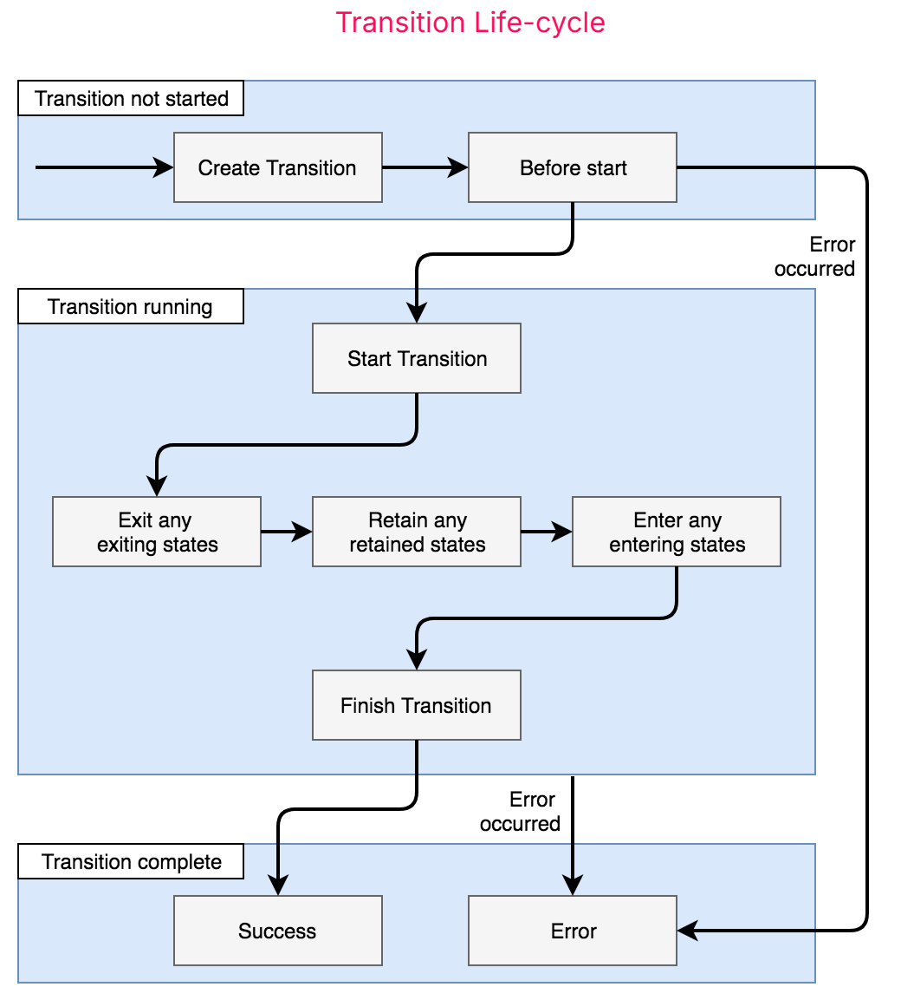

# Topic: Angular

---

# Framework Architecture Overview
Decorators are functions that modify JavaScript classes.

## Module
- Every Angular app has at least one Angular module class, [the root module](https://v2.angular.io/docs/ts/latest/guide/appmodule.html), conventionally named `AppModule`.
- An Angular module, whether a root or feature, is a class with an `@NgModule` decorator.

### Angular modules vs. JavaScript modules
- The Angular module — a class decorated with `@NgModule` — is a fundamental feature of Angular.
- In JavaScript each file is a module and all objects defined in the file belong to that module.

## Component
1. A component controls a patch of screen called a view.
2. A component's application logic is defined inside a class to describe what it does to support the view.
3. The class interacts with the view through an API of properties and methods.
4. Angular creates, updates, and destroys components as the user moves through the application.

## Templates
- A component's view is defined with its companion template, which is a form of HTML that tells Angular how to render the component.

## Metadata
- Metadata tells Angular how to process a class.
- To tell Angular that a class is a component, we have to attach metadata to the class. In TypeScript, we attach metadata by using a decorator.
- The @Component decorator, which identifies the class immediately below it as a component class.
- The metadata in the @Component tells Angular where to get the major building blocks specified for the component.
- The template, metadata, and component together describe a view.
- We must add metadata to our code so that Angular knows what to do.

## Data Binding
- It is a mechanism for coordinating parts of a template with parts of a component.
- Binding markups are added to the template HTML to tell Angular how to connect both sides.
- Angular processes all data bindings once per JavaScript event cycle, from the root of the application component tree through all child components.

## Directives
- A directive is a class with a `@Directive` decorator. When Angular renders a template, it transforms the DOM according to the instructions given by directives.
- A component is a directive-with-a-template, *i.e.* a `@Component` decorator is actually a `@Directive` decorator extended with template-oriented features.
- Structural directives alter layout by adding, removing, and replacing elements in DOM. Example: `*ngFor`
- Attribute directives alter the appearance or behavior of an existing element. In templates they look like regular HTML attributes, hence the name. Example: `ngModel`

## Services
- Angular has no definition of a service. There is no service base class, and no place to register a service.
- A service is typically a class with a narrow, well-defined purpose. It should do something specific and do it well.
- Component classes should be lean. They don't fetch data from the server, validate user input, or log directly to the console. They delegate such tasks to services.
- A good component presents properties and methods for data binding. It delegates everything nontrivial to services.

## Dependency Injection
- It is a way to supply a new instance of a class with the fully-formed dependencies it requires. Most dependencies are services.
- Angular uses dependency injection to provide new components with the services they need.
- Angular can tell which services a component needs by looking at the types of its constructor parameters.
- When Angular creates a component, it first asks an injector for the services that the component requires.


An injector maintains a container of service instances that it has previously created. If a requested service instance is not in the container, the injector makes one and adds it to the container before returning the service to Angular. When all requested services have been resolved and returned, Angular can call the component's constructor with those services as arguments. This is dependency injection.

### How does Angular know how to make a service?
- We have to register a provider of the service at first with the injector.
- A provider is something that can create or return a service, typically the service class itself. Providers can be registered in modules or in components.
- The injector is the main mechanism of dependency injection. An injector maintains a container of service instances that it created, and can create a new service instance from a provider.

## Resources
- [Architecture Overview](https://v2.angular.io/docs/ts/latest/guide/architecture.html)

---

# Basics of Application
## Environment Setup
1. Download Node.js ([check version compatibility](https://angular.dev/reference/versions))
```bash
# verify installation
node -v
npm -v
```
2. Install Angular CLI
```bash
npm install -g @angular/cli
ng version #check version
```
3. Create new Angular application
```bash
ng new angular-app
```
4. Serve the application.
```bash
ng serve
```

## Project Structure
```
angular-app/
│-- src/                # Source code
│   ├── app/            # Main application folder (components, services)
│   ├── assets/         # Static assets like images, JSON files
│   ├── environments/   # Environment-specific settings
│   ├── index.html      # Main HTML file
│   ├── main.ts         # Entry point of the application
│   ├── styles.css      # Global styles
│   ├── polyfills.ts    # Compatibility settings
│   ├── test.ts         # Test configurations
│-- angular.json        # Angular project configuration
│-- package.json        # Dependencies and scripts
│-- tsconfig.json       # TypeScript configuration
│-- README.md           # Project documentation
```

## Angular JSON
### Schematics
- Instructions for modifying a project by adding new files or modifying existing files.
- These can be configured by mapping the schematic name to a set of default options.
- The `"name"` of a schematic is in the format: `<schematic-package>:<schematic-name>`.
- Schematics for the default Angular CLI ng generate sub-commands are collected in the package `@schematics/angular`.
```json
{
    "projects": {
        "my-app": {
            "schematics": {
                "@schematics/angular:component": {
                    "standalone": false
                }
            }
        }
    }
}
```

### Architect
- It is the tool that the Angular CLI uses to perform complex tasks, such as compilation and test running.
- It is a shell that runs a specified builder to perform a given task, according to a target configuration.
- The architect section of `angular.json` contains a set of Architect targets.
- Each target object specifies
	- builder for that target, which is the npm package for the tool that Architect runs.
	- options section that configures default options for the target.
	- configurations section that names and specifies alternative configurations for the target.
```json
{
    "projects": {
        "my-app": {
            "architect": {
                "build": {
                    "builder": "@angular-devkit/build-angular:application",
                    "options": {
                        "optimization": false,
                        "styles": [
                            "src/styles.css",
                            "node_modules/devextreme/dist/css/dx.light.css"
                        ]
                    },
                    "configurations": {
                        "production": {...},
                        "development": {...}
                    }
                }
            }
        }
    }
}
```

## Resources
1. https://angular.dev/reference/configs/workspace-config
2. https://angular.dev/tools/cli/setup-local

---

# Form Handling and Validation
## Template-driven Forms
- Rely on directives in the template to create and manipulate the underlying object model.
- Useful for adding a simple form to an app, such as an email list signup form.
- Straightforward to add to an app, but not as scalable as reactive forms.
- Uses [asynchronous data flow](https://angular.dev/guide/forms#data-flow-in-template-driven-forms) between the view and the data model.
- Properties are always modified to its new value when a value change event occurs.
- Tests are deeply reliant on manual change detection execution to run properly, and require more setup.
- Good fit if form requirements are basic and logic that can be managed solely in the template.


## Reactive Forms
- Provide direct, explicit access to the underlying form's object model.
- More robust, more scalable, reusable, and testable.
- Uses [synchronous data flow](https://angular.dev/guide/forms#data-flow-in-reactive-forms) between the view and the data model, which makes creating large-scale forms easier.
- The `FormControl` instance always returns a new value when the control's value is updated.
- Requires less setup for testing, and testing does not require deep understanding of change detection to properly test form updates and validation.
- Suitable if forms are a key part of the application, or the application already using reactive patterns.


### Usage
```ts
// module
@NgModule({
  declarations: [...],
  imports: [
    // other imports ...
    ReactiveFormsModule,
  ],
  providers: [],
  bootstrap: [AppComponent],
})
export class AppModule {}

// component
@Component({
  selector: 'app-name-editor',
  templateUrl: './name-editor.component.html',
  styleUrls: ['./name-editor.component.css'],
  standalone: false,
})
export class NameEditorComponent {
  name = new FormControl('');
  updateName() {
    this.name.setValue('Nancy');
  }
}
```

```html
<label for="name">Name: </label>
<input id="name" type="text" [formControl]="name">
<p>Value: {{ name.value }}</p>
<button type="button" (click)="updateName()">Update Name</button>
```

### Grouping Form Controls
#### Form Group
- Defines a form with a fixed set of controls that can be managed together.
- Just as a form control instance gives control over a single input field, a form group instance tracks the form state of a group of form control instances.
- Each control in a form group instance is tracked by name when creating the form group.
```ts
@Component({...})
export class ProfileEditorComponent {
  profileForm = new FormGroup({
    firstName: new FormControl(''),
    lastName: new FormControl(''),
    address: new FormGroup({
      street: new FormControl(''),
      city: new FormControl(''),
      state: new FormControl(''),
      zip: new FormControl(''),
    }),
  });
  updateProfile() {
    this.profileForm.patchValue({
      firstName: 'Nancy',
      address: {
        street: '123 Drew Street',
      },
    });
  }
}
```

```html
<form [formGroup]="profileForm">
  <label for="first-name">First Name: </label><input id="first-name" type="text" formControlName="firstName">
  <label for="last-name">Last Name: </label><input id="last-name" type="text" formControlName="lastName">
  <div formGroupName="address">
    <h2>Address</h2>
    <label for="street">Street: </label><input id="street" type="text" formControlName="street">
    <label for="city">City: </label><input id="city" type="text" formControlName="city">
    <label for="state">State: </label><input id="state" type="text" formControlName="state">
    <label for="zip">Zip Code: </label><input id="zip" type="text" formControlName="zip">
  </div>
</form>
```

#### Form Array
- Defines a dynamic form, where controls can be added and removed at run time.
- A `FormArray`, just like a `FormGroup`, is also a form control container, that aggregates the values and validity state of its child components, but unlike a `FormGroup`, a `FormArray` container does not require knowing all the controls up front, as well as their names.
- It can have an undetermined number of form controls, starting at zero. The controls can then be dynamically added and removed depending on how the user interacts with the UI. Each control will then have a numeric position in the form controls array, instead of a unique name.
- Form controls can be added or removed from the form model anytime at runtime using the `FormArray` API.
```ts
private formBuilder = inject(FormBuilder);
form = this.formBuilder.group({
    lessons: this.formBuilder.array([])
});
printForm() {
    this.logger.log(this.lessons.value);
}
get lessons() {
    return this.form.controls["lessons"] as FormArray;
}
getNameGroup(index: number): FormGroup {
    return this.lessons.at(index) as FormGroup;
}
addLesson() {
    const lessonForm = this.formBuilder.group({
        title: ['', Validators.required],
        level: ['beginner', Validators.required]
    });
    this.lessons.push(lessonForm);
}
deleteLesson(lessonIndex: number) {
    this.lessons.removeAt(lessonIndex);
}
```

```html
<div [formGroup]="form">
    <ng-container formArrayName="lessons">
        @for (lessonForm of lessons.controls; track $index) {
            <div class="row" [formGroup]="getNameGroup($index)">
                <div class="col-4">
                    <input type="text" class="form-control" formControlName="title" placeholder="Enter Title">
                </div>
                <div class="col-4">
                    <input type="text" class="form-control" formControlName="level" placeholder="Enter Level">
                </div>
                <div class="col-4">
                    <button class="btn btn-primary" (click)="deleteLesson($index)">
                        <i class="fa-solid fa-trash"></i>
                    </button>
                </div>
            </div>
        }
    </ng-container>
    <button class="btn btn-primary" (click)="addLesson()"><i class="fa-solid fa-plus"></i></button>
    <button type="submit" class="btn btn-primary" [disabled]="!form.valid" (click)="printForm()">Submit Button</button>
</div>
```

## Validation
### Validating Template-driven Forms
- Same validation attributes as [native HTML form validation](https://developer.mozilla.org/docs/Web/Guide/HTML/HTML5/Constraint_validation).
- Angular uses directives to match these attributes with validator functions in the framework.

```html
<input type="text" id="name" name="name" class="form-control" required minlength="4" appForbiddenName="bob" [(ngModel)]="actor.name" #name="ngModel">
```
### Validating Reactive Forms
```ts
profileForm = this.formBuilder.group({
    firstName: ['', Validators.required]
});
```

#### Validator functions
1. Sync validators: Synchronous functions that take a control instance and immediately return either a set of validation errors or null. These are passed in as the second argument when instantiating a FormControl.
2. Async validators: Asynchronous functions that take a control instance and return a Promise or Observable that later emits a set of validation errors or null. These are passed in as the third argument when instantiating a FormControl.
For performance reasons, Angular only runs async validators if all sync validators pass. Each must complete before errors are set.

### Custom Validators
#### Defining Custom Validators
```ts
export function forbiddenNameValidator(nameRe: RegExp): ValidatorFn {
  return (control: AbstractControl): ValidationErrors | null => {
    const forbidden = nameRe.test(control.value);
    return forbidden ? {forbiddenName: {value: control.value}} : null;
  };
}
```

#### Adding Custom Validators to Template-driven Forms
- add a directive to the template, where the directive wraps the validator function.
- Angular recognizes the directive's role in the validation process because the directive registers itself with the `NG_VALIDATORS` provider.
- The directive class then implements the Validator interface, so that it can easily integrate with Angular forms.
```ts
@Directive({
  selector: '[appForbiddenName]',
  providers: [{provide: NG_VALIDATORS, useExisting: ForbiddenValidatorDirective, multi: true}],
  standalone: false,
})
export class ForbiddenValidatorDirective implements Validator {
  @Input('appForbiddenName') forbiddenName = '';
  validate(control: AbstractControl): ValidationErrors | null {
    return this.forbiddenName
      ? forbiddenNameValidator(new RegExp(this.forbiddenName, 'i'))(control)
      : null;
  }
}
```
```html
<input type="text" id="name" name="name" class="form-control" required minlength="4" appForbiddenName="bob" [(ngModel)]="actor.name" #name="ngModel">
```

#### Adding Custom Validators to Reactive Forms
```ts
this.actorForm = new FormGroup({
    name: new FormControl(this.actor.name, [
        Validators.required,
        Validators.minLength(4),
        forbiddenNameValidator(/bob/i),
    ]),
});
```

### Cross-Field Validation
- It is a custom validator that compares the values of different fields in a form and accepts or rejects them in combination.

#### Reactive Form
```ts
const actorForm = new FormGroup({
  'name': new FormControl(),
  'role': new FormControl(),
  'skill': new FormControl()
}, {
  validators: unambiguousRoleValidator
});

export const unambiguousRoleValidator: ValidatorFn = (control: AbstractControl): ValidationErrors | null => {
  const name = control.get('name');
  const role = control.get('role');
  return name && role && name.value === role.value ? {unambiguousRole: true} : null;
};
```

#### Template-driven Form
```ts
@Directive({
  selector: '[appUnambiguousRole]',
  providers: [
    {provide: NG_VALIDATORS, useExisting: UnambiguousRoleValidatorDirective, multi: true},
  ],
  standalone: false,
})
export class UnambiguousRoleValidatorDirective implements Validator {
  validate(control: AbstractControl): ValidationErrors | null {
    return unambiguousRoleValidator(control);
  }
}
```
```html
<form #actorForm="ngForm" appUnambiguousRole>
```
### Asynchronous Validator
- They have to implement the `AsyncValidatorFn` and `AsyncValidator` interfaces.
- Similar to their synchronous counterparts, with the following differences:
	- The `validate()` functions must return a Promise or an observable,
	- The observable returned must be finite, meaning it must complete at some point. To convert an infinite observable into a finite one, pipe the observable through a filtering operator such as first, last, take, or takeUntil.
- Asynchronous validation happens after the synchronous validation, and is performed only if the synchronous validation is successful.
- After asynchronous validation begins, the form control enters a pending state.

## Resources
1. https://angular.dev/guide/forms
2. https://blog.angular-university.io/angular-form-array/

---

# Browser Storage
- Web Storage, which can be accessed by using the `localStorage` and `sessionStorage` properties of the window object, is limited to 10 MiB of data maximum on all browsers.
- Browsers can store up to 5 MiB of local storage, and 5 MiB of session storage per origin.
- Once this limit is reached, browsers throw a `QuotaExceededError` exception which should be handled by using a `try...catch` block.

## Local Storage
1. Stores data permanently in the browser.
2. Data persists even after the user closes and reopens the browser.
3. The data stored inside the local storage is per-origin.
4. The computer will delete the `localStorage` object’s content in the following instances only:
	1. When the content gets cleared through JavaScript
	2. When the browser’s cache gets cleared
5. Suitable for storing user preferences, themes, tokens, etc.
6. There are inconsistencies with how browsers handle the local storage of documents not served from a web server (for instance, pages with a file: URL scheme). Therefore, the `localStorage` object may behave differently among browsers when used with non-HTTP URLs, such as `file:///document/on/users/local/system.html`.
```ts
// Store data
localStorage.setItem('username', 'JohnDoe');
// Retrieve data
const user = localStorage.getItem('username');
// Remove data
localStorage.removeItem('username');
// Clear all data
localStorage.clear();
```

## Session Storage
1. Similar to Local Storage but data is stored only for the session.
2. The data stored inside the session storage is per-origin and per-instance.
3. Per-instance means per-window or per-tab. In other words, the `sessionStorage` object’s lifespan expires once users close the instance (window or tab).
4. Suitable for temporary storage like form data, filters, etc.
```ts
// Store data
sessionStorage.setItem('sessionID', 'ABC123');
// Retrieve data
const sessionID = sessionStorage.getItem('sessionID');
// Remove data
sessionStorage.removeItem('sessionID');
// Clear all session storage
sessionStorage.clear();
```

## Cookies
1. Stores small amounts of data (usually 4KB).
2. Can have an expiration date (persistent cookies).
3. Can be accessed by both frontend and backend.
4. Cookies are sent with every HTTP request, which can impact performance.
5. Cookies do not have good support for running multiple instances of the same app. Such an attempt can cause errors such as double entry of bookings.
6. Suitable for authentication tokens, user sessions, and tracking data.
```ts
// Create a cookie (expires in 7 days)
document.cookie = "username=JohnDoe; expires=" + new Date(2025, 0, 1).toUTCString();
// Retrieve cookies
console.log(document.cookie);
// Delete a cookie (set expiration in the past)
document.cookie = "username=; expires=Thu, 01 Jan 1970 00:00:00 UTC;";
```

## `IndexedDB`
1. A NoSQL database built into the browser.
2. Used for storing large amounts of structured data.
3. Supports transactions, indexing, and queries.
4. It is more complex than Local Storage and requires event-based handling.
5. Suitable for storing offline data, caching, and complex data.

```ts
const request = indexedDB.open('MyDatabase', 1);

request.onsuccess = (event) => {
  const db = event.target.result;
  console.log('Database opened successfully', db);
};

request.onerror = (event) => {
  console.error('Database error:', event.target.error);
};
```

## When to Use Which Storage?
|   Storage Type  |  Persists After Browser Close? |           Size Limit           |              Use Case              |
|:---------------:|:------------------------------:|:------------------------------:|:----------------------------------:|
| Local Storage   | ✅ Yes                          | 5-10MB                         | User settings, theme, JWT tokens   |
| Session Storage | ❌ No (Cleared when tab closes) | 5MB                            | Temporary data like search filters |
| Cookies         | ✅ Yes (If set with expiration) | 4KB                            | Authentication, tracking data      |
| IndexedDB       | ✅ Yes                          | Unlimited (depends on browser) | Caching, large datasets            |

---

# Basic Error Handling
- Even if an application has been thoroughly tested before deployment, it is always possible that the user may encounter errors.
- A web application cannot really “crash” like a desktop application, it remains open in the current browser tab, unresponsive.

## Error Types
1. Client Side Error
	1. Since JavaScript is single-threaded in the browser, it can happen that a part of the interface freezes and an action is not performed correctly.
	2. When we reference a non-existent variable.
	3. The value provided is not in the range of allowed values.
	4. When Interpreting syntactically invalid code
	5. When a value is not of the expected type
2. HTTP Error
	1. A request to the back end fails and the front end receives an error.
	2. Although in this case it is clear that the error is coming from the back end, there is a need to take care of the error handling for every single request to the back end.
It is better to handle these errors in a centralized location so that the user is presented with consistent error messages and also to avoid forgetting to intercept errors.

## Handling Errors in a Function
```ts
try {
  let result = JSON.parse("{invalidJson"); // This will throw an error
} catch (error) {
  console.error("Error parsing JSON:", error);
}
```

## Using `HttpInterceptor` for API Error Handling
```ts
@Injectable()
export class ErrorInterceptor implements HttpInterceptor {
  intercept(req: HttpRequest<any>, next: HttpHandler): Observable<HttpEvent<any>> {
    return next.handle(req).pipe(
      catchError((error: HttpErrorResponse) => {
        let errorMessage = `Error: ${error.status} - ${error.message}`;
        console.error(errorMessage);
        alert(errorMessage); // Show alert on error
        return throwError(() => new Error(errorMessage));
      })
    );
  }
}

@NgModule({
  providers: [
    { provide: HTTP_INTERCEPTORS, useClass: ErrorInterceptor, multi: true }
  ]
})
export class AppModule {}
```

## Global Error Handler
- The default implementation of `ErrorHandler` prints error messages to the console.
- Whenever the  app throws an unhandled exception anywhere in the application angular intercepts that exception. It then invokes the method handleError(error) which writes the error messages to browser console.
- To intercept error handling, write a custom exception handler that replaces this default as appropriate.
```ts
class MyErrorHandler implements ErrorHandler {
  handleError(error) {
    // do something with the exception
  }
}
// Provide in standalone apps
bootstrapApplication(AppComponent, {
  providers: [{provide: ErrorHandler, useClass: MyErrorHandler}]
})
// Provide in module-based apps
@NgModule({
  providers: [{provide: ErrorHandler, useClass: MyErrorHandler}]
})
class MyModule {}
```

## Resources
- https://www.pkief.com/blog/global-error-handling-in-angular
- https://angular.dev/api/core/ErrorHandler
- https://www.tektutorialshub.com/angular/error-handling-in-angular-applications/

---

# Routing
- Routing helps to change what the user sees in a single-page app.
- It helps to change the view by showing or hiding portions of the display that correspond to particular components, rather than going out to the server to get a new page.

## Angular Routing
- The `Router` enables navigation by interpreting a browser URL as an instruction to change the view.
- `<base href="/">` in the `<head>` of the `index.html` file assumes that the app folder is the application root, and uses `"/"`.

### Defining basic routes
```ts
// app.config.ts
export const appConfig: ApplicationConfig = {
  providers: [provideRouter(routes)]
};

// app.routes.ts
const routes: Routes = [
  { path: 'first-component', component: FirstComponent, title: 'First component', },
  {
    path: 'second-component',
    component: SecondComponent,
    children: [
      { path: 'child-a', component: ChildAComponent },
    ]
  },
  // Componentless Routes
  {
   path: 'parent/:id',
   children: [
     { path: 'a', component: MainChild },
     { path: 'b', component: AuxChild, outlet: 'aux' }
   ]
  },
  { path: '',   redirectTo: '/first-component', pathMatch: 'full' }, // redirect
  { path: '**', component: PageNotFoundComponent } // wild-card route
];

// app.html
<a routerLink="/first-component" routerLinkActive="active" ariaCurrentWhenActive="page">First Component</a>
<a routerLink="/second-component" routerLinkActive="active" ariaCurrentWhenActive="page">Second Component</a>
<router-outlet/>

// app.component.ts
@Component({
  selector: 'app-root',
  imports: [RouterOutlet, RouterLink, RouterLinkActive],
  templateUrl: './app.component.html',
  styleUrls: ['./app.component.css']
})
export class AppComponent {}
```

### Route Order
- The order of routes is important because the `Router` uses a first-match wins strategy when matching routes, so more specific routes should be placed above less specific routes.
- List routes with a static path first, followed by an empty path route, which matches the default route.
- The wildcard route comes last because it matches every URL and the `Router` selects it only if no other routes match first.

### Lazy Loading
```ts
const routes: Routes = [
  {
    path: 'lazy',
    loadComponent: () => import('./lazy.component').then(c => c.LazyComponent)
  }
];
```

### Passing Parameters
#### Passing Path Parameters
- Use Case: Fetching product details using `id`.
```ts
// define route
const routes: Routes = [
  { path: 'product/:id', component: ProductDetailComponent }
];
// navigate
<a [routerLink]="['/product', 101]">View Product 101</a> // this is displayed as "/product/101" in URL
// get the value
constructor(private route: ActivatedRoute) {}
ngOnInit() {
  this.productId = this.route.snapshot.paramMap.get('id');
}
```

#### Passing Query Parameters
- Use Case: Filtering a list of items based on category.
```ts
// navigate
this.router.navigate(['/product'], { queryParams: { id: 101 } }); // this is displayed as "/product?id=101&&name=riyad" in URL
// get value
constructor(private route: ActivatedRoute) {}
ngOnInit() {
  this.route.queryParams.subscribe(params => {
    console.log(params['id']); // 101
  });
}
```

#### Passing Data Using the Navigation Extras Object
- Use Case: Passing sensitive data
- Navigation state allows passing non-URL data between components, but this data is lost on page refresh.
```ts
// navigate
this.router.navigate(['/checkout'], { state: { totalPrice: 2500, discount: 10 } }); // // this is displayed as "/checkout" in URL
// get value
constructor() {
  this.checkoutData = window.history.state;
  console.log(this.checkoutData.totalPrice); // 2500
  console.log(this.checkoutData.discount); // 10
}
```

#### Passing Data via Route Resolver
- Use Case: Fetching data before loading a component's view.
```ts
// create resolver service
@Injectable({ providedIn: 'root' })
export class UserResolver implements Resolve<any> {
  resolve(): Observable<any> {
    return of({ name: 'John Doe', age: 30 }); // Simulated API call
  }
}
// add resolver to route
const routes: Routes = [
  { path: 'profile', component: ProfileComponent, resolve: { user: UserResolver } }
];
// get data
constructor(private route: ActivatedRoute) {}
ngOnInit() {
  this.route.data.subscribe(data => {
    this.userData = data['user'];
    console.log(this.userData.name);
  });
}
```

## UI-Router
- A client-side router updates the browser URL as the user navigates through the single page app.
- Changes to the browser’s URL can drive navigation of the app, enabling a user to create deep-links (i.e., bookmarks) to areas deep within the application.
- Unlike Angular Router, which is URL-driven, UI-Router is state-driven.
- Uses state-based navigation instead of path-based routing.
- Allows nested and parallel views (multiple router outlets).

### States
- Each feature of an application is defined as a state.
- One state is active at any time, and UI-Router manages the transitions between the states.
- Each state describes the URL, the UI, data prerequisites, and other logical prerequisites for a feature.
- Before activating a state, UI-Router first fetches any prerequisites (asynchronously), and then activates the view/s and updates the URL.
- UI-Router states are hierarchical; states can be nested inside other states, forming a tree.
- Child states may inherit data and behavior (such as authentication) from their parent states.

#### State Properties
- `name`: A name for the state, providing a way to refer to the state
- `views`: How the UI will look and behave
- `url`: What the browser’s URL will be
- `params`: Parameter values that the state requires (such as blog-post-id)
- `resolve`: The actual data the state requires (often fetched, asynchronously, from the backend using a parameter value)

### Views
- A state defines a feature’s UI using a view, or multiple views.
- A view is a UI component, which is placed into a viewport (<ui-view>) when the state is activated.
- Views can be nested inside other views. A parent state’s view can create a viewport (<ui-view>), and an nested state can fill that viewport with their own view when activated.
```ts
var state = {
  name: 'home',
  component: HomeComponent
}
```

### URLs
- A state can define a URL, but it isn’t required.
- If a state has defined a URL, the browser’s location is updated to that URL when the state is active.
- A state’s URL is actually a URL fragment. Each state defines only the fragment of the URL that it “owns”. That fragment is appended to the parent state’s url in the browser URL when the nested state is active.

### Parameters
- When a state needs specific data, a parameter may be defined.
- Parameters can be defined in three locations:
	- Path: in the URL's path: `/foo/{fooId}` matches `123` in `http://mysite.com/foo/123`
	- Query: in the URL's query string: `/foo?fooId` matches `123` in `http://mysite.com/foo?fooId=123`
	- Non-url: arbitrary parameter data may be passed programmatically, and not reflect in the URL

### Resolve Data
- A feature often requires that some data be fetched from a server-side API. Often, that data is represented as an ID in a `url` parameter.
- The resolve mechanism allows the required to be fetched before rendering the view.
- If any of the resolve promises are rejected (perhaps due to a 401, 404, or 500 server response from a REST API), then the transition’s promise is rejected and the error hooks are invoked.
- This enables robust error handling for applications, and helps to avoid leaving the application in an inconsistent state.
- The resolve process is asynchronous. If a resolve returns a Promise, the transition is suspended until the promise is settled.
- Resolve data is made available to the views, as well as transition hooks.

### Transitions
- Transitions between states are transaction-like, i.e., they either completely succeed or completely fail.
- UI-Router provides a `Transition` object which represents a transition.
- A transition occurs any time the application state changes, or when any parameter values change.
- When a parent state is active and the user navigates to a child state, a Transition from the parent state to the child starts. Because the parent state was already entered, it is not entered a second time. Instead, the parent state is retained. The child state then becomes the active state.
- A transition will either fully succeed, or fail entirely. (Atomicity)
- Although transitions may take a long time to process, the current state remains unchanged until after the transition succeeds.



## Resources
- https://angular.dev/guide/routing
- https://ui-router.github.io/guide/

---

# Authentication and Authorization Basics

## Authentication
The process of determining whether someone or something is who or what they say they are.

## Authorization

---

# Asynchronization
HTTP Request Response
Response Processing
RxJs

---

# Package management

---

# Logging

---

# Resources
- https://roadmap.sh/angular