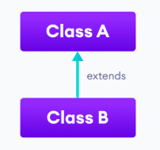
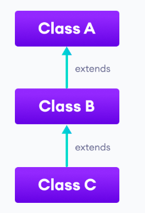
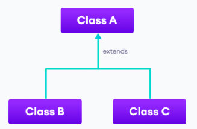
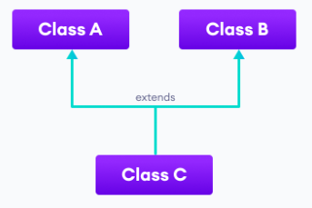
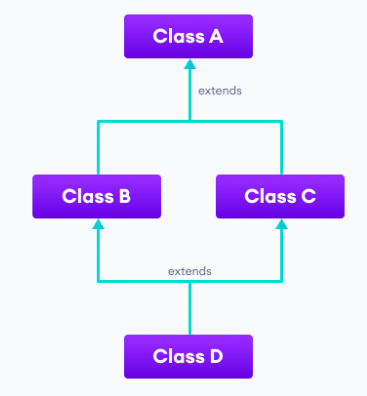
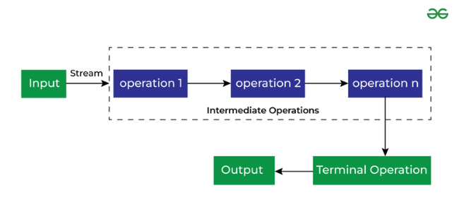
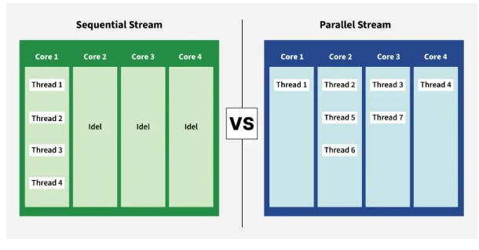
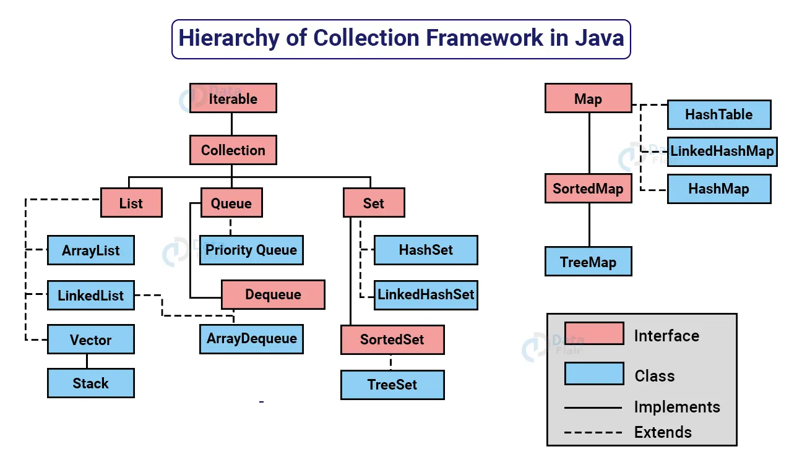

# Topic: OOP with Java

---

# Object-Oriented Programming (OOP) Concepts
Alan Kay, considered by some to be the father of object-oriented programming. In his OOP concept:
1. [Everything Is An Object](https://wiki.c2.com/?EverythingIsAnObject).
2. Objects communicate by sending and receiving messages (in terms of objects).
3. Objects have their own memory (in terms of objects).
4. Every object is an instance of a class (which must be an object).
5. The class holds the shared behavior for its instances (in the form of objects in a program list)
6. To eval a program list, control is passed to the first object and the remainder is treated as its message.

## Classes and Objects
An object is any entity that has a state and behavior. A class is a blueprint for the object.
```java
class Bicycle {
  // state or field
  private int gear = 5;

  // behavior or method
  public void braking() {
    System.out.println("Working of Braking");
  }
}
```

Here, fields/variables and methods represent the state and behavior of the object respectively.
- field s are used to store data.
- method s are used to perform some operations.
```java
Bicycle sportsBicycle = new Bicycle(); // create new object of a class
// access field and method
sportsBicycle.gear;
sportsBicycle.braking();
```

### Constructor
- A constructor in Java is similar to a method that is invoked when an object of the class is created.
- Unlike methods, a constructor has the same name as that of the class and does not have any return type.
- Constructor Types
	- Default/No-Arg Constructor: If we do not define any constructor, the compiler creates one for us by default without any parameter.
	- Parameterized constructor: Unlike default constructor, parameterized constructor have one or more parameters. This type of constructor, it is possible to initialize objects with different set of values at the time of creation. These different set of value initialized to objects must pass as an arguments when the constructor is invoked.

```java
class Company {
  String name;

  // no-arg constructor
  public Company() {
    name = "Enosis";
  }
  // parameterized constructor
  public Company(String name) {
    this.name = name;
  }
}

class Main {
  public static void main(String[] args) {
    Company enosis = new Company();
    Company google = new Company("Google");
  }
}
```

### Method Overloading
- Two or more methods may have the same name if they differ in parameters (different number of parameters, different types of parameters, or both).
- These methods are called overloaded methods and this feature is called method overloading.
- Overloaded methods may have the same or different return types, but they must differ in parameters.
- Different ways to perform method overloading:
	- Overloading by changing the number of parameters
	- Overloading by changing the data type of parameters
- It is not method overloading if we only change the return type of methods. There must be differences in the number of parameters.
```java
void func() { ... }
void func(int a) { ... }
float func(double a) { ... }
float func(int a, float b) { ... }
```

### Constructor Overloading
- Similar to Java method overloading, we can also create two or more constructors with different parameters. This is called constructor overloading.
- Based on the parameter passed during object creation, different constructors are called, and different values are assigned.
- It is also possible to call one constructor from another constructor.

## Encapsulation
- This concept involves combining data and the methods that operate on it into one unit, usually a class.
- Encapsulation protects data from accidental modification, enhances code organization, and streamlines interaction between program components.
- Containerization is concerned with packaging applications and their dependencies for deployment, whereas encapsulation is a programming concept for enclosing data and methods within classes.

### Key Components
1. Data Hiding: It involves restricting direct access to an object’s internal state. Why is it important?
	1. Data Integrity: By controlling access to data, you can ensure that it remains consistent and valid.
	2. Code Maintainability: Isolating data within a class makes code easier to understand, modify, and test.
	3. Security: Protecting sensitive data from unauthorized access is crucial in many applications.
2. Access Modifiers: These keywords determine the accessibility of classes, methods, and other members.
	1. public: accessible everywhere.
	2. protected: they can be accessed by same package and sub-classes.
	3. private: they cannot be accessed outside of the class. Trying to access them outside the class causes error.
	4. If no access modifier is defined, by default java allows to access it within the package, but not sub-classes.
|   Modifier  | Class | Package | Sub-class | Other Classes |
|:-----------:|:-----:|:-------:|:---------:|---------------|
| private     | yes   | no      | no        | no            |
| no modifier | yes   | yes     | no        | no            |
| protected   | yes   | yes     | yes       | no            |
| public      | yes   | yes     | yes       | yes           |

### The Benefits of Encapsulation
- Data Protection: By making data private, you prevent accidental or intentional modification from outside the class, ensuring data integrity.
- Increased Security: Encapsulation helps protect sensitive information by restricting access to it.
- Code Reusability: Encapsulated classes often boast greater reusability because they function as self-contained units with clearly defined interfaces.
- Improved Maintainability: Changes to the internal implementation of a class are less likely to affect other parts of the program due to encapsulation.

## Inheritance
- The `extends` keyword is used to perform inheritance in Java.
- The new class that is created is known as subclass (child or derived class) and the existing class from where the child class is derived is known as superclass (parent or base class).
- In Java, inheritance is an is-a relationship. That is, we use inheritance only if there exists an is-a relationship between two classes. Here, Dog is an Animal.
- In Java, if a class includes protected fields and methods, then these fields and methods are accessible from the subclass of the class.
- In java, Object class is the root of the class hierarchy. Every class has Object as a superclass. All objects, including arrays, implement the methods of this class.
```java
class Animal {
  String name;
  public void eat() {
    System.out.println("I can eat");
  }
}

class Dog extends Animal {
  public void display() {
    System.out.println("My name is " + name);
  }
}

class Main {
  public static void main(String[] args) {
    Dog labrador = new Dog();
    labrador.name = "Rohu";
    labrador.display();
    labrador.eat();
  }
}
```

### Types of Inheritance
1. Single Inheritance

2. Multi-level Inheritance

3. Hierarchical Inheritance

4. Multiple Inheritance: Java doesn't support multiple inheritance. However, we can achieve multiple inheritance using interfaces.

5. Hybrid Inheritance, combining hierarchical and multiple inheritance.


### `super()`
- This keyword is used to call the method of the parent class, or access properties of the parent class from the child class.
- Constructors in Java are not inherited. Hence, there is no such thing as constructor overriding in Java.
- However, we can call the constructor of the superclass from its subclasses. For that, we use `super()`.
- If we override a method in sub-class, we can still access the method from parent class using `super()`.
- Or if we have same property defined in both parent class and child class, we can access the property from parent class using `super()`.
- If we define a constructor in child class, we have to call `super()` in it. Because the compiler can automatically call the no-arg constructor. However, it cannot call parameterized constructors.
- The super should always be the first statement of the subclass constructor. Otherwise it will throw error.

### Method Overriding
- Also known as runtime polymorphism.
- If the same method is defined in both the superclass and the subclass, then the method of the subclass class overrides the method of the superclass. This is known as method overriding.
```java
class Animal {
  public void eat() {
    System.out.println("I can eat");
  }
}

class Dog extends Animal {
  @Override
  public void eat() {
    System.out.println("I eat dog food");
  }
  public void bark() {
    System.out.println("I can bark");
  }
}

class Main {
  public static void main(String[] args) {
    Dog labrador = new Dog();
    labrador.eat();
    labrador.bark();
  }
}
```
- In Java, annotations are the metadata that we used to provide information to the compiler.
- Here, the `@Override` annotation specifies the compiler that the method after this annotation overrides the method of the superclass.
- It is not mandatory to use `@Override`.
- Both the superclass and the subclass must have the same method name, the same return type and the same parameter list.
- We cannot override the method declared as final and static.
- We should always override abstract methods of the superclass.
- The same method declared in the superclass and its subclasses can have different access specifiers.
- We can only use those access specifiers in subclasses that provide larger access than the access specifier of the superclass.
- For example, if a method has protected access in super-class, the sub-class can override it to public but not to private.

## Polymorphism
- It simply means more than one form. That is, the same entity (method or operator or object) can perform different operations in different scenarios.
- Polymorphism allows us to create consistent code.
- We can achieve polymorphism in Java using the following ways:
	- Method Overriding
	- Method Overloading
	- Operator Overloading. However, java does not allow us to overload operators.
```java
class Polygon {
  public void render() {
    System.out.println("Rendering Polygon...");
  }
}

class Square extends Polygon {
  public void render() {
    System.out.println("Rendering Square...");
  }
}

class Circle extends Polygon {
  public void render() {
    System.out.println("Rendering Circle...");
  }
}

class Main {
  public static void main(String[] args) {
    Square s1 = new Square();
    s1.render();

    Circle c1 = new Circle();
    c1.render();
  }
}
```

### Compile Time Polymorphism
- Also called static polymorphism.
- Happens through method overloading.
- The compiler selects the correct version based on the method signature.
- This decision occurs at compile time.

### Runtime Polymorphism
- Also known as dynamic method dispatch.
- Occurs when a method call is resolved at runtime.
- Achieved through method overriding.
```java
class Main {
  public static void main(String[] args) {
    Polygon s1 = new Square();
    s1.render();

    Polygon c1 = new Circle();
    c1.render();
  }
}
```

## Abstraction
- It allows us to hide unnecessary details and only show the needed information.
- This allows us to manage complexity by omitting or hiding details with a simpler, higher-level idea.

### Abstract class
- Use the `abstract` keyword to declare an abstract class.
- We cannot create objects of abstract classes. But if the class has static properties/methods, we can access them via the class name, as static properties do not need objects.
- Is typically used as a base class to define a common contract for subclasses
- A method that doesn't have its body is known as an abstract method. We use the same `abstract` keyword to create abstract methods.
- An abstract class can have both the regular methods and abstract methods.
- If a class contains an abstract method, then the class should be declared abstract. Otherwise, it will generate an error.
- Though abstract classes cannot be instantiated, we can create subclasses from it. But we will have to override the abstract methods, and define them.
- We can also keep the sub-class abstract. We can then override some methods, while others remain abstract, or add more abstract methods.
- An abstract class can have constructors like the regular class. And, we can access the constructor of an abstract class from the subclass using the super keyword.
```java
abstract class Language {
  abstract void anAbstractMethod();
  void aConcreteMethod() {
    System.out.println("This is regular method");
  }
}

class Banlga extends Language {
  @override // recommended to use the annotation, but not required
  void anAbstractMethod() {
    System.out.println("Implementing the abstract method.");
  }
}

abstract class ProgrammingLanguage extends Language {
  abstract String whoCreatedThisLang();
}
```

### Interface
- An interface is a fully abstract class. It includes a group of abstract methods.
- We use the `interface` keyword to create an interface in Java.
- Like abstract classes, we cannot create objects of interfaces.
- To use an interface, other classes must implement it. We use the implements keyword to implement an interface.
- In Java, a class can also implement multiple interfaces.
- Similar to classes, interfaces can extend other interfaces. The `extends` keyword is used for extending interfaces.
- Interfaces provide specifications that a class (which implements it) must follow.
- Interfaces are also used to achieve multiple inheritance in Java.
- We can also add methods with implementation inside an interface. These methods are called default methods.
- Why do we need default methods?
	- We can have many classes implementing the interfaces. If we want to add a new method to the interface, we will have to track all the implementing classes, and implement the method. Otherwise, it will cause error.
	- If we provide a default implementation, implementing classes then later override it. Or if they don't, they won't cause error.
	- Default methods are inherited like ordinary methods.
- Similar to a class, we can access static methods of an interface using its references.
- With the release of Java 9, private methods are also supported in interfaces. We cannot create objects of an interface. Hence, private methods are used as helper methods that provide support to other methods in interfaces.
```java
interface Polygon {
  void getArea(int length, int breadth);
  public default void getSides() {
   // body of getSides()
  }
}

class Rectangle implements Polygon {
  public void getArea(int length, int breadth) {
    System.out.println("The area of the rectangle is " + (length * breadth));
  }
}
```

## Resources
1. https://wiki.c2.com/?AlanKaysDefinitionOfObjectOriented
2. https://stackify.com/oop-concept-for-beginners-what-is-encapsulation/

---

# Strings in Java
## String Class
- In Java, a string is a sequence of characters.
- Strings are immutable. This means once we create a string, we cannot change that string.
- Since `String` objects can not be changed, the objects are thread-safe.
```java
String first = "Java";
String name = new String("Java String");
int length = name.length(); // string length
String second = "Programming in " + first; // string concatenation using "+" operator
String joinedString = first.concat(" Program"); // string concatenation using String class's method
String escape = "This is the \"String\" class."; // escape sequence
```

### String Pool
- In Java, the JVM maintains a string pool to store all of its strings inside the Heap memory. The string pool helps in reusing the strings.
- While creating strings using string literals, we are directly providing the value of the string.
- Hence, the compiler first checks the string pool to see if the string already exists.
- If the string already exists, the new string is not created. Instead, the object a reference to the already existing string.
- If the string doesn't exist, a new string is created.
- While creating strings using the `new` keyword, a new string is created even if it is already present inside the string pool.
- Although String objects created with `new` keyword are created in heap, they are not added to string pool automatically. But they can be added to pool by interning.
- Using string literals can be more memory efficient due to string pool usage.
- String objects can be used when separate instances are explicitly needed.

### Why does Java use String pool?
- String is immutable Object.
- So every time some operation is performed on string, a new string object is created.
- Creating new string object every time is very expensive.
- So java added this functionality to reuse the already existing string contents.
- But this is applicable only for string literal to create string objects.

## `StringBuffer`
- `String` class creates immutable string objects.
- `StringBuffer` class is used for storing the mutable strings.
- It is faster than the `String` class and provides various additional methods.
- The memory allocation of the `StringBuffer` object is done in the heap section of memory.
- Since `String` uses string pool, changing a string causes a new string to be added to the pool, and over time this can cause memory wastage and inefficiency.
- Since `StringBuffer` is mutable, it just modifies the existing object.
- `StringBuffer` class is mostly used when we have to deal with different kinds of operations on the `String`.
- It is also is thread-safe.
- The default capacity of the `StringBuffer` is 16 bytes.
```java
StringBuffer ob = new StringBuffer();
StringBuffer ob = new StringBuffer(15); //Initialising the StringBuffer capacity to the 15 bytes
 StringBuffer ob = new StringBuffer(String);
// If the capacity of StringBuffer gets full after adding an extra String, the new capacity of StringBuffer will be (previousCapacity+1)∗2
ob.append("hello"); // append the new sequence to the existing sequence
ob.appendCodePoint(97); // takes the Unicode value and adds the String representation of the Unicode at the end of the sequence
ob.capacity(); // returns the capacity of the StringBuffer object
ob.deleteCharAt(2);
ob.setCharAt(2,'E'); // invalid index will cause an error due to an invalid range
ob.reverse();
```

## `StringBuilder`
- `StringBuilder` in Java is an alternative to `String` class, and is very similar to `StringBuffer` class.
- It represents a mutable sequence of characters.
- `StringBuilder` class operations are faster than `StringBuffer` because this class is not thread-safe.
- In most cases, operations on a string are performed on the same thread, hence `StringBuilder` class can be used.
- `StringBuilder` class is preferred over `StringBuffer` class due to its faster operations.
- `StringBuilder` class maintains a buffer array to hold the sequence of characters. When the sequence of characters is altered, the buffer array is changed accordingly to reflect the change.
- When the buffer array gets full, a new buffer array, double the size, is allocated to replace the existing array.
- Has same core methods as the `StringBuffer` class.
```java
StringBuilder ob = new StringBuilder();
StringBuilder ob = new StringBuilder(10);
CharSequence seq = "CharSequence";
StringBuilder ob = new StringBuilder(seq);
StringBuilder ob = new StringBuffer("String class object");
```

## Resources
- https://www.scaler.com/topics/java/stringbuilder-in-java/
- https://www.scaler.com/topics/java/stringbuilder-in-java/

---

# Exception Handling
## Introduction
- The code can experience errors while executing our instructions.
- Good exception handling can handle errors and gracefully re-route the program to give the user still a positive experience.
- In production, filesystems can corrupt, networks break down, and JVMs run out of memory.
- The wellbeing of our code depends on how it deals with “unhappy paths”.
- We must handle these conditions because they affect the flow of the application negatively and form exceptions.
- Without handling these exceptions, an otherwise healthy program may stop running altogether!
- Exceptions in Java are objects with all of them extending from Throwable.
```
              ---> Throwable <--- 
              |    (checked)     |
              |                  |
              |                  |
      ---> Exception           Error
      |    (checked)        (unchecked)
      |
RuntimeException
  (unchecked)
```

## Exception Types
### Checked Exceptions
- These are exceptions that the Java compiler requires us to handle.
- We have to either declaratively throw the exception up the call stack (using `throws`), or we have to handle it ourselves (with `try-catch`).
- We should use checked exceptions when we can reasonably expect the caller of our method to be able to recover.
- Examples: `IOException` and `ServletException`.

### Unchecked Exceptions
- Runtime Exceptions refer to the same thing.
- These exceptions are not checked at compile-time but run-time.
- These are exceptions that the Java compiler does not require us to handle.
- If we create an exception that extends `RuntimeException`, it will be unchecked. Otherwise, it will be checked.
- Examples: `NullPointerException`, `IllegalArgumentException`, `ArrayIndexOutOfBoundsException` and `SecurityException`.

### Errors
- These represent serious and usually irrecoverable conditions.
- For example: a library incompatibility, infinite recursion, or memory leaks, `StackOverflowError`, `OutOfMemoryError`.
- Usually, we want these to propagate all the way up.
- Even though they don’t extend `RuntimeException`, they are also unchecked.

## Try, Catch, Finally
- If we have a `try` block, then must have either of `catch` or `finally` block. Otherwise, thows will need to be added to method signature.
- Sometimes, the code can throw more than one exception, and we can have more than one `catch` block handle each individually.
- Java lets us handle subclass exceptions separately, but we have to place them higher in the list of catches.
- When we know that the way we handle errors is going to be the same, we can catch multiple exceptions in the same block.
- When we catch an exception, but do not do anything, it is called Swallowing Exception.
- If none of the statements in the try block generates an exception, the `catch` block is skipped.
- The `finally` block is always executed no matter whether there is an exception or not. This block block is optional, and there can be only one block for one `try` block.
```java
public int getPlayerScore(String playerFile) {
    try {
        Scanner contents = new Scanner(new File(playerFile));
        return Integer.parseInt(contents.nextLine());
    } catch (FileNotFoundException noFile) {
        logger.warn("File not found, resetting score.");
        return 0;
    } catch (IOException e) { // FileNotFoundException is a sub-class of IOException
        logger.warn("Player file wouldn't load!", e);
        return 0;
    } catch (NumberFormatException | IllegalArgumentException e) {
        logger.warn("Player file was corrupted!", e);
        return 0;
    } catch (Exception e) {
        // catch and swallow
        // In such cases, we should still at least add a comment stating that we intentionally ate the exception.
        // or,
        e.printStackTrace();
    } finally {
        // when we have code that needs to execute regardless of whether an exception occurs
        if (contents != null) {
            contents.close();
        }
    }
}
```

## Try with Resources
- When working with things that extend or implements `AutoCloseable` interface, we can use `try-with-resources` syntax.
- Java will automatically close the resources, even if there is any exception, without needing to close it in a `finally` block.
- We can still use a `finally` block, though, to do any other kind of cleanup we want.
```java
public int getPlayerScore(String playerFile) {
    try (Scanner contents = new Scanner(new File(playerFile))) {
      return Integer.parseInt(contents.nextLine());
    } catch (FileNotFoundException e ) {
      logger.warn("File not found, resetting score.");
      return 0;
    }
}
```

## Throw and Throws
- If we don’t want to handle the exception ourselves or we want to generate our exceptions for others to handle, then we have to throw it.
- The `throw` keyword is used to explicitly throw a single exception.
- The `throws` keyword is used to declare the type of exceptions that might occur within the method. It is used in the method declaration.
- If the exception we are throwing is checked, then we have to use `throws` with method signature as well.
- If the exception is unchecked, we don’t have to mark the method, though we can.
- We can also choose to rethrow an exception we’ve caught, or do a wrap and rethrow.
```java
public List<Player> loadAllPlayers(String playersFile) throws TimeoutException. IOException {
    if(!isFilenameValid(playersFile)) {
        throw new IllegalArgumentException("Filename isn't valid!");
    }
    try { 
        // ...
    } catch (IOException io) { 		
        throw io;
        // or, wrap it
        throw new PlayerLoadException(io);
    }
    if( someConditionFailed ) {
        throw new Exception("This operation took too long");
    } 
}
```

## Suppressed Exceptions
```java
public static void suppressedException(String filePath) throws IOException {
    FileInputStream fileIn = null;
    try {
        fileIn = new FileInputStream(filePath); // this faces error
    } catch (FileNotFoundException e) {
        throw new IOException(e); // we have handled the original error, hence suppressed
    } finally {
        fileIn.close(); // filein is null, and this will cause NullPointerException, and the calling method will not know of the original exception
    }
}

// to include suppressed exception information
public static void addSuppressedException(String filePath) throws IOException {
    Throwable firstException = null;
    FileInputStream fileIn = null;
    try {
        fileIn = new FileInputStream(filePath);
    } catch (IOException e) {
        firstException = e;
    } finally {
        try {
            fileIn.close();
        } catch (NullPointerException npe) {
            if (firstException != null) {
                npe.addSuppressed(firstException);
            }
            throw npe;
        }
    }
}

// when using AutoCloseable, it’s the exception thrown in the close method that’s suppressed. The original exception is thrown.
// to get the suppressed exceptions from try-with-resources
public void suppressedResourceException(String[] args) {
    try (MyResource r = new MyResource()) {
        throw new Exception("Exception in try block");
    } catch (Exception e) {
        System.out.println("Caught: " + e);
        for (Throwable suppressed : e.getSuppressed()) { // get the suppressed exceptions
            System.out.println("Suppressed: " + suppressed);
        }
    }
}
```

## Custom Exceptions
- Even though Java provides almost general exceptions, we may want to define custom exceptions because:
	- Business logic exceptions that are specific to the business logic and workflow. These help the application users or the developers understand what the exact problem is.
	- To catch and provide specific treatment to a subset of existing Java exceptions
- To define a custom checked exception, we have to extend the `Exception` class.
- To create a custom unchecked exception, we need to extend the `RuntimeException` class.
```java
// define a custom checked exception
public class IncorrectFileNameException extends Exception { 
    public IncorrectFileNameException(String errorMessage) {
        super(errorMessage);
    }
    // make sure root cause of the issue is included
    public IncorrectFileNameException(String errorMessage, Throwable err) {
        super(errorMessage, err);
    }
}

// throwing a custom exception
try (Scanner file = new Scanner(new File(fileName))) {
    if (file.hasNextLine())
        return file.nextLine();
} catch (FileNotFoundException e) {
    if (!isCorrectFileName(fileName)) {
        throw new IncorrectFileNameException("Incorrect filename : " + fileName );
        // or, make sure root cause of the issue is included
        throw new IncorrectFileNameException("Incorrect filename : " + fileName , err);
    }
}

// define a runtime/unchecked exception
public class IncorrectFileExtensionException 
  extends RuntimeException {
    public IncorrectFileExtensionException(String errorMessage, Throwable err) {
        super(errorMessage, err);
    }
}
```

## Resources
- https://www.baeldung.com/java-exceptions
- https://www.baeldung.com/java-new-custom-exception

---

# Date/Time API
## Introduction
- The `java.util.Date` and `java.util.Calendar` classes in Java are not thread safe. The new Date and Time APIs introduced in Java 8 are immutable and thread safe.
- The `java.util.Date` and `java.util.Calendar` APIs are poorly designed with inadequate methods to perform day-to-day operations. The new Date/Time API is ISO-centric and follows consistent domain models for date, time, duration and periods.
- Developers had to write additional logic to handle time-zone logic with the old APIs, whereas with the new APIs, handling of time zone can be done with Local and `ZonedDate`/`Time` APIs.
- The Date-Time API uses the calendar system defined in [ISO-8601](http://www.iso.org/iso/home/standards/iso8601.htm) as the default calendar.
- To use an alternative calendar system, such as Hijrah or Thai Buddhist, we have to use the `java.time.chrono` package.
- The Date-Time API uses the [Unicode Common Locale Data Repository (CLDR)](http://cldr.unicode.org/).
- The Date-Time API also uses the [Time-Zone Database (TZDB)](http://www.iana.org/time-zones).
- Most of the classes in the Date-Time API create objects that are immutable. This means that objects created from this API is thread-safe.

## `java.time`
- The main API for dates, times, instants, and durations.
- Introduced in the Java SE 8 release, provides a comprehensive model for date and time.
- Although this package is based on the International Organization for Standardization (ISO) calendar system, commonly used global calendars are also supported.
- Classes of this package are [value-based](https://docs.oracle.com/javase/8/docs/api/java/lang/doc-files/ValueBased.html). Use of identity-sensitive operations (including reference equality (`==`), identity hash code, or synchronization) on instances of `LocalDate` may have unpredictable results and should be avoided.
- The `equals` method should be used for comparisons.

### `LocalDate`
- This class represents a date in ISO-8601 calendar system without time (such as `yyyy-MM-dd`).
- This class does not store or represent a time or time-zone.
- It cannot represent an instant on the time-line without additional information such as an offset or time-zone.
```java
LocalDate localDate = LocalDate.now();
LocalDate.of(2015, 02, 20);
LocalDate.parse("2015-02-20");
LocalDate.now().plusDays(1);
LocalDate.now().minus(1, ChronoUnit.MONTHS);
DayOfWeek sunday = LocalDate.parse("2016-06-12").getDayOfWeek();
int twelve = LocalDate.parse("2016-06-12").getDayOfMonth();
boolean leapYear = LocalDate.now().isLeapYear();
boolean notBefore = LocalDate.parse("2016-06-12").isBefore(LocalDate.parse("2016-06-11"));
boolean isAfter = LocalDate.parse("2016-06-12").isAfter(LocalDate.parse("2016-06-11"));
LocalDateTime beginningOfDay = LocalDate.parse("2016-06-12").atStartOfDay();
```

### `LocalTime`
- This class represents A time without a time-zone in the ISO-8601 calendar system, such as `10:15:30`.
- Time is represented to nanosecond precision.
- This class does not store or represent a date or time-zone.
- Similar to `LocalDate`, we can create an instance of `LocalTime` from the system clock or by using parse and of methods.
```java
LocalTime now = LocalTime.now();
LocalTime sixThirty = LocalTime.parse("06:30");
LocalTime sixThirty = LocalTime.of(6, 30);
LocalTime sevenThirty = LocalTime.parse("06:30").plus(1, ChronoUnit.HOURS);
int six = LocalTime.parse("06:30").getHour();
boolean isbefore = LocalTime.parse("06:30").isBefore(LocalTime.parse("07:30"));
LocalTime maxTime = LocalTime.MAX;
```

### `LocalDateTime`
- This class is used to represent a combination of date and time.
- Represents a date-time without a time-zone in the ISO-8601 calendar system, such as `2007-12-03T10:15:30`.
- Time is represented to nanosecond precision.
- This class does not store or represent a time-zone.
- It cannot represent an instant on the time-line without additional information such as an offset or time-zone.
- Has the same methods as `LocalDate` and `LocalTime`.

### `Period` and `Duration`
- The `Period` class represents a quantity of time in terms of years, months and days.
- The `Duration` class represents a quantity of time in terms of seconds and nanoseconds.
- The duration uses nanosecond resolution with a maximum value of the seconds that can be held in a long. This is greater than the current estimated age of the universe.
- The class stores a long representing seconds and an int representing nanosecond-of-second.
- The duration is measured in "seconds", but these are not necessarily identical to the scientific "SI second" definition based on atomic clocks.
- Durations and periods differ in their treatment of daylight savings time when added to `ZonedDateTime`. A Duration will add an exact number of seconds, thus a duration of one day is always exactly 24 hours. By contrast, a `Period` will add a conceptual day, trying to maintain the local time.
```java
LocalDate initialDate = LocalDate.parse("2007-05-10");
LocalDate finalDate = initialDate.plus(Period.ofDays(5));
int five = Period.between(initialDate, finalDate).getDays();
LocalTime finalTime = initialTime.plus(Duration.ofSeconds(30));
long thirty = Duration.between(initialTime, finalTime).getSeconds();
```

### `DateTimeFormatter`
- Class is defined under `java.time.format` package.
- Formatter for printing and parsing date-time objects.
- More complex formatters are provided by `DateTimeFormatterBuilder`.
- The main date-time classes provide two methods:
	- one for formatting, format(DateTimeFormatter formatter)
	- one for parsing, parse(CharSequence text, DateTimeFormatter formatter)
- This class has multiple predefined formatters, like `ISO_LOCAL_TIME`, `RFC_1123_DATE_TIME`.
```java
String localDateString = localDateTime.format(DateTimeFormatter.ISO_DATE);
DateTimeFormatter formatter = DateTimeFormatter.ofPattern("yyyy MM dd");
LocalDate parsedDate = LocalDate.parse(localDateString, formatter);
localDateTime.format(DateTimeFormatter.ofPattern("yyyy/MM/dd"));
localDateTime
  .format(DateTimeFormatter.ofLocalizedDateTime(FormatStyle.MEDIUM)
  .withLocale(Locale.UK));
```

## Resources
- https://www.baeldung.com/java-8-date-time-intro
- https://docs.oracle.com/javase/tutorial/datetime/index.html

---

# Lambda Expressions
## Functional Interfaces
- If a Java interface contains one and only one abstract method then it is termed as functional interface.
- This only one method specifies the intended purpose of the interface.
- `@FunctionalInterface` annotation forces the Java compiler to indicate that the interface is a functional interface.
- Hence, does not allow to have more than one abstract method.
- However, it is not compulsory.
- Since we know that a functional interface has just one method, there should be no need to define the name of that method when passing it as an argument. (Lambda expression allows us to do exactly that.)
```java
import java.lang.FunctionalInterface;
@FunctionalInterface
public interface MyInterface{
    // the single abstract method
    double getValue();
}
```

## Syntax and Usage
- Lambda expression is, essentially, an anonymous or unnamed method.
- The lambda expression does not execute on its own. Instead, it is used to implement a method defined by a functional interface.
- Operator `->` used is known as an arrow operator or a lambda operator.
```java
double getPiValue() {
    return 3.1415;
}
// can be written as
() -> 3.1415 // this does not need return keyword.
// or,
() -> {
    double pi = 3.1415;
    return pi;
}; // known as a block body

// usage
MyInterface ref;
ref = () -> 3.1415;
System.out.println("Value of Pi = " + ref.getPiValue());
```

### Lambda with parameters
```java
@FunctionalInterface
interface IsEvenInterface {
    boolean isEven(Number n);
}

public class Main {
    public static void main( String[] args ) {
        IsEvenInterface ref = (n) -> n%2==0;
        System.out.println("Lambda reversed = " + ref.isEven(797));
    }

}
```

### Generic Functional Interface and Lambda Expressions
```java
@FunctionalInterface
interface GenericInterface<T> {
    T func(T t);
}

public class Main {
    public static void main( String[] args ) {
        GenericInterface<String> reverse = (str) -> {
            String result = "";
            for (int i = str.length()-1; i >= 0 ; i--)
            result += str.charAt(i);
            return result;
        };
        System.out.println("Lambda reversed = " + reverse.func("Lambda"));

        GenericInterface<Integer> factorial = (n) -> {
            int result = 1;
            for (int i = 1; i <= n; i++)
            result = i * result;
            return result;
        };
        System.out.println("factorial of 5 = " + factorial.func(5));
    }
}
```

### Lambda Expression and Stream API
```java
// if we have a stream of data, we can perform bulk operations in the stream by the combination of Stream API and Lambda expression.
// this allows us to perform operations like search, filter, map, reduce, or manipulate collections like Lists.
myPlaces.stream()
        .filter((p) -> p.startsWith("Nepal"))
        .map((p) -> p.toUpperCase())
        .sorted()
        .forEach((p) -> System.out.println(p));
```

## Method References
- We use lambda expressions to create anonymous methods.
- Sometimes, however, a lambda expression does nothing but call an existing method.
- In those cases, it's often clearer to refer to the existing method by name.
- Method references are a special type of lambda expressions that enable us to do this.
- They are compact, easy-to-read lambda expressions for methods that already have a name.
- There are four kinds of method references:
	- Static methods
	- Instance methods of particular objects
	- Instance methods of an arbitrary object of a particular type
	- Constructor
```java
// Static Methods
messages.forEach(word -> StringUtils.capitalize(word)); // instead of this
messages.forEach(StringUtils::capitalize); // use this

// Instance methods of particular objects
public class Bicycle {
    private String brand;
    private Integer frameSize;
    public Bicycle(String brand) {
        this.brand = brand;
        this.frameSize = 0;
    }
    // getters and setters
}
public class BicycleComparator implements Comparator<Bicycle> {
    @Override
    public int compare(Bicycle a, Bicycle b) {
        return a.getFrameSize().compareTo(b.getFrameSize());
    }
}
BicycleComparator bikeFrameSizeComparator = new BicycleComparator();
createBicyclesList().stream().sorted((a, b) -> bikeFrameSizeComparator.compare(a, b)); // instead of this
createBicyclesList().stream().sorted(bikeFrameSizeComparator::compare); // use this
// Instance methods of an arbitrary object of a particular type
numbers.stream().sorted((a, b) -> a.compareTo(b)); // instead of this
numbers.stream().sorted(Integer::compareTo); // use this
// Constructor
List<String> bikeBrands = Arrays.asList("Giant", "Scott", "Trek", "GT");
bikeBrands.stream()
  .map(Bicycle::new)
  .toArray(Bicycle[]::new);
```

## Resources
- https://www.baeldung.com/java-method-references

---

# Stream API
## Introduction to Streams
- Introduced in Java 8, the Stream API is used to process collections of objects.
- A stream in Java is a sequence of objects that supports various methods that can be pipelined to produce the desired result.
- Stream API is a way to express and process collections of objects, which enables us to perform operations like filtering, mapping, reducing, and sorting.
- Once a stream instance is created, it will not modify its source, therefore allowing the creation of multiple instances from a single source.
- Streams are widely used in modern Java applications for Data Processing, processing JSON/XML responses, database Operations, Concurrent Processing.

### Features
- A stream is not a data structure. Instead, it takes input from the Collections, Arrays, or I/O channels.
- Streams don’t change the original data structure, they only provide the result as per the pipelined methods.
- Each intermediate operation is lazily executed and returns a stream as a result, hence, various intermediate operations can be pipelined.
- Terminal operations mark the end of the stream and return the result.

### Creating Streams
```java
// Empty Stream
Stream<String> streamEmpty = Stream.empty();
// Stream of Collection
Collection<String> collection = Arrays.asList("a", "b", "c");
Stream<String> streamOfCollection = collection.stream();
// Stream of Array
Stream<String> streamOfArray = Stream.of("a", "b", "c");
String[] arr = new String[]{"a", "b", "c"};
Stream<String> streamOfArrayFull = Arrays.stream(arr);
Stream<String> streamOfArrayPart = Arrays.stream(arr, 1, 3);
// Stream Builder
Stream<String> streamBuilder = Stream.<String>builder().add("a").add("b").add("c").build();
// Stream Generate
Stream<String> streamGenerated = Stream.generate(() -> "element").limit(10);
```

## Stream Operations


### Intermediate Operation
- Intermediate Operations are the types of operations in which multiple methods are chained in a row.
- Methods are chained together.
- Intermediate operations transform a stream into another stream.
- It enables the concept of filtering where one method filters data and passes it to another method after processing.
- Intermediate operations are lazy. This means that they will be invoked only if it is necessary for the terminal operation execution.
```java
List<List<String>> listOfLists = Arrays.asList(
            Arrays.asList("Reflection", "Collection", "Stream"),
            Arrays.asList("Structure", "State", "Flow"),
            Arrays.asList("Sorting", "Mapping", "Reduction", "Stream")
);

// Create a set to hold intermediate results
Set<String> intermediateResults = new HashSet<>();

// Stream pipeline demonstrating various intermediate operations
List<String> result = listOfLists.stream()
            .flatMap(List::stream)                 // Flatten the list of lists into a single stream
            .filter(s -> s.startsWith("S"))        // Filter elements starting with "S"
            .map(String::toUpperCase)              // Transform each element to uppercase
            .distinct()                            // Remove duplicate elements
            .sorted()                              // Sort elements
            .peek(s -> intermediateResults.add(s)) // Perform an action (add to set) on each element
            .collect(Collectors.toList());         // Collect the final result into a list
```

### Terminal Operation
- Terminal Operations are the type of Operations that return the result.
- These Operations are not processed further just return a final result value.
```java
List<String> names = Arrays.asList(
            "Reflection", "Collection", "Stream",
            "Structure", "Sorting", "State"
);
// forEach: Print each name
names.stream().forEach(System.out::println);
// collect: Collect names starting with 'S' into a list
List<String> sNames = names.stream()
                           .filter(name -> name.startsWith("S"))
                           .collect(Collectors.toList());
// reduce: Concatenate all names into a single string
String concatenatedNames = names.stream().reduce("", (partialString, element) -> partialString + " " + element);
// count: Count the number of names
long count = names.stream().count();
// findFirst: Find the first name
Optional<String> firstName = names.stream().findFirst();
firstName.ifPresent(System.out::println);
```

## Collectors
- Collectors are used in the final step of processing a Stream.
- Implementations of Collector that implement various useful reduction operations, such as accumulating elements into collections, summarizing elements according to various criteria, etc.
- The `collect()` method is one of Java 8’s Stream API terminal methods.
- It allows us to perform mutable fold operations on data elements held in a Stream instance.
- The strategy for this operation is provided via the Collector interface implementation.
- `CollectingAndThen()` is a special collector that allows us to perform another action on a result straight after collecting ends.
- The `joining()` collector can be used for joining `Stream<String>` elements.
```java
List<String> givenList = Arrays.asList("a", "bb", "ccc", "dd");
List<String> resultLinkedList = givenList.stream().collect(toCollection(LinkedList::new));
List<String> resultList = givenList.stream().collect(toList());
Set<String> resultSet = givenList.stream().collect(toSet());
Map<String, Integer> resultMap = givenList.stream().collect(toMap(Function.identity(), String::length, (item, identicalItem) -> item));
String joiningResult = givenList.stream().collect(joining()); // "abbcccdd"
String joiningResultWithParam = givenList.stream().collect(joining(" ")); // "a bb ccc dd"
```

### Custom Collectors
If we want to write our own Collector implementation, we need to implement the Collector interface, and specify its three generic parameters: `public interface Collector<T, A, R> {...} `
1. T – the type of objects that will be available for collection
2. A – the type of a mutable accumulator object
3. R – the type of a final result
```java
public class ImmutableSetCollector<T> implements Collector<T, ImmutableSet.Builder<T>, ImmutableSet<T>> {
    @Override
    public Supplier<ImmutableSet.Builder<T>> supplier() {
        return ImmutableSet::builder;
    }
    
    @Override
    public BiConsumer<ImmutableSet.Builder<T>, T> accumulator() {
        return ImmutableSet.Builder::add;
    }
    
    @Override
    public BinaryOperator<ImmutableSet.Builder<T>> combiner() {
        return (left, right) -> left.addAll(right.build());
    }
    
    @Override
    public Function<ImmutableSet.Builder<T>, ImmutableSet<T>> finisher() {
        return ImmutableSet.Builder::build;
    }
    
    @Override
    public Set<Characteristics> characteristics() {
        return Sets.immutableEnumSet(Characteristics.UNORDERED);
    }
    
    public static <T> ImmutableSetCollector<T> toImmutableSet() {
        return new ImmutableSetCollector<>();
    }
}

// usage
List<String> givenList = Arrays.asList("a", "bb", "ccc", "dddd");
ImmutableSet<String> result = givenList.stream().collect(toImmutableSet());
```

## Parallel Streams
- Java Parallel Streams is meant for utilizing multiple cores of the processor.
- Normally any Java code has one stream of processing, where it is executed sequentially.
- Whereas by using parallel streams, we can divide the code into multiple streams that are executed in parallel on separate cores and the final result is the combination of the individual outcomes.
- The order of execution, however, is not under our control.
- Therefore, it is advisable to use parallel streams in cases where no matter what is the order of execution, the result is unaffected and the state of one element does not affect the other as well as the source of the data also remains unaffected.
- Parallel streams are best used when the order doesn’t matter, elements don’t depend on each other, and data remains unchanged.
- Parallel streams enable large-scale data processing tasks to be handled more efficiently by utilizing the full power of multi-core processors.
- A parallel stream divides the elements into multiple parts and processes them in parallel using multiple threads from the ForkJoinPool.
- May involve overhead due to thread management, so it’s most effective with CPU-bound tasks.



```java
List<Integer> numbers = Arrays.asList(1, 2, 3, 4, 5, 6, 7, 8, 9, 10);
// Convert to parallel stream and perform operations
numbers.parallelStream()
       .filter(n -> n % 2 == 0)
       .forEach(System.out::println);
// or,
numbers.stream().parallel()
       .filter(n -> n % 2 == 0)
       .forEach(System.out::println);
// ordered
numbers.parallelStream()
       .filter(n -> n % 2 == 0)
       .forEachOrdered(e -> System.out.print(e + " "));
```

### Advantages
1. High speed: Parallel Stream allows programmers to perform various operations on data elements in a concurrent and parallel manner, leading to improved performance and faster execution times.
2. Readable code: By using Parallel Stream, program code becomes more readable and easier to understand. Programmers can write data processing code in a simpler and more intuitive way using this feature.
3. Easy implementation: Using Parallel Stream is very easy and straightforward, and programmers don’t need to write any boilerplate code for performing concurrent operations on data elements.

### Disadvantages
1. High memory consumption: Using Parallel Stream can lead to higher memory usage compared to traditional methods, as creating new threads to run parallel operations incurs additional memory overhead.
2. Non-determinism: The use of Parallel Stream can lead to non-deterministic behavior, meaning that the output of the program may vary with each execution.
3. Concurrency issues: Incorrect usage of Parallel Stream can lead to concurrency issues such as race conditions and deadlocks. Therefore, programmers should use this feature carefully and pay attention to concurrency issues.

## Resources
1. https://www.geeksforgeeks.org/java/stream-in-java/
2. https://www.baeldung.com/java-8-streams
3. https://docs.oracle.com/en/java/javase/11/docs/api//java.base/java/util/stream/Collectors.html
4. https://www.geeksforgeeks.org/java/what-is-java-parallel-streams/
5. https://medium.com/@mesfandiari77/parallel-stream-in-java-ac47c54176e0
6. https://www.baeldung.com/java-parallelstream-vs-stream-parallel
7. https://medium.com/@vino7tech/difference-between-stream-and-parallel-stream-in-java-8-0c20004706d2
8. https://docs.oracle.com/javase/tutorial/collections/streams/parallelism.html

---

# Collections Framework and Data Structures
## Arrays
- An array is a collection of similar types of data.
- It is a fixed-size, ordered collection of elements of the same data type.
- Size is fixed at the time of creation, and can not be increased later.
- Trying to access index outside of array size throws `ArrayIndexOutOfBoundsException`.
```java
dataType[] arrayName; // declare an array
arrayName = new dataType[10]; // allocate memory
// or, do it together
String[] array = new String[100];
```

- `dataType` - it can be primitive data types like int, char, double, byte, etc. or Java objects.
- `arrayName` - it is an identifier.

To define the number of elements that an array can hold, we have to allocate memory for the array in Java.
```java
// declare and initialize and array
// Java compiler automatically specifies the size
int[] age = {12, 4, 5, 2, 5};
```

Each memory location is associated with a number, known as an array index. Indices always start from 0.
```java
// access array elements
age[index]
// loop through the array using for loop
for(int i = 0; i < age.length; i++) {
   System.out.println(age[i]);
}
// using enhanced for-loop
for(int a : age) {
   System.out.println(a);
}
```

### Multi-dimensional Array
- A multidimensional array is an array of arrays. Each element of a multidimensional array is an array itself.
- Unlike C/C++, each row of the multidimensional array in Java can be of different lengths.
```java
int[][] a = new int[3][4];
int[][] a = {
      {1, 2, 3}, 
      {4, 5, 6, 9}, 
      {7}, 
};
```

### Copying arrays
```java
int [] numbers = {1, 2, 3, 4, 5, 6};
int [] positiveNumbers = numbers;    // copying arrays
```

Although this allows us to create a copy, this has a problem. If we change a value in the original array, the copy array will also reflect that. Because this copy only copies the reference to the original array, and called a shallow copy. Creating a copy of the whole array (or any object) is called deep copy. To deep copy an array:
```java
arraycopy(Object src, int srcPos,Object dest, int destPos, int length)
```

Here,
- `src` - source array you want to copy
- `srcPos` - starting position (index) in the source array
- `dest` - destination array where elements will be copied from the source
- `destPos` - starting position (index) in the destination array
- `length` - number of elements to copy

Or,
```java
int[] destination = Arrays.copyOfRange(source, 0, source.length);
```

To copy a multi-dimensional array, we will have to iterate through the array and copy by 1 dimension.

## Overview of Java Collections
- The Java Collections Framework (JCF) is a unified architecture for representing and manipulating groups of objects.
- It provides interfaces, implementations, and algorithms to work with data structures more efficiently and flexibly than arrays.
- It does not allow using primitive types.
- It helps us to reduce the need to write custom data structures.
- It also provides ready-made implementations of common algorithms (search, sort, shuffle).
- `Collection` is the root interface of the collection framework, which extends the `Iterable` interface.
- Java does not provide direct implementations of the `Collection` interface but provides implementations of its sub-interfaces like `List`, `Set`, and `Queue`.
- The collections framework allows us to use a specific data structure for a particular type of data.



### Benefits of the framework
1. Reusable and standard implementation of common data structures.
2. Better memory management and performance, and easier data handling.
3. Common operations like searching and sorting are implemented.
4. Polymorphism and interchangeability.
5. Generics for type safety.
6. Consistent APIs like `add()`, `remove()`, `size()`, `contains()` etc.
7. Has thread safe options available.

## Interfaces
### `List`
- The `List` interface is an ordered collection that allows us to store and access elements sequentially.
- Allows duplicate elements.
- Maintains the insertion order.
- Provides indexed access to elements.
- Implementing classes:
	- `ArrayList`
		- It allows us to create resizable arrays.
		- Unlike arrays, `Arraylist`s can automatically adjust their capacity when we add or remove elements from them. Hence, `Arraylist`s are also known as dynamic arrays.
		- Random access is fast (`O(1)`), whereas insertion in the middle is slow (`O(n)`).
		- Not thread-safe.
		- Use `Collections.synchronizedList()` to ensure thread safety.
	- `LinkedList`
		- This follows doubly linked list structure.
		- Also implements the Deque interface.
		- Random access is slow (`O(n)`), but insertion in the middle is fast (`O(1)`).
		- Not thread-safe.
	- `Vector`
		- Thread-safe, i.e. it automatically applies a lock when performing some operation.
		- This continuous use of lock for each operation makes vectors less efficient.
		- This is a legacy class. Modern applications should use synchronized array list to ensure thread safety and better performance.
	- `Stack`
		- Follows the LIFO principle.
		- Extends the `Vector` class.
		- Uses `push()` and `pop()` methods, instead of `add()` and `remove()`.
		- Uses `peek()` to see the top element.
		- Allows to access individual element since it extends the Vector class, which a stack should not.
		- Since it extends Vector class, it is also thread safe.
		- This is a legacy class. Modern applications should use `ArrayDeque` class instead.

```java
List<String> list = new ArrayList<>();
Vector<Integer> vector= new Vector<>();
Stack<Integer> stacks = new Stack<>();
```

### `Set`
- Provides the features of the mathematical set in Java.
- Unlike Lists, sets cannot have duplicate elements.
- Elements in sets are stored in groups like sets in mathematics.
- APIs
	- `add()` and `addAll()` - does the union operation.
	- `retailnAll()` - does the intersection operation.
	- `remove()` and `removeAll()` - does the difference operation.
	- `iterator() `
- Extending Interfaces
	- `SortedSet` - used to store elements with some order in a set. `TreeSet` is an implementing class.
	- `NavigableSet` - provides the features to navigate among the set elements. It is considered as a type of SortedSet. `TreeSet` is an implementing class.
- Implementing classes
	- `HashSet` - provides the functionalities of the hash table data structure.
	- `LinkedHashSet` - provides functionalities of both the hashtable and the linked list data structure.
	- `TreeSet` - provides the functionality of a tree data structure.
		- Unlike `HashSet`, elements in `TreeSet` are stored in some order. It is because `TreeSet` implements the SortedSet interface as well.
		- `HashSet` is faster than the `TreeSet` for basic operations like add, remove, contains and size.
	- EnumSet 

### `Queue`
- Elements are stored in FIFO manner.
- Does not allow random access.
- Usually used for task scheduling, buffering, etc.
- APIs
	- `add()` - adds an element. return true if operation is successful, throws exception otherwise.
	- `offer()` - adds an element. return true if operation is successful, false otherwise.
	- `element()` - returns the head of the queue. Throws an exception if the queue is empty.
	- `peek()` - Returns the head of the queue. Returns null if the queue is empty.
	- `remove()` - Returns and removes the head of the queue. Throws an exception if the queue is empty.
	- `poll()` - Returns and removes the head of the queue. Returns null if the queue is empty.
- Interfaces that extend Queue 
	- `Deque`: provides the functionality of a double-ended queue. `ArrayDeque` and LinkedList are implementing classes.
	- `BlockingQueue`: allows any operation to wait until it can be successfully performed. For example, if we want to delete an element from an empty queue, then the blocking queue allows the delete operation to wait until the queue contains some elements to be deleted. `ArrayBlockingQueue` and `LinkedBlockingQueue` are implementing classes.
	- `BlockingDeque`: same as `BlockingQueue`, but for `Deque`.
- Implementing classes
	- `PriorityQueue`: provides the functionality of heap data structure. The head always appears as sorted, but the rest may not.

### `Map`
- Elements of Map are stored in key/value pairs.
- Keys are unique values associated with individual Values.
- A map cannot contain duplicate keys. And, each key is associated with a single value.
- We can access and modify values using the keys associated with them.
- The Map interface maintains 3 different sets:
	- the set of keys, `keySet() `
	- the set of values, `values() `
	- the set of key/value associations, `entrySet() `
- APIs
	- `put(K, V)`, `putIfAbsent(K, V) `
	- `get(K)` - if key not found, returns null 
	- `getOrDefault(K, defaultValue) `
	- `containsKey(K)`, `containsValue(V)`
	- `replace(K, V)`
	- `remove(K)`
- Extending Interface
	- `SortedMap`  - provides sorting of keys stored in a map. `TreeMap` is an implementing class.
	- `NavigableMap` - provides the features to navigate among the map entries. It is considered as a type of `SortedMap`. `TreeMap` is an implementing class.
	- `ConcurrentMap` - provides a thread-safe map. `ConcurrentHashMap` is an implementing class.
- Implementing classes
	- `HashMap` - provides the functionality of the hash table data structure. The default capacity will be 16 and the default load factor will be 0.75. This means the hash table will be created to hold 16 elements, and once 75% of the table is populated, the elements will be moved to a new table with double capacity.
	- `LinkedHashMap` - Hash table and linked list implementation of the Map interface, with predictable iteration order. It maintains a doubly-linked list. Since it uses the linked list, it requires more storage than HashMap. It is also slower.
	- `EnumMap` 
	- `WeakHashMap` - Keys are of the `WeakReference` type. The object of a weak reference type can be garbage collected in Java if the reference is no longer used in the program. This is useful to save resources.

## Iterators and Enhanced for-loop
### `Iterator`
- This interface allows us to access elements of a collection. It has a sub-interface `ListIterator`.
- All the Java collections include an `iterator()` method. This method returns an instance of iterator used to iterate over elements of collections.
- `hasNext()` - returns true if there exists an element in the collection.
- `next()` - returns the next element of the collection.
- `remove()` - removes the last element returned by the `next()`.
- `forEachRemaining()` - performs the specified action for each remaining element of the collection.

### `ListIterator`
- This interface provides the functionality to access elements of a list.
- It is bidirectional.
- `nextIndex()` returns the index of the element that the `next()` method will return.
- `previous()` - returns the previous element of the list.
- `previousIndex()` - returns the index of the element that the `previous()` method will return.
- `set()` - replaces the element returned by either `next()` or `previous()` with the specified element.

### Enhanced for loop/for-each loop
- A simpler, more readable way to iterate over arrays and collections.
- Internally uses Iterator for collections.
- No need to manage index or call `.get()`.
```java
int[] numbers = {1, 2, 3, 4};
for (int num : numbers) {
    System.out.println(num);
}

List<String> names = List.of("Alice", "Bob", "Charlie");
for (String name : names) {
    System.out.println(name);
}
```

## Comparable and Comparator Interfaces
- Java provides some inbuilt methods to sort primitive types array or Wrapper classes array or list. But what about objects?
- `Comparable` and `Comparator` are core interfaces used for sorting objects in Java.
- Both interfaces use Generics for compile-time type checking.
- We should use `Comparable` to provide default sorting, and `Comparator` to provide custom sorting for different scenarios.

### `Comparable`
- Java provides `Comparable` interface which should be implemented by any custom class if we want to use Arrays or Collections sorting methods.
- It has `compareTo(T obj)` method which is used by sorting methods.
- We should override this method in such a way that it returns a negative integer, zero, or a positive integer if `this` object is less than, equal to, or greater than the object passed as an argument.
```java
public class Employee implements Comparable<Employee> {
    private int id;
    @Override
    public int compareTo(Employee emp) {
        return (this.id - emp.id);
    }
}
```
But what if we want to sort objects differently in different scenarios?

### `Comparator`
- This interface allows to provide different ways of sorting objects of a class.
- Implementations of `Comparator` interface are anonymous classes.
```java
public class Employee {
    private int id;
    private String name;
    private int age;
    private int salary;

    public static Comparator<Employee> SalaryComparator = new Comparator<Employee>() {
        @Override
        public int compare(Employee e1, Employee e2) {
            return e1.getSalary() - e2.getSalary();
        }
    };
    public static Comparator<Employee> AgeComparator = new Comparator<Employee>() {
        @Override
        public int compare(Employee e1, Employee e2) {
            return e1.getAge() - e2.getAge();
        }
    };
    public static Comparator<Employee> NameComparator = new Comparator<Employee>() {
        @Override
        public int compare(Employee e1, Employee e2) {
            return e1.getName().compareTo(e2.getName());
        }
    };
}

// using comparator to sort
Arrays.sort(empArr, Employee.SalaryComparator);

// or,
public class EmployeeComparatorByIdAndName implements Comparator<Employee> {
    @Override
    public int compare(Employee o1, Employee o2) {
        int flag = o1.getId() - o2.getId();
        if(flag==0) flag = o1.getName().compareTo(o2.getName());
        return flag;
    }
}
Arrays.sort(empArr, new EmployeeComparatorByIdAndName());
```

## Algorithms
- The framework provides various static algorithms that can be used to manipulate elements stored in data structures.
- Since algorithms can be used on various collections, these are also known as generic algorithms.
- `Collections.sort(data)` uses the merge sort algorithm. Modifies the object directly.
- `Collections.reverse(data)` - reverses the order of elements
- `Collections.fill(data, 0)` - replace every element in a collection with the specified value
- `Collections.copy(newObj, oldObj)` - creates a copy of elements from the specified source to destination. While performing the operation, both the lists should be of the same size.
- `Collections.swap(data, 0, 6)` - swaps the position of two elements in a collection.
- `Collections.binarySearch(data, 4)`

## Resources
- https://www.digitalocean.com/community/tutorials/comparable-and-comparator-in-java-example

---

# Generics
## Introduction
- Java Generics allows us to create a single class, interface, and method that can be used with different types of data (objects).
- This helps us to reuse our code.
- But it does not work with primitive types.
- `T` used inside the angle bracket `<>` indicates the type parameter.
```java
// create a generics class
class GenericsClass<T> {
  // variable of T type
  private T data;
  public GenericsClass(T data) {
    this.data = data;
  }
  // method that return T type variable
  public T getData() {
    return this.data;
  }
}

class DemoClass {
  // creae a generics method
  public <T> void genericsMethod(T data) {
    System.out.println("Generics Method:");
    System.out.println("Data Passed: " + data);
  }
}

class Main {
  public static void main(String[] args) {
    GenericsClass<Integer> intObj = new GenericsClass<>(5);
    System.out.println("Generic Class returns: " + intObj.getData());
    GenericsClass<String> stringObj = new GenericsClass<>("Java Programming");
    System.out.println("Generic Class returns: " + stringObj.getData());

    DemoClass demo = new DemoClass();
    demo.<String>genericsMethod("Java Programming");
    demo.<Integer>genericsMethod(25);
    // We can call the generics method without including the type parameter. In this case, the compiler can match the type parameter based on the value passed to the method.
  }
}
```

## Advantages
1. Code Reusability
2. Compile-time Type Checking: The type parameter of generics provides information about the type of data used in the generics code.
   `GenericsClass<Integer> list = new GenericsClass<>(); `
   For this instance, if we try to pass in any other object of type than Integer, it will cause error at compile time.
3. The collections framework uses the concept.

## Bounded Type Parameters
- In general, the type parameter can accept any data types (except primitive types).
- However, if we want to use generics for some specific types (such as accept data of number types) only, then we can use bounded types.
- In the case of bound types, we use the `extends` keyword.
```java
class GenericsClass <T extends Number> {
  // this class can only work with data types that are children of Number (Integer, Double, and so on).
  // if we create object with Type that are not children of Number, it will cause error.
  public void display() {
    System.out.println("This is a bounded type generics class.");
  }
}

public class Box<T> {
    private T t;          

    public void set(T t) {
        this.t = t;
    }
    public T get() {
        return t;
    }
    public <U extends Number> void inspect(U u){
        System.out.println("T: " + t.getClass().getName());
        System.out.println("U: " + u.getClass().getName());
    }
}

// multiple bounds
<T extends B1 & B2 & B3>
```

## Wildcards
- In generic code, the question mark (?), called the wildcard, represents an unknown type.
- The wildcard can be used in a variety of situations: as the type of a parameter, field, or local variable; sometimes as a return type (though it is better programming practice to be more specific).
- The wildcard is never used as a type argument for a generic method invocation, a generic class instance creation, or a supertype.

### Upper Bounded Wildcards
```java
public static void process(List<? extends Number> list) {
  // matches Number and any subtype of Number.
  // The method can access the list elements as type Number.
}
```

### Lower Bounded Wildcards
```java
public static void addNumbers(List<? super Integer> list) {
    // lower bounded wildcard restricts the unknown type to be a specific type or a super type of that type.
    // You can specify an upper bound for a wildcard, or you can specify a lower bound, but you cannot specify both.
    for (int i = 1; i <= 10; i++) {}
}
```

### Unbounded Wildcards
```java
public static void printList(List<?> list) {
    for (Object elem: list) {}
}
```

## Resources
- https://docs.oracle.com/javase/tutorial/java/generics/bounded.html
- https://docs.oracle.com/javase/tutorial/java/generics/wildcards.html

---

# Java I/O (Input/Output)
- In Java, streams are the sequence of data that are read from the source and written to the destination.
- An input stream is used to read data from the source.
- An output stream is used to write data to the destination.
- For example, the `System.out` is a type of output stream.
- Depending upon the data a stream holds, it can be classified into:
	- Byte Stream
	- Character Stream

## Byte Streams
- It is used to read and write a single byte (8 bits) of data.
- All byte stream classes are derived from base abstract classes called `InputStream` and `OutputStream`.

### `InputStream`
- It is an abstract superclass in the java.io package that represents an input stream of bytes.
- Methods
	- `read()` - reads one byte of data from the input stream.
	- `read(byte[] array)` - reads bytes from the stream and stores in the specified array.
	- `available()` - returns the number of bytes available in the input stream.
	- `mark()` - marks the position in the input stream up to which data has been read.
	- `reset()` - returns the control to the point in the stream where the mark was set.
	- `markSupported()` - checks if the `mark()` and `reset()` method is supported in the stream.
	- `skips()` - skips and discards the specified number of bytes from the input stream.
	- `close()` - closes the input stream.
- Sub-classes
	- `FileInputStream` - used to read data (in bytes) from files.
	- `ByteArrayInputStream` - used to read an array of input data (in bytes).
	- `ObjectInputStream`- mainly used to read data written by the `ObjectOutputStream`.
	- `BufferedInputStream` - used with other input streams to read the data (in bytes) more efficiently. It maintains an internal buffer of 8192 bytes. It reads a chunk of bytes from the disk and stores in the internal buffer. And from the internal buffer bytes are read individually. The number of communication to the disk is reduced, and hence faster operation.

### `OutputStream`
- It is an abstract superclass in the `java.io` package that represents an output stream of bytes.
- Methods
	- `write(int b)` - writes the specified byte to the output stream.
	- `write(byte[] array)` - writes the bytes from the specified array to the output stream.
	- `flush()` - forces to write all data present in output stream to the destination.
	- `close()` - closes the output stream.
- Sub-classes
	- `FileOutputStream` - used to write data (in bytes) to the files.
	- `ByteArrayOutputStream` class of the `java.io` package can be used to write an array of output data (in bytes).
	- `ObjectOutputStream` - encodes Java objects using the class name and object values. It converts Java objects into corresponding streams. This is known as serialization. Objects need to be serialized while writing to the stream, because this class only writes those objects that implement the `Serializable` interface.
	- `BufferedOutputStream` - used with other output streams to write the data (in bytes) more efficiently. It maintains an internal buffer of 8192 bytes and the mechanism is similar to `BufferedInputStream`.
	- `PrintStream` - used to write output data in commonly readable form instead of bytes.
		- Unlike other output streams, this class converts the primitive data into the text format instead of bytes. It then writes that formatted data to the output stream.
		- And also, this class does not throw any input/output exception. Instead, we need to use the `checkError()` method to find any error in it.
		- The `PrintStream` class also has a feature of auto flushing. This means it forces the output stream to write all the data to the destination under one of the following conditions:
			- if newline character `\n` is written in the print stream.
			- if the `println()` method is invoked.
			- if an array of bytes is written in the print stream.

## Character Streams
- It is used to read and write a single character of data.
- All the character stream classes are derived from base abstract classes `Reader` and `Writer`.

### `Reader`
- A class of the `java.io` package.
- Is an abstract superclass that represents a stream of characters.
- Sub-classes
	- `BufferedReader` - Used with other readers to read data (in characters) more efficiently.
	- `InputStreamReader`
		- Used to convert data in bytes into data in characters.
		- It is also known as a bridge between byte streams and character streams.
	- `FileReader`
		- Used to read data (in characters) from files.
		- new `FileReader(String fileName)` to read files with file name.
		- new `FileReader(File fileObj)` to read using file object.
	- `StringReader`
		- Used to read data (in characters) from strings.
		- The specified string acts as a source from where characters are read individually.
- Methods
	- `ready()` - checks if the reader is ready to be read.
	- `read(char[] array)` - reads the characters from the stream and stores in the specified array.
	- `read(char[] array, int start, int length)` - reads the number of characters equal to length from the stream and stores in the specified array starting from the start.
	- `getEncoding()` - gets the type of encoding that is used to store data in the input stream/file.
	- `mark()` - marks the position in the stream up to which data has been read.
	- `reset()` - returns the control to the point in the stream where the mark is set.
	- `skip()` - discards the specified number of characters from the stream.
	- `close()` - closes the reader.

### `Writer`
- A class of the `java.io` package.
- Is an abstract superclass that represents a stream of characters.
- Sub-classes
	- `BufferedWriter` - used with other writers to write data (in characters) more efficiently.
	- `OutputStreamWriter`
		- Used to convert data in character form into data in bytes form.
		- `flush()` - forces to write all the data present in the writer to the corresponding destination.
		- `append()` - inserts the specified character to the current writer.
	- `FileWriter`
		- Used to write data (in characters) to files.
		- `new FileWriter(String fileName)` to create file writer with file name.
		- `new FileWriter(File fileObj)` to file writer using file object.
	- `StringWriter`
		- used to write data (in characters) to the string buffer.
		- In Java, string buffer is considered as a mutable string.
		- `getBuffer()` - returns the data present in the string buffer.
	- `PrintWriter` 
		- used to write output data in a commonly readable form (text).
		- Unlike other writers, PrintWriter converts the primitive data(`int`, `float`, `char`, etc.) into the text format. It then writes that formatted data to the writer.
		- This class does not throw any input/output exception. Instead, we need to use the `checkError()` method to find any error in it.
		- It also has a feature of auto flushing. This means it forces the writer to write all data to the destination if one of the `println()` or `printf()` methods is called.
- Methods
	- `write(char[] array)` - writes the characters from the specified array to the output stream.
	- `write(String data)` - writes the specified string to the writer.
	- `append(char c)` - inserts the specified character to the current writer.
	- `flush()` - forces to write all the data present in the writer to the corresponding destination.
	- `close()` - closes the writer.

## Buffered Streams
- Streams usually use unbuffered I/O, which means each read or write request is handled directly by the underlying OS.
- This can make a program much less efficient, since each such request often triggers disk access, network activity, or some other operation that is relatively expensive.
- Buffered input streams read data from a memory area known as a buffer.
- The native input API is called only when the buffer is empty.
- Buffered output streams write data to a buffer, and the native output API is called only when the buffer is full.
- A program can convert an unbuffered stream into a buffered stream. The unbuffered stream object is passed to the constructor for a buffered stream class.
- It often makes sense to write out a buffer at critical points, without waiting for it to fill. This is known as flushing the buffer.
- To flush a stream manually, invoke its flush method.
- The flush method is valid on any output stream, but has no effect unless the stream is buffered.
- There are four buffered stream classes used to wrap unbuffered streams:
	- `BufferedInputStream` and `BufferedOutputStream` create buffered byte streams.
	- `BufferedReader` and `BufferedWriter` create buffered character streams.

## Serialization and Deserialization
- Serialization is the conversion of the state of an object into a byte stream. Deserialization does the opposite.
- The serialization process is instance-independent, i.e. we can serialize objects on one platform and deserialize them on another.
- Classes that are eligible for serialization need to implement `Serializable` interface.
- When a class implements the `Serializable` interface, all its sub-classes are serializable as well.
- Static fields belong to a class (as opposed to an object) and are not serialized.
- When an object has a reference to another object, these objects must implement the `Serializable` interface separately, or else a `NotSerializableException` will be thrown.
- The JVM associates a version (`long`) number with each serializable class. We use it to verify that the saved and loaded objects have the same attributes, and thus are compatible on serialization. Most IDEs can generate this number automatically
- If a serializable class doesn’t declare a `serialVersionUID`, the JVM will generate one automatically at run-time.
- However, it’s highly recommended that each class declares its `serialVersionUID`, as the generated one is compiler dependent and thus may result in unexpected `InvalidClassExceptions`.

```java
public class Person implements Serializable {
    private static final long serialVersionUID = 1L;
    static String country = "ITALY";
    private int age;
    private String name;
    transient int height; // use the keyword transient to ignore class fields during serialization.
    private Address country; // Address must be serializable too, otherwise NotSerializableException
    private List<Phone> phoneList; // Phone must be serializable too, otherwise NotSerializableException
    // getters and setters
}
```

### Custom Serialization
- Custom serialization can be particularly useful when trying to serialize an object that has some un-serializable attributes.
- Classes need to have `writeObject` and `readObject`  methods implemented.
```java
public class Employee implements Serializable {
    private static final long serialVersionUID = 1L;
    private transient Address address;
    private Person person;

    // setters and getters

    private void writeObject(ObjectOutputStream oos) throws IOException {
        oos.defaultWriteObject();
        oos.writeObject(address.getHouseNumber());
    }

    private void readObject(ObjectInputStream ois) throws ClassNotFoundException, IOException {
        ois.defaultReadObject();
        Integer houseNumber = (Integer) ois.readObject();
        Address a = new Address();
        a.setHouseNumber(houseNumber);
        this.setAddress(a);
    }
}
```

## File Handling
- `File` - a class of the `java.io` package. Used to perform various operations on files and directories.
- A file object in Java is an abstract representation of the file or directory pathname.

```java
File file = new File(String pathName); // creates an object of File using the path
file.createNewFile(); // true if a new file is created, false if the file already exists in the specified location.

FileWriter output = new FileWriter(file); // Creates a Writer using FileWriter
output.write("This is the data in the output file");
output.close();

FileReader input = new FileReader(file); // Creates a reader using the FileReader
char[] array = new char[100];
input.read(array);
input.close();

file.delete(); // true if the file is deleted, false if the file does not exist.
```

## Resources
- https://docs.oracle.com/javase/tutorial/essential/io/buffers.html
- https://www.baeldung.com/java-serialization

---

# Resources
1. https://www.programiz.com/java-programming
2. https://docs.oracle.com/javase/specs/jls/se20/html/index.html
3. [Core Java frequently asked Interview Questions and Answers](https://youtube.com/playlist?list=PLyHJZXNdCXscoyL5XEZoHHZ86_6h3GWE1&si=442zRiYZNPX4t88P)