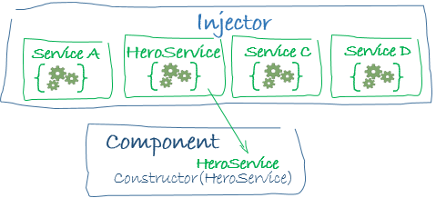

# Framework Architecture Overview
Decorators are functions that modify JavaScript classes.

## Module
- Every Angular app has at least one Angular module class, [the root module](https://v2.angular.io/docs/ts/latest/guide/appmodule.html), conventionally named `AppModule`.
- An Angular module, whether a root or feature, is a class with an `@NgModule` decorator.

### Angular modules vs. JavaScript modules
- The Angular module — a class decorated with `@NgModule` — is a fundamental feature of Angular.
- In JavaScript each file is a module and all objects defined in the file belong to that module.

## Component
1. A component controls a patch of screen called a view.
2. A component's application logic is defined inside a class to describe what it does to support the view.
3. The class interacts with the view through an API of properties and methods.
4. Angular creates, updates, and destroys components as the user moves through the application.

## Templates
- A component's view is defined with its companion template, which is a form of HTML that tells Angular how to render the component.

## Metadata
- Metadata tells Angular how to process a class.
- To tell Angular that a class is a component, we have to attach metadata to the class. In TypeScript, we attach metadata by using a decorator.
- The @Component decorator, which identifies the class immediately below it as a component class.
- The metadata in the @Component tells Angular where to get the major building blocks specified for the component.
- The template, metadata, and component together describe a view.
- We must add metadata to our code so that Angular knows what to do.

## Data Binding
- It is a mechanism for coordinating parts of a template with parts of a component.
- Binding markups are added to the template HTML to tell Angular how to connect both sides.
- Angular processes all data bindings once per JavaScript event cycle, from the root of the application component tree through all child components.

## Directives
- A directive is a class with a `@Directive` decorator. When Angular renders a template, it transforms the DOM according to the instructions given by directives.
- A component is a directive-with-a-template, *i.e.* a `@Component` decorator is actually a `@Directive` decorator extended with template-oriented features.
- Structural directives alter layout by adding, removing, and replacing elements in DOM. Example: `*ngFor`
- Attribute directives alter the appearance or behavior of an existing element. In templates they look like regular HTML attributes, hence the name. Example: `ngModel`

## Services
- Angular has no definition of a service. There is no service base class, and no place to register a service.
- A service is typically a class with a narrow, well-defined purpose. It should do something specific and do it well.
- Component classes should be lean. They don't fetch data from the server, validate user input, or log directly to the console. They delegate such tasks to services.
- A good component presents properties and methods for data binding. It delegates everything nontrivial to services.

## Dependency Injection
- It is a way to supply a new instance of a class with the fully-formed dependencies it requires. Most dependencies are services.
- Angular uses dependency injection to provide new components with the services they need.
- Angular can tell which services a component needs by looking at the types of its constructor parameters.
- When Angular creates a component, it first asks an injector for the services that the component requires.

An injector maintains a container of service instances that it has previously created. If a requested service instance is not in the container, the injector makes one and adds it to the container before returning the service to Angular. When all requested services have been resolved and returned, Angular can call the component's constructor with those services as arguments. This is dependency injection.

### How does Angular know how to make a service?
- We have to register a provider of the service at first with the injector.
- A provider is something that can create or return a service, typically the service class itself. Providers can be registered in modules or in components.
- The injector is the main mechanism of dependency injection. An injector maintains a container of service instances that it created, and can create a new service instance from a provider.

## Resources
- [Architecture Overview](https://v2.angular.io/docs/ts/latest/guide/architecture.html)