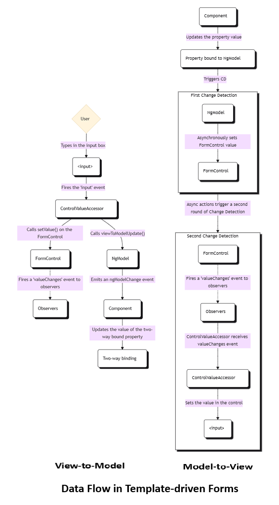
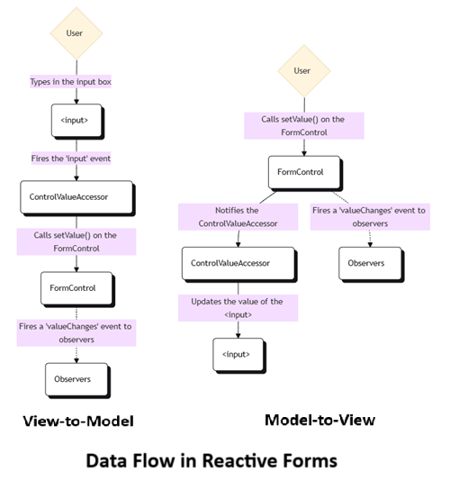

# 03 - Form Handling and Validation

## Template-driven Forms
- Rely on directives in the template to create and manipulate the underlying object model.
- Useful for adding a simple form to an app, such as an email list signup form.
- Straightforward to add to an app, but not as scalable as reactive forms.
- Uses [asynchronous data flow](https://angular.dev/guide/forms#data-flow-in-template-driven-forms) between the view and the data model.
- Properties are always modified to its new value when a value change event occurs.
- Tests are deeply reliant on manual change detection execution to run properly, and require more setup.
- Good fit if form requirements are basic and logic that can be managed solely in the template.



## Reactive Forms
- Provide direct, explicit access to the underlying form's object model.
- More robust, more scalable, reusable, and testable.
- Uses [synchronous data flow](https://angular.dev/guide/forms#data-flow-in-reactive-forms) between the view and the data model, which makes creating large-scale forms easier.
- The `FormControl` instance always returns a new value when the control's value is updated.
- Requires less setup for testing, and testing does not require deep understanding of change detection to properly test form updates and validation.
- Suitable if forms are a key part of the application, or the application already using reactive patterns.



### Usage

```ts
// module
@NgModule({
  declarations: [...],
  imports: [
    // other imports ...
    ReactiveFormsModule,
  ],
  providers: [],
  bootstrap: [AppComponent],
})
export class AppModule {}

// component
@Component({
  selector: 'app-name-editor',
  templateUrl: './name-editor.component.html',
  styleUrls: ['./name-editor.component.css'],
  standalone: false,
})
export class NameEditorComponent {
  name = new FormControl('');
  updateName() {
    this.name.setValue('Nancy');
  }
}
```

```html
<label for="name">Name: </label>
<input id="name" type="text" [formControl]="name">
<p>Value: {{ name.value }}</p>
<button type="button" (click)="updateName()">Update Name</button>
```

### Grouping Form Controls

#### Form Group
- Defines a form with a fixed set of controls that can be managed together.
- Just as a form control instance gives control over a single input field, a form group instance tracks the form state of a group of form control instances.
- Each control in a form group instance is tracked by name when creating the form group.

```ts
@Component({...})
export class ProfileEditorComponent {
  profileForm = new FormGroup({
    firstName: new FormControl(''),
    lastName: new FormControl(''),
    address: new FormGroup({
      street: new FormControl(''),
      city: new FormControl(''),
      state: new FormControl(''),
      zip: new FormControl(''),
    }),
  });
  updateProfile() {
    this.profileForm.patchValue({
      firstName: 'Nancy',
      address: {
        street: '123 Drew Street',
      },
    });
  }
}
```

```html
<form [formGroup]="profileForm">
  <label for="first-name">First Name: </label><input id="first-name" type="text" formControlName="firstName">
  <label for="last-name">Last Name: </label><input id="last-name" type="text" formControlName="lastName">
  <div formGroupName="address">
    <h2>Address</h2>
    <label for="street">Street: </label><input id="street" type="text" formControlName="street">
    <label for="city">City: </label><input id="city" type="text" formControlName="city">
    <label for="state">State: </label><input id="state" type="text" formControlName="state">
    <label for="zip">Zip Code: </label><input id="zip" type="text" formControlName="zip">
  </div>
</form>
```

#### Form Array
- Defines a dynamic form, where controls can be added and removed at run time.
- A `FormArray`, just like a `FormGroup`, is also a form control container, that aggregates the values and validity state of its child components, but unlike a `FormGroup`, a `FormArray` container does not require knowing all the controls up front, as well as their names.
- It can have an undetermined number of form controls, starting at zero. The controls can then be dynamically added and removed depending on how the user interacts with the UI. Each control will then have a numeric position in the form controls array, instead of a unique name.
- Form controls can be added or removed from the form model anytime at runtime using the `FormArray` API.

```ts
private formBuilder = inject(FormBuilder);
form = this.formBuilder.group({
    lessons: this.formBuilder.array([])
});
printForm() {
    this.logger.log(this.lessons.value);
}
get lessons() {
    return this.form.controls["lessons"] as FormArray;
}
getNameGroup(index: number): FormGroup {
    return this.lessons.at(index) as FormGroup;
}
addLesson() {
    const lessonForm = this.formBuilder.group({
        title: ['', Validators.required],
        level: ['beginner', Validators.required]
    });
    this.lessons.push(lessonForm);
}
deleteLesson(lessonIndex: number) {
    this.lessons.removeAt(lessonIndex);
}
```

```html
<div [formGroup]="form">
    <ng-container formArrayName="lessons">
        @for (lessonForm of lessons.controls; track $index) {
            <div class="row" [formGroup]="getNameGroup($index)">
                <div class="col-4">
                    <input type="text" class="form-control" formControlName="title" placeholder="Enter Title">
                </div>
                <div class="col-4">
                    <input type="text" class="form-control" formControlName="level" placeholder="Enter Level">
                </div>
                <div class="col-4">
                    <button class="btn btn-primary" (click)="deleteLesson($index)">
                        <i class="fa-solid fa-trash"></i>
                    </button>
                </div>
            </div>
        }
    </ng-container>
    <button class="btn btn-primary" (click)="addLesson()"><i class="fa-solid fa-plus"></i></button>
    <button type="submit" class="btn btn-primary" [disabled]="!form.valid" (click)="printForm()">Submit Button</button>
</div>
```

## Validation

### Validating Template-driven Forms
- Same validation attributes as [native HTML form validation](https://developer.mozilla.org/docs/Web/Guide/HTML/HTML5/Constraint_validation).
- Angular uses directives to match these attributes with validator functions in the framework.

```html
<input type="text" id="name" name="name" class="form-control" required minlength="4" appForbiddenName="bob" [(ngModel)]="actor.name" #name="ngModel">
```
### Validating Reactive Forms

```ts
profileForm = this.formBuilder.group({
    firstName: ['', Validators.required]
});
```

#### Validator functions
1. Sync validators: Synchronous functions that take a control instance and immediately return either a set of validation errors or null. These are passed in as the second argument when instantiating a FormControl.
2. Async validators: Asynchronous functions that take a control instance and return a Promise or Observable that later emits a set of validation errors or null. These are passed in as the third argument when instantiating a FormControl.
For performance reasons, Angular only runs async validators if all sync validators pass. Each must complete before errors are set.

### Custom Validators

#### Defining Custom Validators

```ts
export function forbiddenNameValidator(nameRe: RegExp): ValidatorFn {
  return (control: AbstractControl): ValidationErrors | null => {
    const forbidden = nameRe.test(control.value);
    return forbidden ? {forbiddenName: {value: control.value}} : null;
  };
}
```

#### Adding Custom Validators to Template-driven Forms
- add a directive to the template, where the directive wraps the validator function.
- Angular recognizes the directive's role in the validation process because the directive registers itself with the `NG_VALIDATORS` provider.
- The directive class then implements the Validator interface, so that it can easily integrate with Angular forms.

```ts
@Directive({
  selector: '[appForbiddenName]',
  providers: [{provide: NG_VALIDATORS, useExisting: ForbiddenValidatorDirective, multi: true}],
  standalone: false,
})
export class ForbiddenValidatorDirective implements Validator {
  @Input('appForbiddenName') forbiddenName = '';
  validate(control: AbstractControl): ValidationErrors | null {
    return this.forbiddenName
      ? forbiddenNameValidator(new RegExp(this.forbiddenName, 'i'))(control)
      : null;
  }
}
```

```html
<input type="text" id="name" name="name" class="form-control" required minlength="4" appForbiddenName="bob" [(ngModel)]="actor.name" #name="ngModel">
```

#### Adding Custom Validators to Reactive Forms

```ts
this.actorForm = new FormGroup({
    name: new FormControl(this.actor.name, [
        Validators.required,
        Validators.minLength(4),
        forbiddenNameValidator(/bob/i),
    ]),
});
```

### Cross-Field Validation
- It is a custom validator that compares the values of different fields in a form and accepts or rejects them in combination.

#### Reactive Form

```ts
const actorForm = new FormGroup({
  'name': new FormControl(),
  'role': new FormControl(),
  'skill': new FormControl()
}, {
  validators: unambiguousRoleValidator
});

export const unambiguousRoleValidator: ValidatorFn = (control: AbstractControl): ValidationErrors | null => {
  const name = control.get('name');
  const role = control.get('role');
  return name && role && name.value === role.value ? {unambiguousRole: true} : null;
};
```

#### Template-driven Form

```ts
@Directive({
  selector: '[appUnambiguousRole]',
  providers: [
    {provide: NG_VALIDATORS, useExisting: UnambiguousRoleValidatorDirective, multi: true},
  ],
  standalone: false,
})
export class UnambiguousRoleValidatorDirective implements Validator {
  validate(control: AbstractControl): ValidationErrors | null {
    return unambiguousRoleValidator(control);
  }
}
```
```html
<form #actorForm="ngForm" appUnambiguousRole>
```

### Asynchronous Validator
- They have to implement the `AsyncValidatorFn` and `AsyncValidator` interfaces.
- Similar to their synchronous counterparts, with the following differences:
	- The `validate()` functions must return a Promise or an observable,
	- The observable returned must be finite, meaning it must complete at some point. To convert an infinite observable into a finite one, pipe the observable through a filtering operator such as first, last, take, or takeUntil.
- Asynchronous validation happens after the synchronous validation, and is performed only if the synchronous validation is successful.
- After asynchronous validation begins, the form control enters a pending state.

## Resources
1. https://angular.dev/guide/forms
2. https://blog.angular-university.io/angular-form-array/